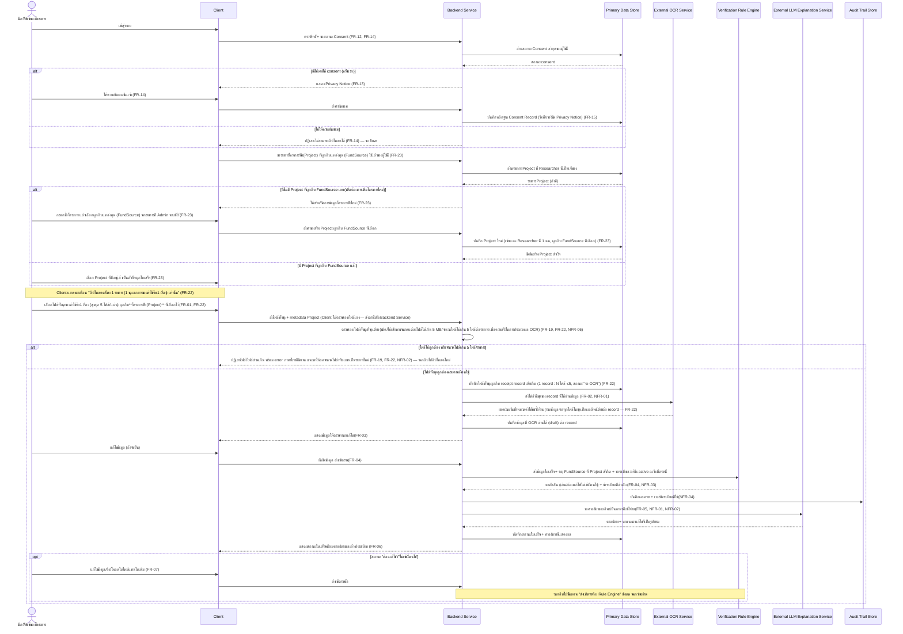
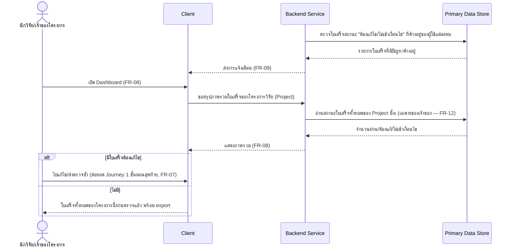
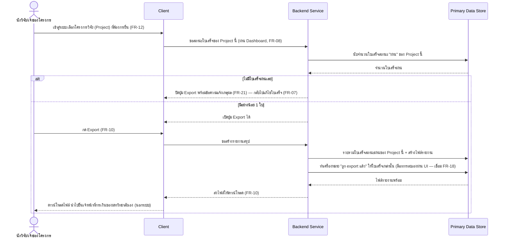
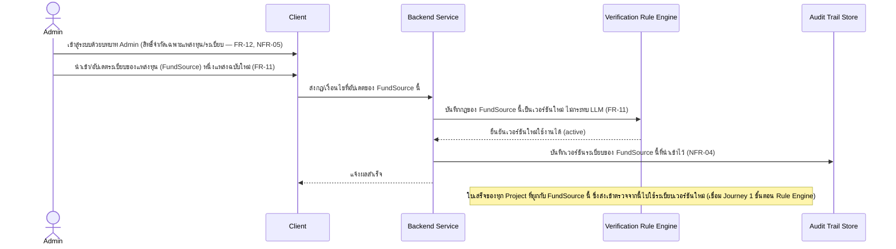
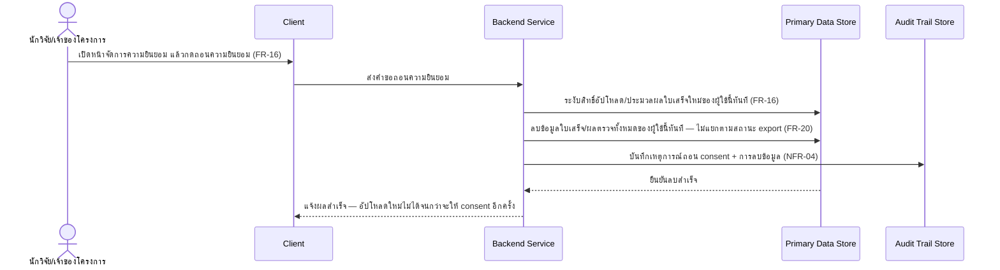
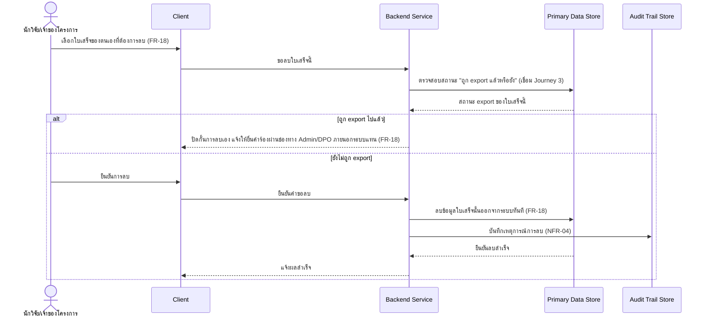

# Architecture — Grant Receipt Assistant

> เอกสารสถาปัตยกรรมระดับ **logical/conceptual** เท่านั้น แปลงจาก [[feature-list]] +
> [[user-journey]] (พร้อม NFR จาก [[backlog]]) — **ไม่ผูก technology/framework/database
> engine/hosting provider ใดๆ** เพราะ [[technology-stack]] ยังไม่มีเนื้อหา (ตรวจสอบแล้วว่าไฟล์นี้
> ไม่มีอยู่จริงในโปรเจกต์ ณ เวลาที่เขียนเอกสารนี้ — 2026-08-23) เมื่อมีการตัดสินใจ tech stack แล้วใน
> อนาคต ให้กลับมาปรับเอกสารนี้ให้อ้างอิงชื่อ stack จริงได้ในหัวข้อ "ประเด็นรอตัดสินใจ" ท้ายเอกสาร

## 0. สถานะเอกสารนี้

- สร้างครั้งแรกเมื่อ 2026-08-23 จากการ sync กับ [[backlog]] (FR-01–FR-21, NFR-01–NFR-11),
  [[feature-list]] (12 ฟีเจอร์), [[user-journey]] (7 journey) — ณ ตอนสร้าง ไฟล์นี้ยังไม่มีอยู่เลย
  จึงถือว่าทุกฟีเจอร์/NFR "ขาดหาย" ทั้งหมด (สร้างใหม่ทั้งไฟล์ ไม่มีเนื้อหาเดิมให้เทียบ) — ปัจจุบันครอบคลุม
  FR-01–FR-22, NFR-01–NFR-11 หลังการ sync รอบ FR-22 (ดูด้านล่าง)
- **อัปเดต 2026-08-23 (รอบ 2):** ผู้ใช้ยืนยันคำตอบทั้ง 2 ประเด็นในหัวข้อ 5 แล้วผ่าน
  `AskUserQuestion` ในเทรดหลัก — **5.1 ตำแหน่งตรวจสอบไฟล์อัปโหลด**: เลือกแนวทาง B (Backend Service
  ตรวจสอบเท่านั้น ไม่มี pre-check ที่ Client) พร้อมข้อกำหนดเพิ่มเติมว่าต้องกำหนดขนาดไฟล์สูงสุดที่
  เหมาะสมกับการประมวลผล OCR ให้รวดเร็ว (เชื่อม NFR-06) — **5.2 รูปแบบการสื่อสาร Backend ↔ OCR/Rule
  Engine/LLM**: ยืนยันแนวทาง A (Synchronous request-response ตลอด pipeline) ตามค่าเริ่มต้นเดิม
  ไม่มีการเปลี่ยนไดอะแกรม ทั้ง 5.1 และ 5.2 จึงเปลี่ยนสถานะเป็น **"ตัดสินใจแล้ว"** ไม่ใช่ค่าเริ่มต้น
  รอยืนยันอีกต่อไป — เหลือเพียงหัวข้อ 5.3 (ประเด็นที่สืบทอดมาจาก [[backlog]] เดิม) ที่ยังค้างอยู่
- **อัปเดต 2026-08-23 (รอบ 3):** เพิ่ม **FR-22 (Multi-file Receipt Bundle)** เข้าสู่เอกสารนี้ —
  ผู้ใช้ finalize ตัวเลข **สูงสุด 5 ไฟล์/รายการ และขนาดไฟล์สูงสุด 5 MB/ไฟล์** แล้ว (ไม่ใช่ TBD อีก
  ต่อไป, ดู [[backlog#Open Point ใหม่จาก FR-22 (2026-08-23 — ยังไม่บล็อกการพัฒนา แต่ต้อง sync ก่อน design ถัดไป)]])
  ปรับแนวคิด "ใบเสร็จ 1 รายการ" ในเอกสารนี้จาก 1 ไฟล์ = 1 ใบเสร็จ เป็น **1 record ใบเสร็จผูกกับได้
  หลายไฟล์ (1:N, สูงสุด 5 ไฟล์)** ตลอดทั้ง Component Diagram (หัวข้อ 2), ตารางขอบเขตความรับผิดชอบ
  (2.1), Data Flow Diagram ของ Journey 1 (3.1), และหัวข้อ 5.1 — โครงสร้าง entity/attribute จริง
  ระดับ database เป็นหน้าที่ของ `db-spec.md` (ทำโดย `api-db-writer` แยกต่างหาก) เอกสารนี้พูดถึงแนวคิด
  1:N นี้เฉพาะระดับ conceptual เท่านั้น
- **อัปเดต 2026-09-03:** sync กับ [[feature-list]]/[[user-journey]] รอบแก้ไขโมเดลข้อมูล — เดิม
  เอกสารนี้ปนแนวคิด "ทุน" (สิ่งที่นักวิจัยเป็นเจ้าของโดยตรง) เป็นก้อนเดียว ตอนนี้แก้ให้สะท้อนโมเดล
  ใหม่ที่ finalize แล้วใน [[backlog]]: แยกเป็น **แหล่งทุน (FundSource)** — นำเข้า/อัปเดตโดย Admin
  (1 แหล่ง : หลายโครงการ), **โครงการวิจัย (Project)** — สร้าง/จัดการโดยนักวิจัย มีเจ้าของ 1 คนต่อ
  โครงการ ผูกกับแหล่งทุนที่ได้รับ, **นักวิจัย (Researcher)** — เจ้าของโครงการ ใบเสร็จผูกกับ
  **Project** โดยตรง ไม่ใช่ผูกกับ FundSource ตรงๆ อีกต่อไป, Rule Engine อ้างอิงระเบียบของ FundSource
  ที่ Project สังกัดอยู่ เวอร์ชันที่ active ณ วันที่ตรวจใบเสร็จ (finalize แล้ว) — เพิ่ม **FR-23
  (Project Setup, ฟีเจอร์ที่ 13)** เป็น flow ต่อยอดก่อนขั้นตอนอัปโหลดใน Journey 1 (ไม่ใช่ journey
  ใหม่แยกต่างหาก ตามที่ `feature-journey-writer` ตัดสินใจไว้แล้ว) ปรับ Component Diagram (หัวข้อ 2),
  ตารางขอบเขตความรับผิดชอบ (2.1), Data Flow Diagram ของ Journey 1 (3.1) และ Journey 4 (3.4), และ
  คำศัพท์ "ทุน"/"เจ้าของทุน" ทั้งเอกสารเป็น "โครงการวิจัย"/"แหล่งทุน"/"เจ้าของโครงการ" ให้ตรงกัน —
  ไม่พบจุดที่ต้องถามผู้ใช้เพิ่มเติม เพราะโมเดลข้อมูลนี้ finalize แล้วทั้งหมดใน [[backlog]] ก่อนเริ่มงานนี้

## 1. ภาพรวมสถาปัตยกรรม

**Grant Receipt Assistant** เป็นระบบ "ด่านตรวจก่อนสอบ" ให้นักวิจัยตรวจสอบใบเสร็จก่อนยื่นเบิกจริงกับ
เจ้าหน้าที่การเงินของมหาวิทยาลัย (ซึ่งอยู่นอกระบบทั้งหมด) ระบบมี 2 บทบาท: **นักวิจัย/เจ้าของโครงการ**
และ **Admin** (ดู [[20260816-01-grant-receipt-verification#3. บทบาทผู้ใช้ (User Roles)]]) หลักการ
ออกแบบที่ตรึงมาจาก spec โดยตรงและมีผลต่อโครงสร้าง component:

- **โมเดลข้อมูลแยก 3 concept ออกจากกันชัดเจน (finalize 2026-09-03):** **แหล่งทุน (FundSource)** —
  นำเข้า/อัปเดตระเบียบโดย Admin, 1 แหล่งทุนให้ทุนได้หลายโครงการ; **โครงการวิจัย (Project)** — สร้าง/
  จัดการโดยนักวิจัยเจ้าของ (FR-23, ฟีเจอร์ที่ 13) มีเจ้าของเป็นนักวิจัย **1 คนต่อโครงการ** และผูกกับ
  แหล่งทุนที่โครงการได้รับ; **นักวิจัย (Researcher)** — เจ้าของโครงการ — **ใบเสร็จผูกกับ Project
  โดยตรง ไม่ใช่ผูกกับ FundSource ตรงๆ** และ Rule Engine ตรวจใบเสร็จโดยอ้างอิงระเบียบของ FundSource
  ที่ Project นั้นสังกัดอยู่ เวอร์ชันที่ **active ณ วันที่ตรวจใบเสร็จ** (ไม่ใช่เวอร์ชัน ณ วันเริ่ม
  โครงการ) — การแยก concept นี้มีผลโดยตรงต่อ Primary Data Store (หัวข้อ 2.1) และต้องมีขั้นตอน
  "ตั้งค่าโครงการวิจัยและผูกกับแหล่งทุน" (FR-23) ก่อนขั้นตอนอัปโหลดใบเสร็จเสมอ (ดู Journey 1 หัวข้อ 3.1)
- **Rule Engine เป็นผู้ตัดสินใจ ไม่ใช่ LLM** (กัน hallucination) — จึงต้องแยก "เอนจินตรวจสอบตามกฎ
  ระเบียบ" ออกเป็น component ของตัวเอง คนละตัวกับ "บริการอธิบายผลด้วยภาษาธรรมชาติ" แม้ทั้งคู่จะถูก
  Backend Service เรียกใช้ในลำดับต่อกันก็ตาม (ดู FR-04, FR-05, FR-06 และ
  [[20260816-01-grant-receipt-verification#1. ภาพรวม/วัตถุประสงค์ของระบบ]])
- **ผู้ให้บริการ OCR และ LLM ถูกปฏิบัติเป็นบริการภายนอก (external)** เพราะ NFR-08/NFR-09 (Cross-
  border Data Transfer, Data Processing Agreement) ผูกกับ "ผู้ให้บริการภายนอก" โดยตรงตามข้อความใน
  backlog — ที่ตั้งจริงของผู้ให้บริการ (ในไทย/ต่างประเทศ) ยังเป็น open point ที่ยังไม่ปิด (ดู
  [[backlog#Open Point ที่ยังไม่ปิดจากเอกสาร PDPA (เพื่ออ้างอิง — ไม่บล็อกการพัฒนา)]]) จึงวาด
  ขอบเขตระบบ (system boundary) ให้ชัดว่า OCR/LLM อยู่นอกขอบเขตที่ระบบควบคุมได้เต็มที่
- **Admin ไม่มีสิทธิ์เข้าถึงข้อมูลใบเสร็จส่วนบุคคลของนักวิจัยเลย** (FR-12) — ทุก component ที่ Admin
  แตะถึงได้ต้องจำกัดเฉพาะ Rule Engine/ระเบียบเท่านั้น ไม่ใช่ข้อมูลใบเสร็จ
- **ไม่มีบทบาท "เจ้าหน้าที่การเงิน"/"ผู้อนุมัติทุน" ในระบบ** (ตัดออกจากขอบเขตแล้ว — ดู
  [[20260816-01-grant-receipt-verification#2.2 ตัดออกจากขอบเขต MVP นี้ (ยืนยันโดยผู้ใช้เมื่อ 2026-08-16 — ดูหัวข้อ 7)]])
  ดังนั้นไม่มี component ใดในระบบที่แทนบทบาทเหล่านี้ — จุดสิ้นสุดของ flow คือ "ไฟล์ export ที่ดาวน์
  โหลดออกไปนอกระบบ"

## 2. Component Diagram

```mermaid
flowchart LR
    subgraph Actors["ผู้ใช้งาน"]
        Researcher["นักวิจัย/เจ้าของโครงการ"]
        Admin["Admin (ผู้ดูแลระบบ/ผู้อัปเดตระเบียบ)"]
    end

    Client["ฝั่งไคลเอนต์ / หน้าจอผู้ใช้ (Client)<br/>UI ทุกหน้าจอ (รวม Project Setup) — ส่งไฟล์ทั้งชุด<br/>(สูงสุด 5 ไฟล์/รายการ) ตรงไปยัง Backend Service + แสดง<br/>คำเตือน "อัปโหลดครั้งละ 1 รายการเท่านั้น" ไม่มีการตรวจสอบ<br/>ไฟล์ฝั่ง Client"]

    Backend["บริการฝั่งเซิร์ฟเวอร์ (Backend Service)<br/>Access Control · Project/FundSource Setup (FR-23) ·<br/>Upload Validation (จุดเดียว — ≤5 ไฟล์/รายการ, ≤5 MB/ไฟล์) ·<br/>Orchestration · Consent/Erasure · Dashboard/Export/<br/>Notification · Audit Logging"]

    RuleEngine["เอนจินตรวจสอบตามกฎระเบียบ<br/>(Verification Rule Engine)<br/>ผู้ตัดสินผ่าน/ต้องแก้ไข/ไม่เข้าเงื่อนไข<br/>อ้างอิงระเบียบของ FundSource ที่ Project สังกัด<br/>เวอร์ชัน active ณ วันที่ตรวจ"]

    subgraph External["บริการภายนอก (ขอบเขต NFR-08/NFR-09)"]
        OCR["บริการ OCR ภายนอก<br/>(External OCR Service)"]
        LLM["บริการอธิบายผลด้วยภาษาธรรมชาติ<br/>(External LLM Explanation Service)"]
    end

    DataStore["ที่เก็บข้อมูลหลัก (Primary Data Store)<br/>Researcher/FundSource (1:N Project)/Project (1 เจ้าของ)/<br/>ใบเสร็จผูกกับ Project (1 record : N ไฟล์ ≤5)/<br/>ผลตรวจ/เวอร์ชันระเบียบ/consent"]
    AuditStore["บันทึกประวัติการทำงาน (Audit Trail Store)<br/>เวอร์ชันระเบียบที่ใช้ตรวจ/ผลตรวจ/เหตุการณ์ consent/<br/>การเปลี่ยนแปลงระเบียบ — รองรับ dispute และ NFR-04/NFR-10"]

    Researcher --> Client
    Admin --> Client
    Client <-->|"HTTP/API เรียก Backend"| Backend
    Backend <-->|"ส่งไฟล์/รับข้อมูลที่อ่านได้"| OCR
    Backend <-->|"ส่งผลตัดสิน+ระเบียบ/รับคำอธิบาย"| LLM
    Backend <-->|"ส่งข้อมูลใบเสร็จ+ระเบียบเวอร์ชันปัจจุบัน/รับคำตัดสิน"| RuleEngine
    Backend <--> DataStore
    RuleEngine <-->|"อ่าน/เขียนเวอร์ชันระเบียบ"| DataStore
    Backend --> AuditStore
    RuleEngine -.->|"แจ้งเวอร์ชันที่ใช้ตัดสิน"| AuditStore
```

### 2.1 ขอบเขตความรับผิดชอบต่อ Component

| Component | ขอบเขตความรับผิดชอบ | FR/NFR ที่เกี่ยวข้อง |
|---|---|---|
| **ฝั่งไคลเอนต์ / Client** | เรนเดอร์ทุกหน้าจอ (Project Setup, upload, ตรวจทาน OCR, สถานะใบเสร็จ, Dashboard, consent/privacy, data access/erasure, admin rule import); ให้นักวิจัยสร้าง/จัดการโครงการวิจัยและเลือกผูกกับแหล่งทุนก่อนเข้าสู่ขั้นตอนอัปโหลด (FR-23); รับไฟล์ทั้งชุดของใบเสร็จ 1 รายการจากผู้ใช้ (สูงสุด 5 ไฟล์) ผูกกับ**โครงการวิจัย**ที่เลือกไว้ แล้วส่งตรงไปยัง Backend Service **โดยไม่ตรวจสอบไฟล์เอง** (ตัดสินใจแล้ว 2026-08-23 — ดูหัวข้อ 5.1: Backend Service เป็นผู้ตรวจสอบไฟล์ที่ authoritative เพียงจุดเดียว); แสดงข้อความเตือน/คำแนะนำระหว่างอัปโหลดว่าให้อัปโหลดครั้งละ 1 รายการ (1 ชุดเอกสาร) เท่านั้น เพื่อป้องกันความสับสนปนกันหลายรายการ (FR-22) | FR-01, FR-03, FR-08, FR-13, FR-14, FR-16, FR-17, FR-18, FR-22, FR-23, NFR-02 |
| **Backend Service** | บังคับสิทธิ์การเข้าถึงตามเจ้าของโครงการทุกคำขอ; **จัดการข้อมูลโครงการวิจัย (Project) ของนักวิจัย** — สร้าง/แก้ไขโครงการและผูกโครงการเข้ากับแหล่งทุน (FundSource) ที่ Admin นำเข้าไว้ (FR-23) ก่อนอนุญาตให้อัปโหลดใบเสร็จของโครงการนั้น; **เป็นจุดเดียวที่ตรวจสอบไฟล์อัปโหลดอย่างเป็นทางการทั้งชุด** ต่อใบเสร็จ 1 รายการ (ชนิดไฟล์/ไฟล์ไม่เสียหาย/ขนาดแต่ละไฟล์ไม่เกิน **5 MB** /จำนวนไฟล์ไม่เกิน **5 ไฟล์ต่อรายการ** — ตัวเลข finalize แล้วตาม FR-19(3)(4)/FR-22 ไม่ใช่ค่าประมาณอีกต่อไป กำหนดร่วมกันเพื่อไม่ให้น้ำหนักรวมของทั้งชุดเอกสารกระทบความเร็วของ OCR ตาม NFR-06 — ตัดสินใจแล้ว 2026-08-23 ดูหัวข้อ 5.1); ผูกไฟล์ทั้งชุดที่ผ่านการตรวจสอบเข้ากับ receipt record เดียวกันที่ผูกกับ**โครงการวิจัย**หนึ่งโครงการ (1 ใบเสร็จ : N ไฟล์ ไม่ใช่ 1:1 อีกต่อไป — FR-22); orchestrate ลำดับ OCR → review → Rule Engine (ส่งเวอร์ชันระเบียบของ FundSource ที่ Project สังกัดอยู่ ณ วันที่ตรวจ) → LLM แบบ synchronous request-response ตลอด pipeline (ตัดสินใจแล้ว 2026-08-23 ดูหัวข้อ 5.2); จัดการสถานะใบเสร็จและ resubmission; สร้าง Dashboard/แจ้งเตือน/export พร้อม gate เงื่อนไข; จัดการวงจร consent (ขอ/บันทึก/ถอน/ลบทันที); จัดการคำขอ data access & erasure; เขียน audit event | FR-01, FR-03, FR-04(orchestrate), FR-06–FR-22 (ยกเว้นการตัดสินใจจริงที่อยู่ใน Rule Engine), FR-23, NFR-02, NFR-04, NFR-05, NFR-06, NFR-11 |
| **Verification Rule Engine** | เก็บ/ใช้ระเบียบของ**แหล่งทุน (FundSource)** แต่ละแหล่งที่ Admin นำเข้าแบบมีเวอร์ชัน (FR-11); ประเมินใบเสร็จเทียบระเบียบของ**แหล่งทุนที่โครงการวิจัย (Project) ของใบเสร็จนั้นสังกัดอยู่** เวอร์ชันที่ **active ณ วันที่ตรวจใบเสร็จ** แล้วคืนคำตัดสิน (ผ่าน/ต้องแก้ไข/ไม่เข้าเงื่อนไข) พร้อมข้อระเบียบที่อ้างอิง — **เป็นผู้ตัดสินใจเพียงผู้เดียว ไม่ใช่ LLM** | FR-04, FR-06, FR-11, NFR-03, NFR-04 |
| **External OCR Service** | อ่านข้อมูล (ยอดเงิน/วันที่/หมวด/ชื่อร้าน) จากไฟล์ใบเสร็จภาษาไทย — เป็นขอบเขตนอกระบบที่ควบคุมได้จำกัด ต้องพิจารณา NFR-08/09 ตามที่ตั้งผู้ให้บริการจริง | FR-02, NFR-01, NFR-06, NFR-08, NFR-09 |
| **External LLM Explanation Service** | แปลผลตัดสินจาก Rule Engine เป็นภาษาไทยที่เข้าใจง่าย พร้อมคำแนะนำแก้ไข — **ไม่มีสิทธิ์เปลี่ยนผลตัดสิน** เป็นขอบเขตนอกระบบเช่นเดียวกับ OCR | FR-05, NFR-01, NFR-02, NFR-03, NFR-08, NFR-09 |
| **Primary Data Store** | เก็บ **Researcher** (นักวิจัย/เจ้าของโครงการ), **FundSource** (แหล่งทุนที่ Admin นำเข้า — 1 แหล่ง : หลายโครงการ), **Project** (โครงการวิจัยของนักวิจัย — เจ้าของ 1 คนต่อโครงการ ผูกกับ FundSource ที่ได้รับ, FR-23) แยกกัน 3 concept ชัดเจน (ไม่ปนกันเป็นก้อนเดียวเหมือนเดิม), **ใบเสร็จ 1 record ต่อ 1 ค่าใช้จ่าย ผูกกับ Project โดยตรง (ไม่ใช่ผูกกับ FundSource ตรงๆ) และผูกได้กับหลายไฟล์ (1:N, สูงสุด 5 ไฟล์ต่อ record — ไม่ใช่ 1 ไฟล์ = 1 ใบเสร็จ อีกต่อไปตั้งแต่ FR-22)** + ข้อมูล OCR ของ record นั้น (draft/แก้ไขแล้ว รวมข้อมูลจากทุกไฟล์ในชุดเป็นผลลัพธ์เดียวต่อ record), ผลตรวจต่อใบเสร็จ (ต่อ record ไม่ใช่ต่อไฟล์ อ้างอิงเวอร์ชันระเบียบของ FundSource ที่ Project สังกัด ณ วันที่ตรวจ), เวอร์ชันระเบียบต่อ FundSource, หลักฐาน consent (วันที่/เวอร์ชัน Privacy Notice), สถานะ "ถูก export แล้วหรือยัง" ต่อใบเสร็จ (ต่อ record — ถ้า record ถูก export แล้ว ล็อกทั้งชุดไฟล์ ไม่ใช่ล็อกทีละไฟล์) | FR-01–FR-04, FR-07, FR-08, FR-10–FR-22, FR-23, NFR-05, NFR-11 |
| **Audit Trail Store** | บันทึกที่ไม่ลบ/แก้ทับของ: เวอร์ชันระเบียบของ FundSource ที่ใช้ตัดสินต่อใบเสร็จ, เหตุการณ์ consent (ให้/ถอน/ลบ), การนำเข้าระเบียบของ Admin ต่อ FundSource — รองรับ dispute และ compliance | NFR-03, NFR-04, NFR-10 |

## 3. Data Flow Diagram ต่อ Journey หลัก

อ้างอิงจาก [[user-journey]] — Journey 6 (ขอสำเนาข้อมูลส่วนบุคคล, FR-17) มี pattern การไหลของข้อมูล
เหมือน Journey 3 (ขอสรุป/รวบรวมข้อมูลจาก Data Store แล้วส่งไฟล์ให้ดาวน์โหลด) เพียงต่างกันที่ขอบเขต
ข้อมูลที่ดึง (Journey 3 ดึงเฉพาะใบเสร็จสถานะผ่านของโครงการวิจัย (Project) หนึ่งโครงการ ส่วน
Journey 6 ดึงข้อมูลส่วนบุคคลทั้งหมดของนักวิจัยคนนั้น ได้แก่ ใบเสร็จ+ผลตรวจ+ประวัติ consent) จึงไม่
วาดแยกซ้ำตามกฎข้อ 4 ของงานนี้ — ฟีเจอร์ที่ 13 (Project Setup, FR-23) ไม่มี journey แยกต่างหากเช่นกัน
เพราะ [[user-journey]] ผูก flow นี้เข้าเป็นส่วนต่อยอดของ Journey 1 (ขั้นตอนที่ 4) แล้ว จึงสะท้อนเป็น
gate เพิ่มเติมใน sequence diagram หัวข้อ 3.1 แทนที่จะแยกหัวข้อใหม่

### 3.1 Journey 1 — อัปโหลดใบเสร็จและตรวจสอบผลจนผ่านเกณฑ์ (รวม consent gate + FR-23 project setup gate + FR-19 + FR-22 multi-file bundle)



### 3.2 Journey 2 — ติดตามภาพรวมโครงการและจัดการใบเสร็จที่มีปัญหา (Dashboard + แจ้งเตือน)



### 3.3 Journey 3 — Export รายงานสรุปใบเสร็จที่ผ่านตรวจแล้ว



### 3.4 Journey 4 — Admin นำเข้า/อัปเดตระเบียบของแหล่งทุนเข้าสู่ Rule Engine



### 3.5 Journey 5 — ถอนความยินยอม (Withdraw Consent) และการลบข้อมูลทั้งหมดทันที



### 3.6 Journey 7 — ลบข้อมูลใบเสร็จของตนเองด้วยตนเอง (Right to Erasure รายใบ)



## 4. NFR Mapping

| รหัส | คำอธิบายสั้น | Component ที่รับผิดชอบหลัก | แนวทางเชิงหลักการที่ต้องคำนึงถึง |
|---|---|---|---|
| NFR-01 | OCR/LLM ต้องรองรับภาษาไทยเต็มรูปแบบ | External OCR Service, External LLM Explanation Service | เลือก/กำหนดผู้ให้บริการที่รองรับภาษาไทยครบทั้งการอ่านตัวเลข/ข้อความและการอธิบายผล — Backend Service ต้องตรวจสอบภาษาของผลลัพธ์ก่อนส่งต่อให้ Client |
| NFR-02 | Usability — ภาษาที่เข้าใจง่ายสำหรับคนไม่มีพื้นฐานการเงิน | External LLM Explanation Service, Backend Service, Client | LLM Explanation Service ต้องแปลงศัพท์การเงินเป็นภาษาชาวบ้าน; Backend Service ต้องสร้าง error message ของ FR-19/FR-21 เป็นภาษาไทยที่ชัดเจนเช่นกัน ไม่ใช่แค่ผลตรวจจาก LLM |
| NFR-03 | Explainability — ผลตรวจต้องอ้างอิงข้อระเบียบได้เสมอ | Verification Rule Engine, Backend Service | Rule Engine ต้องคืนค่า "ข้อระเบียบที่ใช้ตัดสิน" ควบคู่กับคำตัดสินทุกครั้ง ไม่ใช่แค่ pass/fail — Backend Service ต้องบังคับให้มีการอ้างอิงนี้ก่อนส่งต่อให้ LLM แปลผล เพื่อกัน LLM สร้างคำอธิบายที่ไม่มีฐานอ้างอิงจริง (hallucination) |
| NFR-04 | Audit Trail — บันทึกกฎ/เวอร์ชันระเบียบ/ผลลัพธ์ต่อใบเสร็จ | Backend Service, Audit Trail Store, Verification Rule Engine | ทุกผลตรวจต้องผูกกับเวอร์ชันระเบียบของ **FundSource** ที่ **Project** ของใบเสร็จนั้นสังกัดอยู่ ณ ขณะนั้นแบบ immutable (แก้ไข/ลบทับไม่ได้) เพื่อรองรับการตรวจสอบย้อนหลังเมื่อระเบียบเปลี่ยน (แม้ Project จะเปลี่ยน FundSource ที่ผูกในภายหลัง ผลตรวจเก่าต้องไม่เปลี่ยนตาม) และรองรับ dispute |
| NFR-05 | Security/Access Control | Backend Service, Primary Data Store | Backend Service ต้องตรวจสอบสิทธิ์ตามเจ้าของ**โครงการวิจัย (Project)** ทุก request ก่อนเข้าถึงข้อมูลใบเสร็จ/ข้อมูล Project นั้น — Admin ต้องถูกกันไม่ให้เข้าถึง endpoint ที่คืนข้อมูลใบเสร็จส่วนบุคคลได้เลยในระดับตรรกะสิทธิ์ ไม่ใช่แค่ซ่อนใน UI (Admin เข้าถึงได้เฉพาะ FundSource/ระเบียบเท่านั้น) |
| NFR-06 | Performance ของ OCR/Rule Engine (เป้าหมายเวลาตอบสนองโดยรวมยังไม่กำหนด) | External OCR Service, Verification Rule Engine, Backend Service | ยังไม่มีตัวเลขเป้าหมายด้านเวลาตอบสนองโดยรวม — แต่ Backend Service มีมาตรการป้องกันเบื้องต้นแล้วผ่าน Upload Validation ที่ finalize ตัวเลขขนาดไฟล์สูงสุด **5 MB/ไฟล์** และ **5 ไฟล์/รายการ** (FR-19, FR-22 — ดูหัวข้อ 5.1) เพื่อไม่ให้น้ำหนักรวมของชุดเอกสารต่อ 1 ใบเสร็จกระทบความเร็ว OCR — ส่วนเป้าหมายเวลาตอบสนองโดยรวมของ pipeline ต้องตัดสินใจร่วมกับหัวข้อ 5.2 (sync/async) ก่อนกำหนดรายละเอียดต่อใน `detailed-design/` |
| NFR-07 | Scalability ปริมาณใบเสร็จ (เป้าหมายตัวเลขยังไม่กำหนด) | Backend Service, Primary Data Store | ยังไม่มีตัวเลขเป้าหมาย — ต้องรองรับปริมาณทั้ง Researcher/Project/FundSource/ใบเสร็จที่เพิ่มขึ้นตามจำนวนโครงการ (ไม่ใช่แค่จำนวนแหล่งทุนซึ่งมีน้อยกว่ามาก) — รูปแบบการสื่อสารระหว่าง component (หัวข้อ 5.2) มีผลต่อว่าระบบต้องรองรับการประมวลผลพร้อมกันมากน้อยเพียงใด |
| NFR-08 | Cross-border Data Transfer (conditional) | External OCR Service, External LLM Explanation Service | ขอบเขตของทั้งสอง component นี้ถูกวาดเป็น "บริการภายนอก" โดยตั้งใจ เพื่อให้ชัดว่าจุดที่ต้องพิจารณามาตรการคุ้มครองข้อมูลข้ามพรมแดนคือจุดเชื่อมต่อ (integration boundary) นี้ — ที่ตั้งจริงยังเป็น open point (ดูหัวข้อ 5.3) |
| NFR-09 | Data Processing Agreement กับผู้ให้บริการภายนอก (Organizational) | External OCR Service, External LLM Explanation Service | เป็นข้อตกลงระดับองค์กร ไม่ใช่ฟังก์ชันของ component แต่ขอบเขตการเชื่อมต่อในไดอะแกรมนี้ (Backend ↔ OCR/LLM) คือจุดที่ DPA ต้องครอบคลุม |
| NFR-10 | Data Breach Notification (Organizational/Process) | Backend Service, Audit Trail Store | ระบบไม่มี component "ตรวจจับการรั่วไหล" โดยเฉพาะตาม spec ปัจจุบัน แต่ Audit Trail Store ต้องมีข้อมูลเพียงพอ (log การเข้าถึง/เปลี่ยนแปลงข้อมูล) ให้กระบวนการแจ้งเหตุละเมิดข้อมูล (ซึ่งเป็น process ภายนอกซอฟต์แวร์) ใช้อ้างอิงได้ |
| NFR-11 | Data Retention & Deletion Policy (ตัวเลข TBD) | Backend Service, Primary Data Store | Backend Service ต้องเป็นจุดเดียวที่ trigger การลบข้อมูล (ทั้งกรณี FR-18 ลบรายใบแบบมีเงื่อนไข export-lock และ FR-20 ลบทั้งหมดทันทีเมื่อถอน consent) — ตัวเลขระยะเวลาเก็บยังเป็น TBD ตามที่ระบุใน backlog |

## 5. ประเด็นรอตัดสินใจ

### 5.1 ตำแหน่งของการตรวจสอบไฟล์อัปโหลด (FR-19) — Client หรือ Backend Service

**สถานะ**: **ตัดสินใจแล้ว (ยืนยันโดยผู้ใช้ผ่าน `AskUserQuestion` เมื่อ 2026-08-23)** — เลือก
**แนวทาง B: Backend Service ตรวจสอบไฟล์เท่านั้น (authoritative เดียว)** Client **ไม่มี**
pre-check ไฟล์ก่อนส่งอีกต่อไป (ต่างจากค่าเริ่มต้นเดิมของเอกสารรุ่นแรกที่ใช้แนวทาง C) — ไดอะแกรมใน
หัวข้อ 2 และ 3.1 ได้ปรับให้ตรงกับการตัดสินใจนี้แล้ว

**ข้อกำหนดเพิ่มเติมจากผู้ใช้**: การตรวจสอบไฟล์ที่ Backend Service ต้อง**กำหนดขนาดไฟล์สูงสุดที่
เหมาะสมกับการประมวลผล OCR ให้รวดเร็วเหมาะสมกับการใช้งานจริง** ไม่ปล่อยให้ไฟล์ใหญ่ตามใจผู้ใช้ — เชื่อม
กับ NFR-06 (Performance ของ OCR/Rule Engine) โดยตรง

**อัปเดต 2026-08-23 (รอบ 3):** ตัวเลขนี้ **finalize แล้ว** ไม่ใช่ TBD/ค่าประมาณของผู้เขียนเอกสารนี้
อีกต่อไป — ผู้ใช้ยืนยันผ่าน **FR-22 (Multi-file Receipt Bundle)** และ FR-19 ข้อ (3)-(4) ว่า:
**ขนาดไฟล์สูงสุด = 5 MB ต่อไฟล์** และ **จำนวนไฟล์สูงสุด = 5 ไฟล์ต่อใบเสร็จ 1 รายการ** (กำหนดร่วมกัน
เพื่อไม่ให้น้ำหนักรวมของทั้งชุดเอกสารต่อ 1 รายการหนักเกินไปจนกระทบความเร็วของ OCR) ดู
[[20260816-01-grant-receipt-verification#4. Functional Requirements|FR-19]],
[[20260816-01-grant-receipt-verification#4. Functional Requirements|FR-22]] เป็นแหล่งอ้างอิงตัวเลข
นี้โดยตรง — ตัวเลข MB/จำนวนไฟล์ระดับ schema จริงใน `db-spec.md` ต้องปรับให้ตรงกับ 5 MB/5 ไฟล์นี้ด้วย
(ดู [[backlog#Open Point ใหม่จาก FR-22 (2026-08-23 — ยังไม่บล็อกการพัฒนา แต่ต้อง sync ก่อน design ถัดไป)]]
— db-spec.md เคยตั้งค่าชั่วคราวไว้ที่ 10 MB ต้องแก้เป็น 5 MB โดย `api-db-writer` แยกต่างหาก ไม่ใช่
งานของเอกสารนี้)

ตารางตัวเลือกที่นำเสนอให้ผู้ใช้ตัดสินใจ (เก็บไว้เพื่ออ้างอิงว่าเคยพิจารณาทางเลือกอะไรบ้าง):

| แนวทาง | ข้อดี | ข้อเสีย |
|---|---|---|
| A. ตรวจที่ Client เท่านั้น (ก่อนส่งไฟล์ออกไป) | ผู้ใช้ได้ feedback เร็วที่สุด ไม่ต้องส่งไฟล์เสียหาย/ผิดชนิดข้ามเครือข่ายเลย | ตรวจสอบที่ client หลีกเลี่ยง/ปลอมแปลงได้ (ไม่ authoritative) ผิดหลัก security defense-in-depth และขัดกับ FR-19 ที่ระบุว่า "ระบบ" (implication: ฝั่งเซิร์ฟเวอร์) ต้องปฏิเสธไฟล์ไม่ถูกต้อง |
| **B. ตรวจที่ Backend Service เท่านั้น (authoritative เดียว) — เลือกแนวทางนี้** | เชื่อถือได้ 100% ไม่มีช่องโหว่ ตรงกับคำว่า "ระบบต้องตรวจสอบ" ใน FR-19 ตรงตัว มีจุดตรวจสอบเดียวที่ดูแลง่าย ไม่ต้อง sync logic 2 ที่ | ผู้ใช้ต้องรอไฟล์อัปโหลดเสร็จก่อนจะรู้ว่าไฟล์ผิด (UX ช้ากว่าแนวทาง A/C เล็กน้อย โดยเฉพาะไฟล์ใหญ่/เน็ตช้า) — บรรเทาด้วยการกำหนดขนาดไฟล์สูงสุดที่เหมาะสม (ดูข้อกำหนดเพิ่มเติมข้างบน) เพื่อไม่ให้ผู้ใช้ต้องรอนาน |
| C. ทั้งสองฝั่ง (Client pre-check เพื่อ UX เร็ว + Backend Service ตรวจซ้ำแบบ authoritative) | ได้ทั้ง UX ที่เร็วและความปลอดภัย/ความถูกต้องที่เชื่อถือได้ (defense-in-depth) | มี logic ตรวจสอบไฟล์อยู่ 2 ที่ (ต้องดูแลให้ตรงกันเมื่อมีการเปลี่ยนเงื่อนไข เช่น ขนาดไฟล์สูงสุด) — ผู้ใช้พิจารณาแล้วเห็นว่าความซับซ้อนที่เพิ่มขึ้นไม่จำเป็น เมื่อกำหนดขนาดไฟล์สูงสุดให้เหมาะสมแทนได้ |

### 5.2 รูปแบบการสื่อสารระหว่าง Backend Service ↔ OCR/Rule Engine/LLM — Synchronous หรือ Asynchronous

**สถานะ**: **ตัดสินใจแล้ว (ยืนยันโดยผู้ใช้ผ่าน `AskUserQuestion` เมื่อ 2026-08-23)** — ยืนยัน
**แนวทาง A: Synchronous request-response ตลอด pipeline** ตามค่าเริ่มต้นเดิมที่ใช้อยู่แล้วในไดอะแกรม
หัวข้อ 3 ทั้งหมด — **ไม่มีการเปลี่ยนแปลงไดอะแกรมสำหรับหัวข้อนี้** เพราะเป็นแนวทางเดียวกับที่ออกแบบไว้
แต่แนวทาง B/C ยังคงถูกบันทึกไว้ด้านล่างเพื่ออ้างอิงในอนาคต หากเมื่อ NFR-06/NFR-07 มีตัวเลขเป้าหมาย
จริงแล้วพบว่า synchronous ไม่รองรับพอ จะสามารถย้อนมาทบทวนแนวทางนี้ได้โดยไม่ต้องเริ่มวิเคราะห์ใหม่ทั้งหมด

| แนวทาง | ข้อดี | ข้อเสีย |
|---|---|---|
| **A. Synchronous request-response ตลอด pipeline — เลือกแนวทางนี้ (ยืนยันแล้ว)** — Client รอผลจาก OCR/Rule Engine/LLM ในคำขอเดียวต่อขั้นตอน | ออกแบบ/ทดสอบง่ายกว่า ตรงกับ flow ที่ user-journey วาดไว้ (ไม่มี node "กำลังประมวลผล") ผู้ใช้เห็นผลทันทีหลังกดปุ่มแต่ละครั้ง | ถ้าผู้ให้บริการ OCR/LLM ภายนอกตอบช้า (ยังไม่รู้ตัวเลขจาก NFR-06) การเรียกจะบล็อก UI ทั้งหมด และเมื่อผู้ใช้พร้อมกันมากขึ้น (NFR-07 ยังไม่รู้ตัวเลข) จะขยาย (scale) ยากกว่า — ผู้ใช้รับทราบความเสี่ยงนี้แล้วและยอมรับได้ในสถานะ MVP ปัจจุบัน |
| B. Asynchronous แบบ job queue + สถานะ "กำลังประมวลผล" ให้ Client poll/รอการแจ้งเตือน | ไม่บล็อก UI แม้ OCR/LLM ช้า; รองรับปริมาณใบเสร็จพร้อมกันได้ดีกว่า; ใช้ประโยชน์จากฟีเจอร์แจ้งเตือนที่มีอยู่แล้ว (FR-09) ได้ทันที | ต้องเพิ่มแนวคิดสถานะ "กำลังประมวลผล"/mechanism แจ้งผลเสร็จ ซึ่ง user-journey ปัจจุบันไม่ได้วาดไว้ (ต้องปรับ flow ให้ผู้ใช้เข้าใจว่าไม่ใช่ผลทันที) เพิ่มความซับซ้อนของ state ที่ต้อง track |
| C. Hybrid — OCR (ขั้นตอนที่มี human-in-the-loop รอตรวจทานอยู่แล้วจาก FR-03) เป็น async ได้ธรรมชาติ ส่วน Rule Engine+LLM (ขั้นตอนกดส่งแล้วรอผลทันที) เป็น sync | ใช้จุดที่มี "การหยุดรอผู้ใช้" ตามธรรมชาติของ FR-03 ให้เป็นประโยชน์ ลดความซับซ้อนของ async ไปแค่ครึ่งทาง | ยังมีความซับซ้อนของการผสม 2 รูปแบบในระบบเดียว ต้องดูแลทั้งสอง pattern คู่กัน |

### 5.3 ประเด็นรอตัดสินใจอื่นที่สืบทอดมาจาก [[backlog]] (ไม่ใช่ประเด็นใหม่จากงานนี้)

- **ที่ตั้งผู้ให้บริการ OCR/LLM จริง** (ในไทย/ต่างประเทศ) — กระทบว่า External OCR Service/External
  LLM Explanation Service ต้องมีมาตรการ cross-border transfer (NFR-08) หรือไม่ ยังเป็น open point
  (ดู [[backlog#Open Point ที่ยังไม่ปิดจากเอกสาร PDPA (เพื่ออ้างอิง — ไม่บล็อกการพัฒนา)]])
- **ตัวเลขระยะเวลาเก็บข้อมูล (retention)** ตาม NFR-11 — ยังเป็น TBD รอระเบียบของมหาวิทยาลัย/
  กรมบัญชีกลาง มีผลต่อรายละเอียดการ implement การลบข้อมูลใน Backend Service/Primary Data Store
  ใน `detailed-design/` ขั้นถัดไป (ไม่กระทบภาพรวม component ระดับนี้)
- **[[technology-stack]] ยังไม่มีเนื้อหา** — เมื่อมีการตัดสินใจ framework/ภาษา/database
  engine/hosting provider แล้ว ให้ปรับ `api-spec.md`/`db-spec.md`/`detailed-design/` ให้อ้างอิงจริง
  ได้ แต่ **เอกสารนี้ (architecture.md) ควรคงความเป็น logical/conceptual ไว้แม้ tech stack ตัดสินใจ
  แล้วก็ตาม** เพราะเป็นชั้นที่ตั้งใจให้เปลี่ยน implementation ได้โดยไม่กระทบภาพรวม component

## เอกสารที่เกี่ยวข้อง

- [[backlog]] — สรุป FR/NFR ทั้งหมดที่ขับเคลื่อนการออกแบบนี้ (FR-01–FR-23, NFR-01–NFR-11)
- [[feature-list]] — 13 ฟีเจอร์ที่ map เข้ากับ component ในหัวข้อ 2.1 (รวมฟีเจอร์ที่ 13 — Project Setup, FR-23)
- [[user-journey]] — 7 journey ต้นทางของ Data Flow Diagram ในหัวข้อ 3 (FR-23 ผูกเข้าเป็นส่วนต่อยอดของ Journey 1 ไม่ใช่ journey แยก)
- [[20260816-01-grant-receipt-verification]] — เอกสาร spec ต้นทางของ FR-01–FR-12/FR-19/FR-21/FR-22/FR-23/NFR-01–NFR-07
- [[20260816-02-pdpa-compliance]] — เอกสาร spec ต้นทางของ FR-13–FR-18/FR-20/NFR-08–NFR-11 (PDPA)
- [[technology-stack]] — ยังไม่มีเนื้อหา (ตรวจสอบแล้วเมื่อ 2026-09-03) — จุดที่จะกำหนด tech stack จริงในอนาคต
