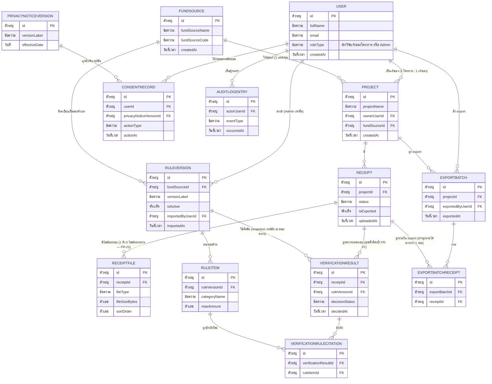

# DB Spec — Grant Receipt Assistant (Entity-Attribute-Relationship เชิง Logical)

> เอกสารโมเดลข้อมูลระดับ **logical** เท่านั้น แปลงจาก [[architecture]] + [[feature-list]] +
> [[user-journey]] (พร้อม FR/NFR จาก [[backlog]]) — **ห้ามใช้ SQL type (เช่น `VARCHAR(255)`,
> `INT`, `TIMESTAMP`) และห้ามระบุว่าเป็น SQL/NoSQL หรือ database engine ใดๆ** เพราะ
> [[technology-stack]] ยังไม่มีเนื้อหา (ตรวจสอบแล้ว ณ 2026-09-03) ชนิดข้อมูลทั้งหมดในเอกสารนี้ใช้คำ
> เชิงตรรกะเท่านั้น: **ข้อความ, ตัวเลข, วันที่, วันที่-เวลา, จริง/เท็จ, ตัวระบุ (identifier),
> อ้างอิงถึง Entity อื่น** ทุก field ในเอกสารนี้ต้องตรงกับ field ที่ใช้ใน [[api-spec]] เสมอ (เขียนคู่กัน
> ในงานเดียวกัน)

## 0. สถานะเอกสารนี้

- สร้างครั้งแรกเมื่อ 2026-08-23 หลัง [[architecture]] เสร็จสมบูรณ์ (component diagram, data flow
  ต่อ 7 journey, NFR mapping, ประเด็นรอตัดสินใจ 5.1/5.2 ตัดสินใจแล้ว) — ก่อนหน้านี้ไฟล์นี้ไม่มีอยู่เลย
  จึงถือว่าทุก entity "ขาดหาย" ทั้งหมด (สร้างใหม่ทั้งไฟล์)
- ครอบคลุม FR-01–FR-21 (ยกเว้น FR-01 ที่ superseded เข้าไปใน FR-19), NFR-01–NFR-11 ทั้งหมด
  ตามที่ [[architecture]] วาด component ไว้แล้ว
- เครื่องมือ `AskUserQuestion` ไม่ได้ถูกส่งมาให้ใช้ในเซสชันนี้ ประเด็นที่ควรถามผู้ใช้ (ขนาดไฟล์อัปโหลด
  สูงสุด ซึ่ง [[architecture#5. ประเด็นรอตัดสินใจ|หัวข้อ 5.1 ของ architecture]] มอบหมายให้เอกสารนี้
  ตัดสินใจต่อ) จึงถูกบันทึกเป็นค่าตั้งต้นชั่วคราวพร้อมเหตุผลไว้ในหัวข้อ 5 แทน — โปรดยืนยัน/แก้ไขค่านี้
  **(เดิม)** — ค่านี้ถูก finalize แล้วในการอัปเดตรอบถัดไป ดูหัวข้อถัดไป
- **อัปเดต 2026-08-23 (รอบ 2):** เพิ่ม **FR-22 (Multi-file Receipt Bundle)** เข้าสู่เอกสารนี้ ตามที่
  [[backlog]]/[[feature-list]]/[[user-journey]]/[[architecture]] ถูก sync ให้ครอบคลุม FR-22 แล้ว —
  ปรับ entity `Receipt` จาก "1 record : 1 ไฟล์" เป็น **"1 record : N ไฟล์ (1 ≤ N ≤ 5)"** โดย
  แยกข้อมูลระดับไฟล์ออกเป็น entity ใหม่ **ไฟล์ประกอบใบเสร็จ (ReceiptFile)** ตามหลัก
  normalization (1 record ใบเสร็จ = 1 ค่าใช้จ่าย ผูกได้กับหลายไฟล์หลักฐาน) พร้อม**finalize**ตัวเลข
  ขนาดไฟล์สูงสุดในหัวข้อ 5.1 จาก 10 MB (ค่าตั้งต้นชั่วคราวเดิม) เป็น **5 MB/ไฟล์** และเพิ่มกฎ
  **สูงสุด 5 ไฟล์/รายการ** ตรงตัวเลขที่ผู้ใช้ finalize แล้วผ่าน FR-19(3)(4)/FR-22 (ไม่ใช่ตัวเลือกที่
  เปิดให้ทบทวนอีกต่อไป) — ครอบคลุม FR-01–FR-22, NFR-01–NFR-11 ทั้งหมด
- **อัปเดต 2026-08-23 (รอบ 3):** `detailed-design-writer` พบช่องว่างว่าค่า `Receipt.status` =
  "รอผลตรวจ" ไม่มี operation ใดใน [[api-spec]] ตั้งค่าจริง (pipeline OP-04/OP-06 เป็น synchronous
  ทั้งเส้น) ตรวจสอบยืนยันแล้วว่ามีช่องว่างนี้จริง แก้โดย**ลบ "รอผลตรวจ" ออกจาก enum** (ดูเหตุผลเต็มที่
  [[db-spec#5.4 สถานะ Receipt.status ที่ตัดออก (แก้ไข 2026-08-23)|หัวข้อ 5.4]]) — enum เหลือ 5 ค่า
- **อัปเดต 2026-09-03 (แก้ไขโมเดลข้อมูลที่ผิด — sync กับ [[architecture]]/[[feature-list]] รอบ
  FR-23):** เดิมเอกสารนี้เขียน entity **"Fund" (ทุนวิจัย)** ว่ามี `ownerUserId` ผูกตรงกับนักวิจัย
  1 คน และ `Receipt.fundId` ชี้ตรงไปยัง Fund นั้น ซึ่ง**ผิด** — ปนแนวคิด "แหล่งทุน" (fund source
  เช่น สกว./วช./ทุนภายในมหาวิทยาลัย มีรหัส/ระเบียบเป็นของตัวเอง ให้ทุนได้หลายโครงการ) เข้ากับ
  "โครงการวิจัย" (สิ่งที่นักวิจัยเป็นเจ้าของจริงและเป็นสิ่งที่ใบเสร็จควรผูกด้วย) แก้ไขโดย:
  - แยก entity `Fund` เดิมออกเป็น **FundSource (แหล่งทุน)** — ตัด `ownerUserId` ออก และ
    **Project (โครงการวิจัย)** เพิ่มใหม่ — มี `ownerUserId` (นักวิจัยเจ้าของ **1 คนต่อโครงการ**,
    finalize แล้ว) และ `fundSourceId` (อ้างอิง FundSource ที่โครงการได้รับทุนมา)
  - ย้าย relation `Receipt → Fund` เป็น **`Receipt → Project`** แทน (`Receipt.fundId` →
    `Receipt.projectId`)
  - ย้าย `ExportBatch.fundId` เป็น **`ExportBatch.projectId`** เช่นกัน (export เป็นรายโครงการ ตาม
    [[user-journey#Journey 3: Export รายงานสรุปใบเสร็จที่ผ่านตรวจแล้ว|user-journey Journey 3]])
  - เพิ่ม `RuleVersion.fundSourceId` — ระเบียบผูกกับ**แหล่งทุนแต่ละแหล่ง** ไม่ใช่ระเบียบเดียวรวมทั้ง
    มหาวิทยาลัยเหมือนเดิม จึงแก้กฎธุรกิจข้อ 7 จาก "1 เวอร์ชัน active ทั้งระบบ" เป็น **"1 เวอร์ชัน
    active ต่อ FundSource หนึ่งพร้อมกัน"**
  - เพิ่มกฎธุรกิจใหม่ (ข้อ 11): การเลือก `RuleVersion` ที่ใช้ตรวจใบเสร็จต้องมาจาก FundSource ที่
    Project ของใบเสร็จนั้นสังกัดอยู่ **ณ วันที่ตรวจ** (finalize แล้ว — ดู
    [[20260816-01-grant-receipt-verification#11.1 ประเด็นที่ถามผู้ใช้เพิ่มเติมและคำตอบที่ยืนยันแล้ว (finalize 2026-09-03)|spec หัวข้อ 11.1 ข้อ 2]])
  - เรียงลำดับ entity ใหม่ทั้งหมด (หัวข้อ 2) ให้ `ReceiptFile` อยู่ถัดจาก `Receipt` แทนที่จะอยู่ท้ายไฟล์
    (เดิมถูกเพิ่มทีหลังในรอบ FR-22) — **ไม่มีจุดที่ต้องถามผู้ใช้เพิ่มเติมในรอบนี้** เพราะโมเดลข้อมูลนี้
    finalize แล้วทั้งหมดใน [[backlog]]/spec หัวข้อ 11 ก่อนเริ่มงานนี้ (ดู
    [[20260816-01-grant-receipt-verification#11. ส่วนแก้ไขจากการชี้ประเด็นของผู้ใช้ (2026-09-03) — แยกนิยาม "แหล่งทุน" ออกจาก "โครงการวิจัย"|spec หัวข้อ 11]])
  - **หมายเหตุการนับรหัส entity**: เอกสารรุ่นก่อนใช้รหัส E-01–E-13 (เรียงตามลำดับที่ถูกเพิ่มเข้ามา
    ไม่ใช่ตามหมวดหมู่) รอบนี้ **จัดเรียงรหัส E- ใหม่ทั้งหมด** ให้ entity ที่เกี่ยวข้องกันอยู่ติดกัน
    (Project/FundSource ก่อน Receipt, ReceiptFile ต่อจาก Receipt ทันที) — ถ้ามีเอกสารอื่นอ้างอิง
    รหัส E- เดิม (เช่น `detailed-design/`) จะต้องปรับ wikilink ตามให้ตรงกับรหัสใหม่ในรอบ
    `sync-technical-spec` ถัดไป (ไม่ใช่ขอบเขตงานนี้)

## 1. ER Diagram (ภาพรวมความสัมพันธ์)

> หมายเหตุสัญกรณ์: มีเดียมใช้ `จริงเท็จ`/`วันที่เวลา` (ไม่มีเครื่องหมาย `/`หรือ `-`) เป็นชื่อ token
> ในไดอะแกรมเท่านั้นเพื่อความเข้ากันได้ของ Mermaid parser — ในตารางรายละเอียด attribute ของแต่ละ
> entity (หัวข้อ 2) ใช้รูปแบบมาตรฐาน `จริง/เท็จ` และ `วันที่-เวลา` ตามที่กำหนดไว้ในกฎของงานนี้
>
> หมายเหตุ cardinality ของ `RECEIPT ||--o{ RECEIPTFILE`: สัญกรณ์ crow's foot ของ Mermaid รองรับแค่
> zero/one/many แบบพื้นฐาน ไม่มีสัญลักษณ์สำหรับขอบบน (upper bound) แบบ "≤5" ไดอะแกรมนี้จึงแสดงเป็น
> zero-or-many (`o{`) ตามธรรมเนียม แต่**เงื่อนไขจริงคือ 1 ถึง 5 ไฟล์ต่อ receipt (ไม่ใช่ 0 ถึงไม่จำกัด)**
> — บังคับเป็นกฎทางธุรกิจแทน (ดู [[db-spec#4. กฎทางธุรกิจที่กระทบโครงสร้างข้อมูล (Business Rules)|หัวข้อ 4 กฎข้อ 9]])
>
> หมายเหตุ cardinality ของ `USER ||--o{ PROJECT` และ `FUNDSOURCE ||--o{ PROJECT`: **โครงการวิจัย
> (Project) หนึ่งโครงการมีเจ้าของ (`ownerUserId`) ได้เพียง 1 คนเท่านั้น** (finalize แล้ว — ดู
> [[20260816-01-grant-receipt-verification#11.1 ประเด็นที่ถามผู้ใช้เพิ่มเติมและคำตอบที่ยืนยันแล้ว (finalize 2026-09-03)|spec หัวข้อ 11.1 ข้อ 1]])
> ทิศทางความเป็นเจ้าของจึงเป็น "User 1 คน : Project หลายโครงการ" (ไม่ใช่ Project หนึ่งมีเจ้าของหลายคน)
> เช่นเดียวกับ FundSource 1 แหล่ง : Project หลายโครงการ (ไม่ใช่ Project หนึ่งมีหลายแหล่งทุน)

## 2. รายละเอียด Entity

### E-01 ผู้ใช้ระบบ (User)

บัญชีผู้ใช้แบบรวม ครอบคลุมทั้ง 2 บทบาท (**นักวิจัย/เจ้าของโครงการ** — เรียกว่า Researcher ในเอกสาร
[[architecture]]/[[feature-list]] และ Admin) เพราะทั้งสองบทบาทต้องมีการเข้าสู่ระบบ/ยืนยันตัวตนเหมือน
กัน ต่างกันที่สิทธิ์การเข้าถึงข้อมูล — **ไม่มี entity แยกต่างหากชื่อ "Researcher"** เพราะ Researcher
คือ `User` ที่ `roleType` = "นักวิจัย/เจ้าของโครงการ" นั่นเอง (ดู
[[architecture#2.1 ขอบเขตความรับผิดชอบต่อ Component|Backend Service — Access Control]],
[[20260816-01-grant-receipt-verification#3. บทบาทผู้ใช้ (User Roles)|บทบาทผู้ใช้]])

| Attribute | ชนิดข้อมูลเชิงตรรกะ | จำเป็นต้องมีค่า | คำอธิบาย |
|---|---|---|---|
| id | ตัวระบุ | ใช่ | รหัสอ้างอิงเฉพาะของผู้ใช้ |
| fullName | ข้อความ | ใช่ | ชื่อ-นามสกุลผู้ใช้ |
| email | ข้อความ | ใช่ | อีเมล/ชื่อเข้าใช้งาน — ไม่ซ้ำกันในระบบ |
| roleType | ข้อความ (ค่าที่เป็นไปได้: "นักวิจัย/เจ้าของโครงการ", "Admin") | ใช่ | กำหนดสิทธิ์การเข้าถึงทั้งหมด (FR-12, NFR-05) — ผู้ใช้ที่มีค่านี้เป็น "นักวิจัย/เจ้าของโครงการ" คือ Researcher ที่เป็นเจ้าของ `Project` ได้ (ดู E-03) |
| createdAt | วันที่-เวลา | ใช่ | วันที่สร้างบัญชี |

**FR/NFR ที่เกี่ยวข้อง**: [[20260816-01-grant-receipt-verification#4. Functional Requirements|FR-12]],
[[20260816-01-grant-receipt-verification#4. Functional Requirements|FR-23]],
[[20260816-01-grant-receipt-verification#5. Non-Functional Requirements|NFR-05]]

### E-02 แหล่งทุน (FundSource)

**แก้ไข 2026-09-03**: เดิม entity นี้ชื่อ "Fund" (ทุนวิจัย) และมี `ownerUserId` ผูกตรงกับนักวิจัย
1 คน ซึ่งผิด — แหล่งทุนจริง (เช่น สกว./วช./ทุนภายในมหาวิทยาลัย) **ไม่มีเจ้าของเป็นนักวิจัยคนใดคนหนึ่ง**
เป็นข้อมูลระดับองค์กรที่ Admin นำเข้า/ดูแล มีรหัส/ระเบียบใบเสร็จเป็นของตัวเอง และให้ทุนได้
**หลายโครงการวิจัย** (ดู [[feature-list#8. นำเข้า/อัปเดตระเบียบของแหล่งทุนเข้าสู่ Rule Engine (Admin)|ฟีเจอร์ที่ 8]],
[[feature-list#13. จัดการข้อมูลโครงการวิจัยและผูกกับแหล่งทุน (Project Setup)|ฟีเจอร์ที่ 13]])

| Attribute | ชนิดข้อมูลเชิงตรรกะ | จำเป็นต้องมีค่า | คำอธิบาย |
|---|---|---|---|
| id | ตัวระบุ | ใช่ | รหัสอ้างอิงเฉพาะของแหล่งทุน |
| fundSourceName | ข้อความ | ใช่ | ชื่อแหล่งทุน (เช่น "สกว.", "วช.", "ทุนภายในมหาวิทยาลัย") |
| fundSourceCode | ข้อความ | ไม่ | รหัสแหล่งทุน (ถ้ามี) |
| createdAt | วันที่-เวลา | ใช่ | วันที่ Admin นำเข้าแหล่งทุนนี้เข้าสู่ระบบครั้งแรก |

**FR/NFR ที่เกี่ยวข้อง**: [[20260816-01-grant-receipt-verification#4. Functional Requirements|FR-11]],
[[20260816-01-grant-receipt-verification#4. Functional Requirements|FR-23]]

**สมมติฐานที่ต้องบันทึกไว้**: FundSource ไม่มีความเกี่ยวข้องกับ consent ของนักวิจัยคนใดคนหนึ่งเลย
(เพราะไม่มีเจ้าของเป็นนักวิจัย) ดังนั้นเมื่อนักวิจัยถอนความยินยอมทั้งหมด (FR-20) จึง**ไม่กระทบ**
FundSource เลย (ต่างจาก `Project` ที่ต้องพิจารณาแยกในหัวข้อ E-03)

### E-03 โครงการวิจัย (Project)

**เพิ่มใหม่ 2026-09-03** (FR-23, ฟีเจอร์ที่ 13) — สิ่งที่นักวิจัยเป็นเจ้าของจริง ได้รับทุนจากแหล่งทุน
แหล่งใดแหล่งหนึ่ง (`fundSourceId`) และเป็นสิ่งที่**ใบเสร็จ (Receipt) ผูกด้วยโดยตรง** (ไม่ใช่ผูกตรงกับ
FundSource อย่างที่โมเดลเดิมก่อน 2026-09-03 เคยออกแบบผิดไว้) นักวิจัยต้องสร้าง/เลือก Project นี้ก่อน
เริ่มอัปโหลดใบเสร็จเสมอ (ดู [[user-journey#Journey 1: นักวิจัยอัปโหลดใบเสร็จและตรวจสอบผลจนผ่านเกณฑ์|Journey 1 ขั้นตอน Project Setup gate]])

| Attribute | ชนิดข้อมูลเชิงตรรกะ | จำเป็นต้องมีค่า | คำอธิบาย |
|---|---|---|---|
| id | ตัวระบุ | ใช่ | รหัสอ้างอิงเฉพาะของโครงการวิจัย |
| projectName | ข้อความ | ใช่ | ชื่อโครงการวิจัย |
| ownerUserId | อ้างอิงถึง Entity อื่น (User) | ใช่ | นักวิจัยเจ้าของโครงการ ต้องเป็น User ที่ `roleType` = "นักวิจัย/เจ้าของโครงการ" — **1 โครงการมีเจ้าของเพียง 1 คนเท่านั้น** (finalize แล้ว ยืนยันโดยผู้ใช้เมื่อ 2026-09-03) |
| fundSourceId | อ้างอิงถึง Entity อื่น (FundSource) | ใช่ | แหล่งทุนที่โครงการนี้ได้รับ — เลือกจากรายการที่ Admin นำเข้าไว้แล้วเท่านั้น (FR-23) แก้ไขเปลี่ยนแปลงได้ภายหลัง (ดูกฎธุรกิจข้อ 11) |
| createdAt | วันที่-เวลา | ใช่ | วันที่สร้างโครงการในระบบ |

**FR/NFR ที่เกี่ยวข้อง**: [[20260816-01-grant-receipt-verification#4. Functional Requirements|FR-23]],
[[20260816-01-grant-receipt-verification#4. Functional Requirements|FR-01]],
[[20260816-01-grant-receipt-verification#4. Functional Requirements|FR-08]],
[[20260816-01-grant-receipt-verification#4. Functional Requirements|FR-12]]

**สมมติฐานที่ต้องบันทึกไว้**: เมื่อนักวิจัยถอนความยินยอมทั้งหมด (FR-20) ตัว entity `Project`
**ไม่ถูกลบ** — FR-20 ระบุเฉพาะ "ข้อมูลใบเสร็จ/ผลตรวจ" เท่านั้น โครงการวิจัยยังคงอยู่เผื่อนักวิจัยกลับมา
ให้ความยินยอมใหม่ในอนาคตแล้วอัปโหลดใบเสร็จผูกกับโครงการเดิมได้ต่อ (ไม่ต้องสร้างโครงการใหม่ — สืบทอด
สมมติฐานเดิมของ entity "Fund" ก่อนแก้ไข) — ถ้าผู้ใช้เห็นว่าควรลบโครงการไปด้วย โปรดแจ้งกลับมาเพื่อปรับ

### E-04 ใบเสร็จ (Receipt)

หัวใจของระบบ — เป็น **record ระดับ "ค่าใช้จ่าย 1 เรื่อง"** ไม่ใช่ record ระดับไฟล์ (ตั้งแต่ FR-22:
1 record ผูกได้กับไฟล์ประกอบหลายไฟล์ผ่าน [[db-spec#E-05 ไฟล์ประกอบใบเสร็จ (ReceiptFile)|E-05]] —
ไม่ใช่ 1 ไฟล์ = 1 ใบเสร็จอีกต่อไป) เก็บข้อมูลดิบจาก OCR และข้อมูลที่นักวิจัยยืนยัน/แก้ไขแล้ว
**แยกจากกันเสมอ** (เทียบเท่าหลักการ "price snapshot" ที่โจทย์อ้างถึง — ไม่ overwrite ค่าดิบทับ เพื่อ
พิสูจน์ได้ว่าผลตรวจใช้ค่าที่แก้ไขแล้วจริงตาม FR-03 AC-2) ค่า OCR ที่เก็บใน record นี้เป็นผลลัพธ์ที่
**รวมข้อมูลจากทุกไฟล์ในชุดเป็นค่าเดียวต่อ record** (FR-22 — เช่น ถ้าไฟล์ที่ 1 มียอดเงินและไฟล์ที่ 2
มีแค่ลายเซ็นยืนยันตัวตน OCR จะดึงยอดเงินจากไฟล์ที่อ่านได้มาใส่ในค่าเดียวของ record นี้) **แก้ไข
2026-09-03**: `fundId` เดิมที่ชี้ตรงไปยัง "Fund" ถูกเปลี่ยนเป็น **`projectId`** ชี้ไปยัง
[[db-spec#E-03 โครงการวิจัย (Project)|Project]] แทน (ใบเสร็จผูกกับโครงการวิจัยโดยตรง ไม่ใช่ผูกตรงกับ
แหล่งทุนอีกต่อไป)

| Attribute | ชนิดข้อมูลเชิงตรรกะ | จำเป็นต้องมีค่า | คำอธิบาย |
|---|---|---|---|
| id | ตัวระบุ | ใช่ | รหัสอ้างอิงเฉพาะของใบเสร็จ (record ระดับค่าใช้จ่าย 1 เรื่อง) |
| projectId | อ้างอิงถึง Entity อื่น (Project) | ใช่ | โครงการวิจัยที่ใบเสร็จนี้ผูกอยู่ (FR-01, FR-23) — **ไม่ใช่ `fundId` อีกต่อไป** |
| uploadedAt | วันที่-เวลา | ใช่ | วันที่-เวลาที่สร้าง record นี้ครั้งแรก (คือครั้งที่อัปโหลดไฟล์ทั้งชุดครั้งแรก — ไม่ใช่ต่อไฟล์ แต่ละไฟล์มี `uploadedAt` ของตัวเองใน E-05) |
| ocrAmount | ตัวเลข | ไม่ | ยอดเงินที่ OCR อ่านได้ดิบ รวมผลจากทุกไฟล์ในชุดเป็นค่าเดียว (FR-02, FR-22) — อ่านไม่ได้ปล่อยว่างได้ |
| ocrDate | วันที่ | ไม่ | วันที่บนใบเสร็จที่ OCR อ่านได้ดิบ (รวมผลจากทุกไฟล์ในชุด) |
| ocrCategory | ข้อความ | ไม่ | หมวดค่าใช้จ่ายที่ OCR อ่าน/เดาได้ดิบ (รวมผลจากทุกไฟล์ในชุด) |
| ocrVendorName | ข้อความ | ไม่ | ชื่อร้าน/ผู้ขายที่ OCR อ่านได้ดิบ ("ถ้ามี" ตาม FR-02) |
| confirmedAmount | ตัวเลข | ใช่ (หลังผ่านขั้นตอนยืนยัน FR-03) | ยอดเงินที่นักวิจัยยืนยัน/แก้ไขแล้ว — ค่านี้เท่านั้นที่ส่งเข้า Rule Engine |
| confirmedDate | วันที่ | ใช่ (หลังผ่านขั้นตอนยืนยัน) | วันที่ที่นักวิจัยยืนยัน/แก้ไขแล้ว |
| confirmedCategory | ข้อความ | ใช่ (หลังผ่านขั้นตอนยืนยัน) | หมวดค่าใช้จ่ายที่นักวิจัยยืนยัน/แก้ไขแล้ว |
| confirmedVendorName | ข้อความ | ไม่ | ชื่อร้าน/ผู้ขายที่ยืนยันแล้ว ("ถ้ามี") |
| status | ข้อความ (ค่าที่เป็นไปได้: "รอ OCR", "รอตรวจทาน", "ผ่าน", "ต้องแก้ไข", "ไม่เข้าเงื่อนไข") | ใช่ | สถานะปัจจุบันของใบเสร็จ (FR-06) — **ไม่มีค่า "รอผลตรวจ"** เพราะ pipeline การตรวจ (OP-04) เป็น synchronous ทั้งเส้นตาม [[architecture#5.2 รูปแบบการสื่อสารระหว่าง Backend Service ↔ OCR/Rule Engine/LLM — Synchronous หรือ Asynchronous|architecture 5.2]] สถานะจึงเปลี่ยนจาก "รอตรวจทาน" ตรงไปเป็นผลตัดสินสุดท้าย (ผ่าน/ต้องแก้ไข/ไม่เข้าเงื่อนไข) ในคำขอเดียวเสมอ ไม่มีช่วงเวลาที่ persist เป็น "รอผลตรวจ" จริง (ดู [[db-spec#5.4 สถานะ Receipt.status ที่ตัดออก (แก้ไข 2026-08-23)|หัวข้อ 5.4]]) |
| isExported | จริง/เท็จ | ใช่ (ค่าตั้งต้น เท็จ) | เคยถูกรวมอยู่ใน export batch มาก่อนหรือไม่ — เมื่อเป็นจริงแล้วห้ามกลับเป็นเท็จ (ล็อกการลบตาม FR-18 ล็อกทั้งชุดไฟล์ ไม่ใช่ล็อกทีละไฟล์) |
| firstExportedAt | วันที่-เวลา | ไม่ | วันที่-เวลาที่ถูก export ครั้งแรก (ไม่มีค่าถ้ายังไม่เคยถูก export) |

**FR/NFR ที่เกี่ยวข้อง**: [[20260816-01-grant-receipt-verification#4. Functional Requirements|FR-01]],
[[20260816-01-grant-receipt-verification#4. Functional Requirements|FR-02]],
[[20260816-01-grant-receipt-verification#4. Functional Requirements|FR-03]],
[[20260816-01-grant-receipt-verification#4. Functional Requirements|FR-06]],
[[20260816-01-grant-receipt-verification#4. Functional Requirements|FR-07]],
[[20260816-01-grant-receipt-verification#4. Functional Requirements|FR-19]],
[[20260816-01-grant-receipt-verification#4. Functional Requirements|FR-22]],
[[20260816-01-grant-receipt-verification#4. Functional Requirements|FR-23]],
[[20260816-02-pdpa-compliance#4. Functional Requirements|FR-18]],
[[20260816-02-pdpa-compliance#4. Functional Requirements|FR-20]],
[[20260816-01-grant-receipt-verification#5. Non-Functional Requirements|NFR-01]],
[[20260816-01-grant-receipt-verification#5. Non-Functional Requirements|NFR-06]]

### E-05 ไฟล์ประกอบใบเสร็จ (ReceiptFile)

**เพิ่มใหม่ 2026-08-23 (รอบ FR-22)** — แยกออกจาก `Receipt` (E-04) ตามหลัก normalization เพื่อรองรับ
**FR-22 (Multi-file Receipt Bundle)**: ใบเสร็จ 1 record (1 ค่าใช้จ่าย) ผูกได้กับไฟล์หลักฐานได้
**1 ถึง 5 ไฟล์** (เช่น ค่ารถตู้ต้องมี "ใบสำคัญรับเงิน" + "สำเนาบัตรผู้รับเงิน" รวมเป็นชุดเดียวกัน) —
ทุกไฟล์ในชุดเดียวกันต้องผูกกับ `Receipt.id` เดียวกันเสมอ (อัปโหลดพร้อมกันในคำขอเดียว ดู
[[api-spec#OP-01 อัปโหลดใบเสร็จ|api-spec OP-01]]) ใบเสร็จ 1 แผ่นที่มีสินค้าหลายชิ้นจากร้านเดียวกัน
(เช่น ปากกา+ลิควิดในใบเดียว) **ไม่ต้องแยก entity เพิ่ม** — ยังนับเป็น `ReceiptFile` 1 record ตามปกติ
(ไม่กระทบโครงสร้างข้อมูล ตามที่ FR-22 ระบุไว้ตรงๆ)

| Attribute | ชนิดข้อมูลเชิงตรรกะ | จำเป็นต้องมีค่า | คำอธิบาย |
|---|---|---|---|
| id | ตัวระบุ | ใช่ | รหัสอ้างอิงเฉพาะของไฟล์ |
| receiptId | อ้างอิงถึง Entity อื่น (Receipt) | ใช่ | ใบเสร็จ (record ค่าใช้จ่าย 1 เรื่อง) ที่ไฟล์นี้เป็นส่วนหนึ่งของชุด |
| fileReference | ข้อความ | ใช่ | ตัวชี้ไปยังไฟล์ที่จัดเก็บ (รูปแบบ/ที่เก็บจริงเป็นประเด็นของ [[technology-stack]]) |
| originalFileName | ข้อความ | ใช่ | ชื่อไฟล์ต้นฉบับที่นักวิจัยอัปโหลด |
| fileType | ข้อความ (ค่าที่เป็นไปได้: "jpg", "png", "pdf") | ใช่ | ชนิดไฟล์ที่ตรวจสอบผ่านแล้ว (FR-19) |
| fileSizeBytes | ตัวเลข | ใช่ | ขนาดไฟล์ ณ ตอนอัปโหลด — ต้องไม่เกิน **5 MB** (finalize แล้ว ดูหัวข้อ 5.1) |
| sortOrder | ตัวเลข | ไม่ | ลำดับการแสดงผลของไฟล์ในชุด (เช่น เอกสารที่ 1/2) — ไม่บังคับ ใช้เพื่อ UX เท่านั้น |
| uploadedAt | วันที่-เวลา | ใช่ | วันที่-เวลาที่ไฟล์นี้ถูกอัปโหลด (ทุกไฟล์ในชุดเดียวกันมักมีค่าเดียวกัน เพราะอัปโหลดพร้อมกันครั้งเดียวตาม FR-22 — ยกเว้นกรณี OP-07 แทนที่ไฟล์ทั้งชุดใหม่) |

**FR/NFR ที่เกี่ยวข้อง**: [[20260816-01-grant-receipt-verification#4. Functional Requirements|FR-01]],
[[20260816-01-grant-receipt-verification#4. Functional Requirements|FR-19]],
[[20260816-01-grant-receipt-verification#4. Functional Requirements|FR-22]],
[[20260816-01-grant-receipt-verification#5. Non-Functional Requirements|NFR-06]]

### E-06 เวอร์ชันระเบียบ (RuleVersion)

**แก้ไข 2026-09-03**: เดิมระเบียบเป็นชุดเดียวรวมทั้งมหาวิทยาลัย มีได้เพียง 1 เวอร์ชัน active ทั้งระบบ
ซึ่งผิด — ระเบียบเป็นของ**แหล่งทุนแต่ละแหล่ง (FundSource)** คนละแหล่งทุนมีระเบียบต่างกัน จึงเพิ่ม
`fundSourceId` และเปลี่ยนกฎ "1 เวอร์ชัน active" ให้เป็น**ต่อ FundSource หนึ่ง** ไม่ใช่ทั้งระบบ (ดู
[[architecture#3.4 Journey 4 — Admin นำเข้า/อัปเดตระเบียบของแหล่งทุนเข้าสู่ Rule Engine|architecture Journey 4]])

| Attribute | ชนิดข้อมูลเชิงตรรกะ | จำเป็นต้องมีค่า | คำอธิบาย |
|---|---|---|---|
| id | ตัวระบุ | ใช่ | รหัสอ้างอิงเฉพาะของเวอร์ชันระเบียบ |
| fundSourceId | อ้างอิงถึง Entity อื่น (FundSource) | ใช่ | แหล่งทุนที่ระเบียบเวอร์ชันนี้เป็นของ (FR-11, FR-23) — **ไม่มีในเอกสารรุ่นก่อน 2026-09-03** |
| versionLabel | ข้อความ | ใช่ | ชื่อ/หมายเลขเวอร์ชันที่ Admin กำหนด |
| importedByUserId | อ้างอิงถึง Entity อื่น (User) | ใช่ | Admin ผู้นำเข้า (ต้อง roleType = "Admin") |
| importedAt | วันที่-เวลา | ใช่ | วันที่-เวลานำเข้า (NFR-04) |
| isActive | จริง/เท็จ | ใช่ | เป็นเวอร์ชันที่ใช้ตรวจใบเสร็จของ `fundSourceId` นี้อยู่ในปัจจุบันหรือไม่ — มีได้สูงสุด 1 record ที่เป็นจริง**ต่อ `fundSourceId` หนึ่ง** ในเวลาเดียวกัน (ไม่ใช่ 1 เดียวทั้งระบบอีกต่อไป — ดูกฎธุรกิจข้อ 7 ที่แก้ไขแล้ว) |

**FR/NFR ที่เกี่ยวข้อง**: [[20260816-01-grant-receipt-verification#4. Functional Requirements|FR-11]],
[[20260816-01-grant-receipt-verification#4. Functional Requirements|FR-23]],
[[20260816-01-grant-receipt-verification#5. Non-Functional Requirements|NFR-04]]

### E-07 ข้อกำหนดย่อยระเบียบ (RuleItem)

ข้อกำหนด/เงื่อนไขย่อยภายในระเบียบเวอร์ชันหนึ่ง (เช่น หมวดค่าใช้จ่ายที่อนุญาต, วงเงินสูงสุดต่อหมวด,
เอกสารประกอบที่ต้องมี) — เป็นสิ่งที่ผลตรวจต้องอ้างอิงกลับมาได้เสมอ (NFR-03 Explainability)

| Attribute | ชนิดข้อมูลเชิงตรรกะ | จำเป็นต้องมีค่า | คำอธิบาย |
|---|---|---|---|
| id | ตัวระบุ | ใช่ | รหัสอ้างอิงเฉพาะของข้อกำหนดย่อย |
| ruleVersionId | อ้างอิงถึง Entity อื่น (RuleVersion) | ใช่ | เวอร์ชันระเบียบที่ข้อกำหนดนี้เป็นส่วนหนึ่ง |
| categoryName | ข้อความ | ใช่ | หมวดค่าใช้จ่ายที่ข้อกำหนดนี้ครอบคลุม |
| maxAmount | ตัวเลข | ไม่ | วงเงินสูงสุดของหมวดนี้ (ไม่มีค่า = ไม่จำกัดวงเงิน) |
| requiredDocumentDescription | ข้อความ | ไม่ | คำอธิบายเอกสารประกอบที่ต้องมี (ถ้ามีเงื่อนไขนี้) |
| ruleText | ข้อความ | ใช่ | ข้อความระเบียบฉบับเต็มของข้อกำหนดนี้ สำหรับแสดงเป็นข้ออ้างอิงตอนอธิบายผลตรวจ (NFR-03) |

**FR/NFR ที่เกี่ยวข้อง**: [[20260816-01-grant-receipt-verification#4. Functional Requirements|FR-04]],
[[20260816-01-grant-receipt-verification#4. Functional Requirements|FR-11]],
[[20260816-01-grant-receipt-verification#5. Non-Functional Requirements|NFR-03]]

### E-08 ผลตรวจใบเสร็จ (VerificationResult)

ผลตัดสินของ Rule Engine ต่อ**การส่งเข้าตรวจแต่ละครั้ง** (append-only/immutable — ห้ามแก้ไข/ลบทับ
ของเดิม) หนึ่งใบเสร็จอาจมีหลาย record นี้เมื่อถูกส่งตรวจซ้ำหลายครั้งตาม FR-07 เพื่อรองรับ Audit Trail
ย้อนหลังตาม NFR-04 **แก้ไข 2026-09-03**: `ruleVersionId` ต้องเป็น `RuleVersion` ของ **FundSource ที่
Project ของใบเสร็จนี้สังกัดอยู่ ณ วันที่ตรวจ** (ไม่ใช่เวอร์ชันเดียวรวมทั้งระบบเหมือนเดิม — ดู
[[db-spec#4. กฎทางธุรกิจที่กระทบโครงสร้างข้อมูล (Business Rules)|กฎข้อ 11]])

| Attribute | ชนิดข้อมูลเชิงตรรกะ | จำเป็นต้องมีค่า | คำอธิบาย |
|---|---|---|---|
| id | ตัวระบุ | ใช่ | รหัสอ้างอิงเฉพาะของผลตรวจครั้งนี้ |
| receiptId | อ้างอิงถึง Entity อื่น (Receipt) | ใช่ | ใบเสร็จที่ถูกตรวจ |
| ruleVersionId | อ้างอิงถึง Entity อื่น (RuleVersion) | ใช่ | เวอร์ชันระเบียบของ FundSource ที่ Project ของใบเสร็จนี้สังกัดอยู่ ที่ **active ณ ขณะตรวจ** — บันทึกแบบ snapshot ไม่ใช่ reference ไปยัง "เวอร์ชันล่าสุดปัจจุบัน" เพื่อให้ผลตรวจเก่ายังอธิบายได้ถูกต้องแม้ระเบียบเปลี่ยนไปแล้ว หรือแม้ Project จะเปลี่ยน FundSource ที่ผูกในภายหลัง (NFR-04) |
| decisionStatus | ข้อความ (ค่าที่เป็นไปได้: "ผ่าน", "ต้องแก้ไข", "ไม่เข้าเงื่อนไข") | ใช่ | คำตัดสินจาก Rule Engine เท่านั้น — ไม่ใช่จาก LLM (FR-04) |
| decidedAt | วันที่-เวลา | ใช่ | วันที่-เวลาที่ตัดสิน |
| explanationText | ข้อความ | ไม่ | คำอธิบายที่แปลผลโดย External LLM Explanation Service เป็นภาษาไทยเข้าใจง่าย (FR-05) — เก็บแยก field จาก decisionStatus ชัดเจน เพื่อยืนยันว่า LLM ไม่มีสิทธิ์เปลี่ยนผลตัดสิน |

**FR/NFR ที่เกี่ยวข้อง**: [[20260816-01-grant-receipt-verification#4. Functional Requirements|FR-04]],
[[20260816-01-grant-receipt-verification#4. Functional Requirements|FR-05]],
[[20260816-01-grant-receipt-verification#4. Functional Requirements|FR-06]],
[[20260816-01-grant-receipt-verification#4. Functional Requirements|FR-23]],
[[20260816-01-grant-receipt-verification#5. Non-Functional Requirements|NFR-01]],
[[20260816-01-grant-receipt-verification#5. Non-Functional Requirements|NFR-02]],
[[20260816-01-grant-receipt-verification#5. Non-Functional Requirements|NFR-03]],
[[20260816-01-grant-receipt-verification#5. Non-Functional Requirements|NFR-04]]

### E-09 ข้อระเบียบที่อ้างอิงในผลตรวจ (VerificationRuleCitation)

Join entity ระหว่างผลตรวจหนึ่งครั้งกับข้อกำหนดย่อยของระเบียบที่ถูกใช้อ้างอิงในการตัดสินครั้งนั้น
(ผลตรวจหนึ่งครั้งอาจอ้างอิงข้อกำหนดมากกว่า 1 ข้อ) — จำเป็นเพื่อให้ NFR-03 (Explainability) เป็นจริงใน
ระดับโครงสร้างข้อมูล ไม่ใช่แค่ข้อความอธิบายลอยๆ

| Attribute | ชนิดข้อมูลเชิงตรรกะ | จำเป็นต้องมีค่า | คำอธิบาย |
|---|---|---|---|
| id | ตัวระบุ | ใช่ | รหัสอ้างอิงเฉพาะ |
| verificationResultId | อ้างอิงถึง Entity อื่น (VerificationResult) | ใช่ | ผลตรวจครั้งที่อ้างอิงข้อกำหนดนี้ |
| ruleItemId | อ้างอิงถึง Entity อื่น (RuleItem) | ใช่ | ข้อกำหนดย่อยที่ถูกอ้างอิง |

**FR/NFR ที่เกี่ยวข้อง**: [[20260816-01-grant-receipt-verification#4. Functional Requirements|FR-06]],
[[20260816-01-grant-receipt-verification#5. Non-Functional Requirements|NFR-03]]

### E-10 เวอร์ชันประกาศความเป็นส่วนตัว (PrivacyNoticeVersion)

| Attribute | ชนิดข้อมูลเชิงตรรกะ | จำเป็นต้องมีค่า | คำอธิบาย |
|---|---|---|---|
| id | ตัวระบุ | ใช่ | รหัสอ้างอิงเฉพาะ |
| versionLabel | ข้อความ | ใช่ | หมายเลข/ชื่อเวอร์ชันของ Privacy Notice |
| content | ข้อความ | ใช่ | เนื้อหาเต็ม: วัตถุประสงค์การเก็บ/ใช้ข้อมูล, ตัวตนผู้ควบคุมข้อมูล (มหาวิทยาลัย), นโยบายระยะเวลาเก็บข้อมูล (อ้างอิง NFR-11), สิทธิ์ของเจ้าของข้อมูล (FR-13) |
| effectiveDate | วันที่ | ใช่ | วันที่เวอร์ชันนี้มีผลใช้บังคับ |

**FR/NFR ที่เกี่ยวข้อง**: [[20260816-02-pdpa-compliance#4. Functional Requirements|FR-13]],
[[20260816-02-pdpa-compliance#4. Functional Requirements|FR-15]],
[[20260816-02-pdpa-compliance#5. Non-Functional Requirements|NFR-11]]

### E-11 ประวัติความยินยอม (ConsentRecord)

Log แบบ append-only ทุกครั้งที่ผู้ใช้ให้/ถอนความยินยอม — สถานะความยินยอม "ปัจจุบัน" ของผู้ใช้คนหนึ่ง
คือ record ล่าสุด (เรียงตาม actionAt) ไม่ใช่ field แยกที่ overwrite ได้ เพื่อให้เป็นหลักฐานย้อนหลังตาม
หลัก Accountability (FR-15) และเป็นส่วนหนึ่งของ Audit Trail Store ตาม
[[architecture#2.1 ขอบเขตความรับผิดชอบต่อ Component|Audit Trail Store]]

| Attribute | ชนิดข้อมูลเชิงตรรกะ | จำเป็นต้องมีค่า | คำอธิบาย |
|---|---|---|---|
| id | ตัวระบุ | ใช่ | รหัสอ้างอิงเฉพาะ |
| userId | อ้างอิงถึง Entity อื่น (User) | ใช่ | ผู้ให้/ถอนความยินยอม |
| privacyNoticeVersionId | อ้างอิงถึง Entity อื่น (PrivacyNoticeVersion) | ใช่ | เวอร์ชัน Privacy Notice ที่ผู้ใช้เห็น ณ ตอนกระทำการนี้ |
| actionType | ข้อความ (ค่าที่เป็นไปได้: "ให้ความยินยอม", "ถอนความยินยอม") | ใช่ | ประเภทการกระทำ |
| actionAt | วันที่-เวลา | ใช่ | วันที่-เวลาที่กระทำ |

**FR/NFR ที่เกี่ยวข้อง**: [[20260816-02-pdpa-compliance#4. Functional Requirements|FR-14]],
[[20260816-02-pdpa-compliance#4. Functional Requirements|FR-15]],
[[20260816-02-pdpa-compliance#4. Functional Requirements|FR-16]],
[[20260816-02-pdpa-compliance#5. Non-Functional Requirements|NFR-04]]

### E-12 รอบการ Export (ExportBatch)

หนึ่ง record ต่อการกด Export หนึ่งครั้ง — เก็บไว้เพื่อรองรับเหตุผล Audit Trail/ป้องกันการลบหลักฐาน
หนีความรับผิดที่ FR-18 อ้างถึง **แก้ไข 2026-09-03**: `fundId` เดิมเปลี่ยนเป็น **`projectId`**
เพราะ export เป็นรายโครงการวิจัย (นักวิจัยเลือกโครงการที่ต้องการยื่นก่อน export ดู
[[user-journey#Journey 3: Export รายงานสรุปใบเสร็จที่ผ่านตรวจแล้ว|user-journey Journey 3]])

| Attribute | ชนิดข้อมูลเชิงตรรกะ | จำเป็นต้องมีค่า | คำอธิบาย |
|---|---|---|---|
| id | ตัวระบุ | ใช่ | รหัสอ้างอิงเฉพาะ |
| projectId | อ้างอิงถึง Entity อื่น (Project) | ใช่ | โครงการวิจัยที่ถูก export รายงานสรุปในครั้งนี้ (FR-10, FR-23) — **ไม่ใช่ `fundId` อีกต่อไป** |
| exportedByUserId | อ้างอิงถึง Entity อื่น (User) | ใช่ | นักวิจัยผู้กด Export (ต้องเป็นเจ้าของโครงการนั้น — FR-12) |
| exportedAt | วันที่-เวลา | ใช่ | วันที่-เวลาที่ export |
| fileReference | ข้อความ | ใช่ | ตัวชี้ไปยังไฟล์รายงานที่สร้างขึ้น |

**FR/NFR ที่เกี่ยวข้อง**: [[20260816-01-grant-receipt-verification#4. Functional Requirements|FR-10]],
[[20260816-01-grant-receipt-verification#4. Functional Requirements|FR-21]]

### E-13 ใบเสร็จในรอบ Export (ExportBatchReceipt)

Join entity ระหว่างรอบ export หนึ่งครั้งกับใบเสร็จที่ถูกรวมอยู่ในรอบนั้น — ใบเสร็จหนึ่งใบอาจถูกรวมอยู่
ใน export batch ได้มากกว่า 1 ครั้ง (เพราะทุกครั้งที่ export ระบบรวบรวม "ใบเสร็จสถานะผ่านทั้งหมดของ
โครงการ" ใหม่เสมอ ไม่ใช่แค่ใบที่ผ่านใหม่ — ดู
[[architecture#3.3 Journey 3 — Export รายงานสรุปใบเสร็จที่ผ่านตรวจแล้ว|Journey 3]]) แต่ field
`Receipt.isExported` จะเป็นจริงตั้งแต่ครั้งแรกที่ถูกรวมและไม่เปลี่ยนกลับ

| Attribute | ชนิดข้อมูลเชิงตรรกะ | จำเป็นต้องมีค่า | คำอธิบาย |
|---|---|---|---|
| id | ตัวระบุ | ใช่ | รหัสอ้างอิงเฉพาะ |
| exportBatchId | อ้างอิงถึง Entity อื่น (ExportBatch) | ใช่ | รอบ export ที่รวมใบเสร็จนี้ |
| receiptId | อ้างอิงถึง Entity อื่น (Receipt) | ใช่ | ใบเสร็จที่ถูกรวม |

**FR/NFR ที่เกี่ยวข้อง**: [[20260816-01-grant-receipt-verification#4. Functional Requirements|FR-10]],
[[20260816-02-pdpa-compliance#4. Functional Requirements|FR-18]]

### E-14 บันทึกเหตุการณ์ตรวจสอบย้อนหลัง (AuditLogEntry)

บันทึกเหตุการณ์ที่ไม่มี entity เฉพาะของตัวเองรองรับอยู่แล้ว (การนำเข้าระเบียบมี RuleVersion, ผลตรวจมี
VerificationResult, ความยินยอมมี ConsentRecord) — ใช้กับเหตุการณ์การลบ/ปฏิเสธการลบ ซึ่งสำคัญต่อ
NFR-04/NFR-10 **บันทึกเฉพาะข้อมูล meta (จำนวน/รหัสอ้างอิง/เวลา) ไม่บันทึกเนื้อหาใบเสร็จ** เพื่อไม่ให้
ขัดกับเจตนาการลบข้อมูลจริงตาม FR-18/FR-20 **แก้ไข 2026-09-03**: `affectedFundId` เดิมเปลี่ยนเป็น
**`affectedProjectId`**

| Attribute | ชนิดข้อมูลเชิงตรรกะ | จำเป็นต้องมีค่า | คำอธิบาย |
|---|---|---|---|
| id | ตัวระบุ | ใช่ | รหัสอ้างอิงเฉพาะ |
| actorUserId | อ้างอิงถึง Entity อื่น (User) | ใช่ | ผู้กระทำ (นักวิจัยเจ้าของข้อมูล หรือ Admin กรณีนำเข้าระเบียบ) |
| eventType | ข้อความ (ค่าที่เป็นไปได้: "ลบใบเสร็จรายเดียว (FR-18)", "ปฏิเสธการลบเพราะถูก export แล้ว (FR-18)", "ถอนความยินยอม+ลบข้อมูลทั้งหมด (FR-20)") | ใช่ | ประเภทเหตุการณ์ |
| occurredAt | วันที่-เวลา | ใช่ | วันที่-เวลาที่เกิดเหตุการณ์ |
| affectedProjectId | อ้างอิงถึง Entity อื่น (Project) | ไม่ | โครงการวิจัยที่เกี่ยวข้อง (ถ้ามี) — **ไม่ใช่ `affectedFundId` อีกต่อไป** |
| affectedReceiptCount | ตัวเลข | ไม่ | จำนวนใบเสร็จที่ถูกลบในเหตุการณ์นี้ (ใช้แทนการเก็บรหัสใบเสร็จโดยตรงกรณี FR-20 เพื่อลดความเสี่ยงข้อมูลหลุด) |
| detailText | ข้อความ | ไม่ | รายละเอียดเพิ่มเติมเชิง meta เท่านั้น |

**FR/NFR ที่เกี่ยวข้อง**: [[20260816-02-pdpa-compliance#4. Functional Requirements|FR-18]],
[[20260816-02-pdpa-compliance#4. Functional Requirements|FR-20]],
[[20260816-01-grant-receipt-verification#5. Non-Functional Requirements|NFR-04]],
[[20260816-02-pdpa-compliance#5. Non-Functional Requirements|NFR-10]]

## 3. สรุปความสัมพันธ์ (Relationship Summary)

| จาก Entity | ไป Entity | Cardinality | ความหมาย |
|---|---|---|---|
| User | Project | 1 : N | นักวิจัย (User ที่ roleType = "นักวิจัย/เจ้าของโครงการ") 1 คน เป็นเจ้าของโครงการวิจัยได้หลายโครงการ — แต่ละโครงการมีเจ้าของเพียง 1 คน (finalize แล้ว) |
| FundSource | Project | 1 : N | แหล่งทุน 1 แหล่ง ให้ทุนแก่โครงการวิจัยได้หลายโครงการ |
| User | ConsentRecord | 1 : N | ผู้ใช้ 1 คนมีประวัติให้/ถอนความยินยอมได้หลายครั้งตามเวลา |
| User | RuleVersion | 1 : N | Admin 1 คนนำเข้าระเบียบได้หลายเวอร์ชัน (คนละแหล่งทุน/คนละครั้ง) |
| User | ExportBatch | 1 : N | นักวิจัย 1 คน export ได้หลายครั้ง |
| User | AuditLogEntry | 1 : N | ผู้ใช้ 1 คนเป็นผู้กระทำเหตุการณ์ที่ถูกบันทึกได้หลายครั้ง |
| Project | Receipt | 1 : N | โครงการวิจัย 1 โครงการมีใบเสร็จได้หลายใบ — **ไม่ใช่ Fund → Receipt อีกต่อไป** |
| Project | ExportBatch | 1 : N | โครงการวิจัย 1 โครงการถูก export ได้หลายครั้ง (คนละเวลา) |
| FundSource | RuleVersion | 1 : N | แหล่งทุน 1 แหล่งมีระเบียบได้หลายเวอร์ชันตามเวลา (มีได้เพียง 1 เวอร์ชัน active ต่อแหล่งทุนหนึ่งพร้อมกัน) |
| Receipt | ReceiptFile | 1 : N (จำกัด 1 ถึง 5) | ใบเสร็จ 1 record (1 ค่าใช้จ่าย) ผูกกับไฟล์หลักฐานได้ 1–5 ไฟล์ (FR-22) — ไม่ใช่ 1:1 อีกต่อไป |
| PrivacyNoticeVersion | ConsentRecord | 1 : N | Privacy Notice เวอร์ชันหนึ่งถูกอ้างอิงในประวัติความยินยอมได้หลาย record |
| Receipt | VerificationResult | 1 : N | ใบเสร็จ 1 ใบถูกตรวจได้หลายครั้ง (ทุกครั้งที่ส่งซ้ำตาม FR-07) |
| RuleVersion | RuleItem | 1 : N | ระเบียบเวอร์ชันหนึ่งมีข้อกำหนดย่อยได้หลายข้อ |
| RuleVersion | VerificationResult | 1 : N | ระเบียบเวอร์ชันหนึ่งถูกใช้ตัดสินผลตรวจได้หลายครั้ง (คนละใบเสร็จ/คนละเวลา) |
| VerificationResult | RuleItem | N : M (ผ่าน VerificationRuleCitation) | ผลตรวจครั้งหนึ่งอ้างอิงข้อกำหนดได้หลายข้อ และข้อกำหนดหนึ่งข้อถูกอ้างอิงในผลตรวจได้หลายครั้ง |
| ExportBatch | Receipt | N : M (ผ่าน ExportBatchReceipt) | รอบ export หนึ่งรวมใบเสร็จได้หลายใบ และใบเสร็จหนึ่งใบถูกรวมได้หลายรอบ |

## 4. กฎทางธุรกิจที่กระทบโครงสร้างข้อมูล (Business Rules)

1. **แยกค่าดิบจาก OCR กับค่าที่ยืนยันแล้วเสมอ** (`Receipt.ocr*` vs `Receipt.confirmed*`) —
   ห้าม overwrite ค่าดิบทับด้วยค่าที่แก้ไข ต้องเก็บคู่กันเสมอ เทียบเท่าหลักการ price-snapshot ที่ต้อง
   บันทึกค่าที่ใช้จริงแยกจากค่าต้นทาง (ดู [[20260816-01-grant-receipt-verification#4. Functional Requirements|FR-03]] AC-2)
2. **VerificationResult.ruleVersionId เป็น snapshot ไม่ใช่ live reference** — ต้องชี้ไปยัง
   RuleVersion ของ FundSource ที่ Project ของใบเสร็จนั้นสังกัดอยู่ ที่ `isActive = จริง` ณ ขณะตัดสิน
   เท่านั้น แม้ Admin จะนำเข้าเวอร์ชันใหม่ของ FundSource นั้นในอนาคต หรือ Project จะเปลี่ยน
   FundSource ที่ผูกภายหลัง ผลตรวจเก่าต้องยังอ้างอิงเวอร์ชันเดิมที่ใช้จริงตอนนั้นได้เสมอ (NFR-04)
3. **VerificationResult เป็น append-only** — การส่งตรวจซ้ำ (FR-07) ต้องสร้าง record ใหม่ ไม่แก้ไข/
   ลบ record เดิม เพื่อรักษาประวัติสำหรับ dispute (NFR-03, NFR-04)
4. **Receipt.isExported เปลี่ยนจากเท็จเป็นจริงได้ทางเดียว** ห้ามเปลี่ยนกลับเป็นเท็จไม่ว่ากรณีใด
   (ยกเว้นตัว record ถูกลบทั้งแถวไปเลยกรณี FR-20) — เป็นกลไกล็อกการลบตาม FR-18
5. **การลบใบเสร็จรายเดียว (FR-18)**: อนุญาตเมื่อ `Receipt.isExported = เท็จ` เท่านั้น ถ้าเป็นจริง
   ต้องปฏิเสธ (ปฏิบัติผ่าน Admin/DPO นอกระบบแทน) — เมื่อลบสำเร็จ ลบ `Receipt`, `ReceiptFile` ทุกไฟล์
   ในชุด (E-05), และ `VerificationResult`/`VerificationRuleCitation` ที่ผูกอยู่ทั้งหมด แล้วสร้าง
   `AuditLogEntry` (eventType = "ลบใบเสร็จรายเดียว") ไว้เป็นหลักฐาน meta
6. **การถอนความยินยอมทั้งหมด (FR-20)**: ลบ `Receipt` ทุกใบของนักวิจัยคนนั้น (ทุกโครงการที่เป็นเจ้าของ)
   **โดยไม่ตรวจสอบ `isExported`** (ต่างจากกฎข้อ 5) พร้อม `ReceiptFile`/`VerificationResult`/
   `VerificationRuleCitation`/`ExportBatchReceipt` ที่ผูกอยู่ — **ไม่ลบ** `Project` และ **ไม่ลบ**
   `FundSource` (ดูสมมติฐานใน E-02/E-03) และไม่ลบ `ExportBatch` ตัวมันเอง (เก็บ record เปล่าไว้เป็น
   หลักฐาน meta ว่ามีการ export เกิดขึ้นจริงในอดีต แม้ใบเสร็จที่อยู่ใน batch นั้นจะถูกลบไปแล้ว)
   แล้วสร้าง `AuditLogEntry` (eventType = "ถอนความยินยอม+ลบข้อมูลทั้งหมด") พร้อม `affectedReceiptCount`
7. **RuleVersion.isActive มีได้เพียง 1 record ที่เป็นจริง "ต่อ FundSource หนึ่ง" ในเวลาเดียวกัน**
   (แก้ไข 2026-09-03 — เดิมเคยเขียนว่า "ทั้งระบบ" ซึ่งผิด เพราะระเบียบเป็นของแต่ละแหล่งทุน) การนำเข้า
   เวอร์ชันใหม่ (FR-11) ของ FundSource ใดต้องตั้งเวอร์ชันเดิม**ของ FundSource เดียวกันนั้น**เป็นเท็จใน
   การดำเนินการเดียวกัน (ไม่กระทบ `isActive` ของ FundSource อื่น)
8. **ConsentRecord เป็น append-only** — สถานะความยินยอม "ปัจจุบัน" ของผู้ใช้คำนวณจาก record ที่มี
   `actionAt` ล่าสุดเสมอ ไม่มี field สถานะแยกที่ overwrite ได้ตรงๆ
9. **Receipt : ReceiptFile ต้องมี 1 ถึง 5 record เสมอ (FR-22)** — ห้ามสร้าง `Receipt` ที่ไม่มี
   `ReceiptFile` แม้แต่ไฟล์เดียว (ขั้นต่ำ 1 ไฟล์) และห้ามมี `ReceiptFile` เกิน 5 record ต่อ `Receipt`
   หนึ่งใบ (ขั้นสูงสุด 5 ไฟล์) — ตรวจสอบทั้งหมดในคำขออัปโหลดเดียวกัน (ดู
   [[api-spec#OP-01 อัปโหลดใบเสร็จ|api-spec OP-01]]) ไม่รองรับการเพิ่ม/ลบไฟล์แยกทีละไฟล์ภายหลัง —
   การแก้ไขชุดไฟล์ทำได้ผ่านการแทนที่ไฟล์ทั้งชุดเท่านั้น (ดู
   [[api-spec#OP-07 อัปโหลดไฟล์ใบเสร็จใหม่แทนใบเดิม|api-spec OP-07]])
10. **ค่า OCR/สถานะ/isExported เป็นระดับ `Receipt` (record) ไม่ใช่ระดับ `ReceiptFile`** — ถึงแม้ไฟล์
    ในชุดจะมีหลายไฟล์ แต่มีผลตรวจ/สถานะ/การล็อกลบเพียงชุดเดียวต่อ 1 ค่าใช้จ่าย เมื่อ `Receipt` ถูก
    export หรือถูกลบ ต้องกระทบ `ReceiptFile` ทุกไฟล์ในชุดพร้อมกันเสมอ (ล็อก/ลบทั้งชุด ไม่ใช่ทีละไฟล์)
11. **เพิ่มใหม่ 2026-09-03 — การเลือก RuleVersion ที่ใช้ตรวจใบเสร็จ (FR-04, FR-23)**: ก่อนส่งข้อมูล
    ใบเสร็จให้ Verification Rule Engine ตัดสิน (OP-04/OP-06) ต้องเลือก `RuleVersion` ที่
    `fundSourceId` = `Project.fundSourceId` (ของ `Receipt.projectId` ที่กำลังตรวจ ณ **เวลาที่
    ยืนยันส่งตรวจ**) และ `isActive` = จริง เสมอ (finalize แล้ว — ดู
    [[20260816-01-grant-receipt-verification#11.1 ประเด็นที่ถามผู้ใช้เพิ่มเติมและคำตอบที่ยืนยันแล้ว (finalize 2026-09-03)|spec หัวข้อ 11.1 ข้อ 2]])
    **ไม่ใช่เวอร์ชัน ณ วันเริ่มโครงการ** — ถ้า `Project` เปลี่ยน `fundSourceId` ในภายหลัง
    `VerificationResult` ที่เคย snapshot `ruleVersionId` ไว้ก่อนหน้าต้อง**ไม่เปลี่ยนตาม** (immutable
    ตามกฎข้อ 2/3)
12. **เพิ่มใหม่ 2026-09-03 — ความเป็นเจ้าของ Project (FR-23)**: `Project.ownerUserId` ต้องมีค่าเสมอ
    และชี้ไปยัง `User` เพียง 1 คนต่อ 1 โครงการ (finalize แล้ว — ไม่รองรับโครงการที่มีเจ้าของร่วมหลาย
    คนใน MVP นี้ ดู [[20260816-01-grant-receipt-verification#11.1 ประเด็นที่ถามผู้ใช้เพิ่มเติมและคำตอบที่ยืนยันแล้ว (finalize 2026-09-03)|spec หัวข้อ 11.1 ข้อ 1]])
    — `User` 1 คนเป็นเจ้าของ `Project` ได้หลายโครงการ (1:N จากฝั่ง User)

## 5. ประเด็นรอตัดสินใจ

### 5.1 ขนาดไฟล์อัปโหลดสูงสุดและจำนวนไฟล์สูงสุดต่อรายการ (finalize แล้ว)

มอบหมายมาจาก [[architecture#5.1 ตำแหน่งของการตรวจสอบไฟล์อัปโหลด (FR-19) — Client หรือ Backend Service|architecture หัวข้อ 5.1]]
ให้เอกสารนี้เป็นผู้กำหนดตัวเลขจริงต่อ — **เดิม** (รอบแรกของเอกสารนี้) กำหนดค่าตั้งต้นชั่วคราวไว้ที่
10 MB/ไฟล์ เพราะเครื่องมือ `AskUserQuestion` ไม่ได้ถูกส่งมาให้ใช้ในเซสชันนั้น

**สถานะ**: **ตัดสินใจแล้ว/finalize แล้ว (2026-08-23)** — ผู้ใช้ยืนยันตัวเลขจริงผ่าน **FR-22
(Multi-file Receipt Bundle)** และ FR-19 ข้อ (3)-(4) แล้ว **ไม่ใช่ค่าตั้งต้นชั่วคราวหรือตัวเลือกที่ยัง
เปิดให้ทบทวนอีกต่อไป**:

- **ขนาดไฟล์สูงสุด = 5 MB ต่อไฟล์** (`ReceiptFile.fileSizeBytes` ≤ 5 MB) — แทนค่า 10 MB ชั่วคราวเดิม
- **จำนวนไฟล์สูงสุด = 5 ไฟล์ต่อใบเสร็จ 1 รายการ** (`Receipt` : `ReceiptFile` ≤ 5 — ดู
  [[db-spec#4. กฎทางธุรกิจที่กระทบโครงสร้างข้อมูล (Business Rules)|กฎข้อ 9]])

ตัวเลขทั้งสองกำหนดร่วมกันเพื่อไม่ให้น้ำหนักรวมของทั้งชุดเอกสารต่อ 1 รายการ (สูงสุด 5×5 MB = 25 MB/
รายการ) กระทบความเร็วของ OCR (NFR-06) อ้างอิงแหล่งที่มาโดยตรง:
[[20260816-01-grant-receipt-verification#4. Functional Requirements|FR-19]],
[[20260816-01-grant-receipt-verification#4. Functional Requirements|FR-22]],
[[backlog#Open Point ใหม่จาก FR-22 (2026-08-23 — ยังไม่บล็อกการพัฒนา แต่ต้อง sync ก่อน design ถัดไป)|backlog Open Point ใหม่จาก FR-22]]

ตารางตัวเลือก A/B/C (5/10/20 MB) ที่เอกสารรุ่นก่อนเคยเสนอไว้ **ถูกลบออกแล้ว** เพราะตัวเลขไม่ใช่ประเด็น
เปิดให้ทบทวนอีกต่อไป (เช่นเดียวกับแนวทางที่ [[architecture]] หัวข้อ 5.1 ใช้เมื่อตัวเลขนี้ finalize)

### 5.2 รูปแบบไฟล์รายงาน Export (FR-10) และรูปแบบไฟล์สำเนาข้อมูลส่วนบุคคล (FR-17)

ยังไม่กำหนดรูปแบบไฟล์ที่แน่นอน (เช่น PDF/CSV/Excel) — เอกสารนี้ตั้งใจไม่ระบุ เพราะเป็นรายละเอียดที่
ควรตัดสินใจร่วมกับ [[technology-stack]] (มีผลต่อ library/format ที่ backend ต้องรองรับ) ดู
[[api-spec#OP-10 Export รายงานสรุปใบเสร็จที่ผ่านตรวจแล้ว|OP-10]] และ
[[api-spec#OP-16 ขอสำเนาข้อมูลส่วนบุคคลของตนเอง|OP-16]] ที่อ้างอิงประเด็นนี้ไว้เช่นกัน

### 5.3 ประเด็นที่สืบทอดมาจาก [[architecture]] (ไม่ใช่ประเด็นใหม่จากงานนี้)

ที่ตั้งผู้ให้บริการ OCR/LLM จริง, ตัวเลข retention (NFR-11), และ [[technology-stack]] ที่ยังไม่มี
เนื้อหา — ยังเป็น open point เดียวกับที่ [[architecture]] หัวข้อ 5.3 (ประเด็นรอตัดสินใจอื่นที่สืบทอดมาจาก [[backlog]])
บันทึกไว้ ไม่กระทบโครงสร้าง entity ในเอกสารนี้ (ค่า retention ที่แน่นอนจะกระทบแค่ "นโยบายลบอัตโนมัติ"
ซึ่งเป็น process ที่ implement บน entity ที่มีอยู่แล้ว ไม่ต้องเพิ่ม entity ใหม่)

### 5.4 สถานะ Receipt.status ที่ตัดออก (แก้ไข 2026-08-23)

**บริบท**: ระหว่างขั้นตอน `sync-technical-spec`/`detailed-design-writer` (เขียน
`detailed-design/receipt-upload-ocr.md` และ `detailed-design/rule-engine-verification.md`) พบว่า
`Receipt.status` enum เดิมมีค่า **"รอผลตรวจ"** อยู่ แต่ไม่มี operation ใดใน [[api-spec]] (OP-01–OP-17)
ที่ set สถานะนี้จริง — ตรวจสอบยืนยันแล้วว่าช่องว่างนี้มีจริง:

- OP-01/OP-02 (อัปโหลด → OCR) ตั้ง `status` จาก "รอ OCR" ไปเป็น "รอตรวจทาน" เท่านั้น
- OP-04/OP-06 (ยืนยันข้อมูล → ส่งเข้า Rule Engine → LLM แปลผล → คืนผล) เป็น **synchronous
  request-response ในคำขอเดียว** ตาม [[architecture#5.2 รูปแบบการสื่อสารระหว่าง Backend Service ↔ OCR/Rule Engine/LLM — Synchronous หรือ Asynchronous|architecture 5.2]]
  จึงเปลี่ยน `status` จาก "รอตรวจทาน" ตรงไปเป็นผลตัดสินสุดท้าย (ผ่าน/ต้องแก้ไข/ไม่เข้าเงื่อนไข) ในการ
  ดำเนินการเดียวกันเสมอ ไม่มีขั้นตอนกลางที่ persist สถานะ "รอผลตรวจ" ไว้ให้อ่านได้จริง (ไม่เหมือนกรณี
  asynchronous ที่ถูกปฏิเสธไปแล้วในหัวข้อ 5.2 ของ architecture ซึ่งถ้าเลือกแนวทางนั้นค่านี้จะมีความหมาย
  จริง)

**ทางแก้ที่เลือก**: **ลบ "รอผลตรวจ" ออกจาก `Receipt.status` enum** (แทนการเพิ่ม operation ใหม่มา
สร้างสถานะนี้) เพราะ:
1. ไม่มี FR/NFR ใดต้องการให้ผู้ใช้เห็นสถานะ "กำลังตรวจอยู่" ระหว่างทาง — [[architecture]] หัวข้อ 5.2
   ยืนยันแล้วว่าผู้ใช้ "เห็นผลทันทีหลังกดปุ่มแต่ละครั้ง" ตรงกับหลักการที่ระบบเลือก synchronous
   pipeline โดยเจตนา
2. การเพิ่ม operation/mechanism มาสร้างสถานะที่ไม่มีใครอ่านได้จริง (เพราะ response กลับมาพร้อมผลตัดสิน
   สุดท้ายในคำขอเดียวกันอยู่แล้ว) จะเพิ่มความซับซ้อนโดยไม่มีประโยชน์ใช้งานจริง
3. ถ้าในอนาคต [[architecture]] หัวข้อ 5.2 ถูกทบทวนใหม่เป็นแนวทาง B/C (asynchronous/hybrid — ตามที่
   บันทึกไว้เผื่ออนาคตอยู่แล้ว) ค่า "รอผลตรวจ" ควรถูกเพิ่มกลับมาพร้อมกับ operation ใหม่ที่ตั้งค่านี้จริง
   ในรอบ `sync-technical-spec` ครั้งนั้น ไม่ใช่เก็บไว้ล่วงหน้าโดยไม่มี operation รองรับ

**ผลกระทบ**: แก้ enum ใน E-04 (หัวข้อ 2) เหลือ 5 ค่า ("รอ OCR", "รอตรวจทาน", "ผ่าน", "ต้องแก้ไข",
"ไม่เข้าเงื่อนไข") และแก้ [[api-spec#OP-08 ดูภาพรวมสถานะใบเสร็จของโครงการ (Dashboard)|api-spec OP-08]]
ให้ตรงกัน — ไม่กระทบ operation อื่นเพราะไม่มี operation ใดอ้างถึง "รอผลตรวจ" มาก่อนอยู่แล้ว (ยืนยันด้วย
การ grep ทั้งสองไฟล์)

## เอกสารที่เกี่ยวข้อง

- [[api-spec]] — สัญญาการทำงาน (operation contract) ที่ใช้ field ตรงกับ entity ในเอกสารนี้ทุกจุด
- [[architecture]] — component/data flow ต้นทางของการออกแบบนี้ (รวมโมเดล FundSource/Project/
  Researcher แยก 3 concept ที่ finalize เมื่อ 2026-09-03)
- [[backlog]] — สรุป FR/NFR ทั้งหมด (FR-01–FR-23, NFR-01–NFR-11)
- [[feature-list]] — 13 ฟีเจอร์ที่ entity ในเอกสารนี้ต้องรองรับให้ครบ (รวมฟีเจอร์ที่ 13 — Project Setup)
- [[user-journey]] — 7 journey ที่ entity ในเอกสารนี้ต้องรองรับ flow ให้ครบ
- [[20260816-01-grant-receipt-verification]] — spec ต้นทางของ FR-01–FR-12/FR-19/FR-21/FR-22/FR-23/NFR-01–NFR-07 (หัวข้อ 11 คือแหล่งอ้างอิงตรงของโมเดล FundSource/Project/Researcher)
- [[20260816-02-pdpa-compliance]] — spec ต้นทางของ FR-13–FR-18/FR-20/NFR-08–NFR-11 (PDPA)
- [[technology-stack]] — ยังไม่มีเนื้อหา — จุดที่จะกำหนดชนิดข้อมูลจริง/database engine ในอนาคต
