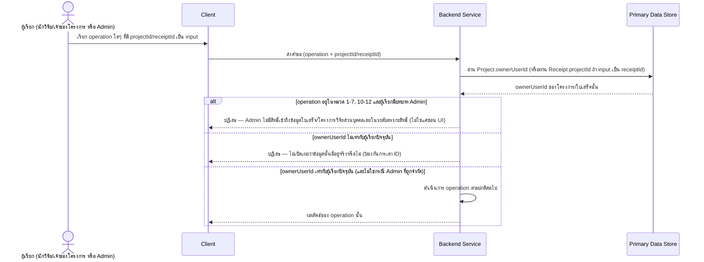

# Detailed Design — จำกัดสิทธิ์การเข้าถึงข้อมูลตามเจ้าของ (Access Control)

> การออกแบบระดับ component สำหรับ [[feature-list#9. จำกัดสิทธิ์การเข้าถึงข้อมูลตามเจ้าของ (Access Control)|ฟีเจอร์ที่ 9]]
> — ฟีเจอร์นี้**ไม่มี operation เฉพาะของตัวเอง** เป็น cross-cutting concern ตามที่
> [[api-spec#2. กฎการเข้าถึงข้อมูลแบบ Cross-Cutting (Access Control)|api-spec หัวข้อ 2]] ระบุไว้ตรงๆ
> เอกสารนี้จึงไม่มี sequence diagram ของ journey เดี่ยวๆ แต่แสดงกฎที่บังคับกับ**ทุก operation**ที่มี
> `projectId`/`receiptId` เป็น input แทน

## 0. สถานะเอกสารนี้

- สร้างครั้งแรกเมื่อ 2026-08-23 ครอบคลุม FR-12, NFR-05, NFR-10 ตามที่
  [[feature-list#9. จำกัดสิทธิ์การเข้าถึงข้อมูลตามเจ้าของ (Access Control)|ฟีเจอร์ที่ 9]] กำหนดไว้
- **อัปเดต 2026-09-03 (sync กับ [[architecture]]/[[api-spec]]/[[db-spec]] รอบแก้ไขโมเดลข้อมูล FR-23):**
  เดิมกฎนี้ตรวจสอบผ่าน `Fund.ownerUserId` ซึ่งผิด — ความเป็นเจ้าของที่แท้จริงอยู่ที่ระดับ **`Project`**
  แก้ไขทุกจุดที่อ้างถึง `Fund`/`fundId` เป็น `Project`/`projectId` แทน เพิ่มกฎข้อ 3 ว่า `fundSourceId`
  ไม่มีเจ้าของเป็นนักวิจัยคนใดคนหนึ่ง (ข้อมูลระดับองค์กร) จึงไม่ต้องตรวจสอบความเป็นเจ้าของแบบเดียวกัน
  เพิ่มแถว OP-18–OP-21 (ฟีเจอร์ที่ 13 ใหม่) ในตารางหัวข้อ 3 และปรับรหัส entity ให้ตรงกับ [[db-spec]]
  ที่จัดเรียงใหม่ (User = E-01, FundSource = E-02, Project = E-03)

## 1. ภาพรวม

กฎ 3 ข้อที่บังคับกับทุก operation ใน [[api-spec]] (ตาม
[[api-spec#2. กฎการเข้าถึงข้อมูลแบบ Cross-Cutting (Access Control)|api-spec หัวข้อ 2]]):

1. ก่อนประมวลผล operation ใดๆ ที่อ้างถึง `projectId`/`receiptId` ต้องตรวจสอบว่า `Project.ownerUserId`
   (หรือ `Project` ที่ `Receipt.projectId` ชี้ไป) เท่ากับผู้เรียกปัจจุบันเสมอ — ถ้าไม่ตรง ต้องปฏิเสธ
   การเข้าถึง **โดยไม่เปิดเผยว่าข้อมูลนั้นมีอยู่จริงหรือไม่** (ป้องกันการเดา ID)
2. **Admin ต้องถูกปฏิเสธจากทุก operation ในหมวดที่ 1–7, 10–12** (ใบเสร็จ/โครงการวิจัย/consent/สิทธิ์
   ข้อมูลส่วนบุคคล) ที่ระดับตรรกะสิทธิ์ ไม่ใช่แค่ซ่อนปุ่มใน UI — สิทธิ์ของ Admin จำกัดเฉพาะ
   [[admin-rule-management]] (OP-11, OP-12) และการอ่าน [[project-setup#OP-21 ดูรายการแหล่งทุนที่มีอยู่|OP-21]]
   เท่านั้น
3. **`fundSourceId` ไม่มีเจ้าของเป็นนักวิจัยคนใดคนหนึ่ง** (ข้อมูลระดับองค์กรที่ Admin ดูแล) จึง**ไม่
   ต้อง**ตรวจสอบความเป็นเจ้าของแบบข้อ 1 กับ operation ที่มีแค่ `fundSourceId` เป็น input (เช่น OP-21)
   — แต่การ**เขียน**ข้อมูลแหล่งทุน/ระเบียบ (OP-11) ยังคงจำกัดเฉพาะ Admin เท่านั้นตามข้อ 2

Component ที่บังคับใช้กฎนี้: **Backend Service** เพียงจุดเดียว (จุดเดียวที่ authoritative ตาม
[[architecture#2.1 ขอบเขตความรับผิดชอบต่อ Component|architecture 2.1]]) — Client ไม่ตรวจสอบเอง

## 2. Sequence Diagram — รูปแบบทั่วไปที่ใช้ร่วมกันในทุก operation

## 3. ตารางบังคับใช้กฎ Cross-Cutting ต่อทุก Operation

| Operation | มี `projectId`/`receiptId`/`fundSourceId` เป็น input? | ตรวจสอบเจ้าของ? | Admin เรียกได้? |
|---|---|---|---|
| OP-01 อัปโหลดใบเสร็จ | ใช่ (`projectId`) | ใช่ | ไม่ได้ |
| OP-02 อ่าน OCR (internal) | ใช่ (ผ่าน Receipt ที่สร้างจาก OP-01) | ใช่ (สืบทอดจาก OP-01) | ไม่มีผู้ใช้เรียกตรง |
| OP-03 ดึงข้อมูลตรวจทาน | ใช่ (`receiptId`) | ใช่ | ไม่ได้ |
| OP-04 ยืนยัน+ส่งเข้าตรวจ | ใช่ (`receiptId`) | ใช่ | ไม่ได้ |
| OP-05 ดูรายละเอียดผลตรวจ | ใช่ (`receiptId`) | ใช่ | ไม่ได้ |
| OP-06 แก้ไข+ส่งซ้ำ | ใช่ (`receiptId`) | ใช่ | ไม่ได้ |
| OP-07 อัปโหลดไฟล์ใหม่แทน | ใช่ (`receiptId`) | ใช่ | ไม่ได้ |
| OP-08 Dashboard | ใช่ (`projectId`) | ใช่ | ไม่ได้ |
| OP-09 รายการแจ้งเตือน | ไม่ (implicit ผู้เรียกปัจจุบัน) | ใช่ (กรองเฉพาะโครงการของผู้เรียก) | ไม่ได้ |
| OP-10 Export รายงาน | ใช่ (`projectId`) | ใช่ | ไม่ได้ |
| OP-11 นำเข้าระเบียบ | ใช่ (`fundSourceId` — ไม่มีเจ้าของเป็นนักวิจัย) | ไม่เกี่ยว (ไม่มีข้อมูลใบเสร็จส่วนบุคคล) | **ได้ (เฉพาะ Admin)** |
| OP-12 ดูเวอร์ชัน active ของแหล่งทุน | ใช่ (`fundSourceId` — ไม่มีเจ้าของเป็นนักวิจัย) | ไม่เกี่ยว | **ได้ (เฉพาะ Admin)** |
| OP-13 ดู Privacy Notice | ไม่ (implicit) | ไม่เกี่ยว (ข้อมูลสาธารณะ) | ไม่ได้ |
| OP-14 ให้ความยินยอม | ไม่ (implicit) | ใช่ (เฉพาะของตนเอง) | ไม่ได้ |
| OP-15 ถอนความยินยอม | ไม่ (implicit) | ใช่ (เฉพาะของตนเอง) | ไม่ได้ |
| OP-16 ขอสำเนาข้อมูลส่วนบุคคล | ไม่ (implicit) | ใช่ (เฉพาะของตนเอง) | ไม่ได้ |
| OP-17 ลบใบเสร็จ | ใช่ (`receiptId`) | ใช่ | ไม่ได้ |
| OP-18 ดูรายการโครงการวิจัยของตนเอง | ไม่ (implicit) | ใช่ (เฉพาะของตนเอง) | ไม่ได้ |
| OP-19 สร้างโครงการวิจัยใหม่ | ไม่ (implicit สำหรับ `ownerUserId`; รับ `fundSourceId` เป็น input ด้วย) | ใช่ (`ownerUserId` = ผู้เรียกเสมอ) | ไม่ได้ |
| OP-20 แก้ไขข้อมูลโครงการวิจัย | ใช่ (`projectId`) | ใช่ | ไม่ได้ |
| OP-21 ดูรายการแหล่งทุนที่มีอยู่ | ใช่ (`fundSourceId` เป็น output ไม่มีเจ้าของ) | ไม่เกี่ยว (ข้อมูลระดับองค์กร — กฎข้อ 3) | **ได้ (อ่านได้ทั้งนักวิจัยและ Admin)** |

## 4. State Diagram

ไม่มี — ฟีเจอร์นี้เป็นกฎ cross-cutting ไม่มี entity ที่มี state ของตัวเอง (การตรวจสอบเกิดขึ้นทุกครั้ง
ที่มีการเรียก operation อื่น ไม่ persist สถานะการตรวจสอบไว้ที่ใด)

## 5. Edge Case และวิธีจัดการ

| # | Edge Case | วิธีจัดการ | อ้างอิง |
|---|---|---|---|
| 1 | นักวิจัย A ทราบ/เดา ID ใบเสร็จหรือโครงการของนักวิจัย B | ปฏิเสธการเข้าถึง ไม่แสดงข้อมูลของ B ให้ A เห็น — ไม่เปิดเผยด้วยว่า ID นั้นมีอยู่จริงหรือไม่ (ป้องกันการเดา ID แบบ enumeration) | FR-12 AC-2, NFR-05 |
| 2 | Admin พยายามเข้าถึงข้อมูลใบเสร็จ/โครงการวิจัยส่วนบุคคลของนักวิจัยคนใดคนหนึ่ง | ปฏิเสธที่ระดับตรรกะสิทธิ์ ไม่ใช่แค่ซ่อนปุ่มใน UI | FR-12 AC-3 |
| 3 | นักวิจัยมีโครงการวิจัยมากกว่า 1 โครงการ | ใบเสร็จที่อัปโหลดผูกกับโครงการที่เลือกเท่านั้น ไม่ปรากฏในโครงการอื่นของนักวิจัยคนเดียวกัน | FR-01 AC-3 |
| 4 | เกิดเหตุการณ์ข้อมูลใบเสร็จรั่วไหล/ถูกเข้าถึงโดยไม่ได้รับอนุญาต | ต้องมีกลไก/กระบวนการแจ้งเตือน สคส. ภายใน 72 ชั่วโมง (organizational/process ไม่ใช่ functional logic ของระบบ) | NFR-10 |
| 5 | นักวิจัย/Admin อ่านรายการ `FundSource` ผ่าน OP-21 | อนุญาตทั้งคู่โดยไม่ต้องตรวจสอบความเป็นเจ้าของ (ข้อมูลระดับองค์กร ไม่มีเจ้าของเป็นนักวิจัยคนใดคนหนึ่ง) | กฎข้อ 3, FR-23 |

## เอกสารที่เกี่ยวข้อง

- [[feature-list#9. จำกัดสิทธิ์การเข้าถึงข้อมูลตามเจ้าของ (Access Control)|feature-list ฟีเจอร์ที่ 9]]
- [[api-spec#1. บทบาทผู้เรียก (Caller Roles)|api-spec หัวข้อ 1]], [[api-spec#2. กฎการเข้าถึงข้อมูลแบบ Cross-Cutting (Access Control)|api-spec หัวข้อ 2]]
- [[db-spec#E-01 ผู้ใช้ระบบ (User)|db-spec E-01]], [[db-spec#E-02 แหล่งทุน (FundSource)|E-02]], [[db-spec#E-03 โครงการวิจัย (Project)|E-03]]
- [[architecture#2.1 ขอบเขตความรับผิดชอบต่อ Component|architecture 2.1]]
- ฟีเจอร์อื่นทั้งหมด (1-8, 10-13) — ทุกฟีเจอร์อ้างอิงกฎในเอกสารนี้เป็นกฎ cross-cutting
- test case: `docs/03-testing/01-test-plan/test-cases/access-control.md`
