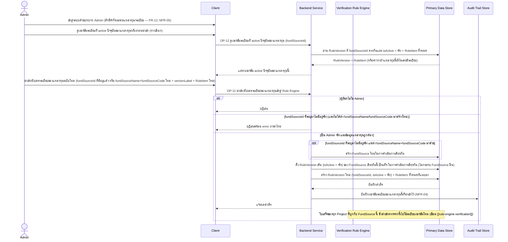
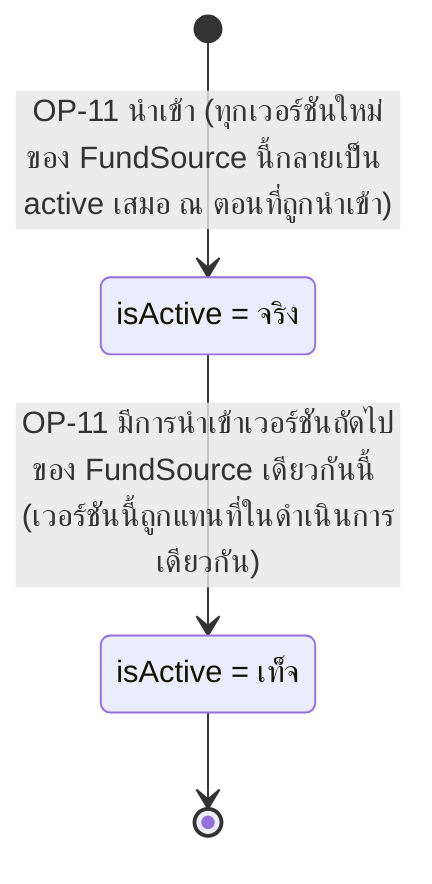

# Detailed Design — นำเข้า/อัปเดตระเบียบของแหล่งทุนเข้าสู่ Rule Engine (Admin)

> การออกแบบระดับ component สำหรับ [[feature-list#8. นำเข้า/อัปเดตระเบียบของแหล่งทุนเข้าสู่ Rule Engine (Admin)|ฟีเจอร์ที่ 8]]
> แปลงจาก [[user-journey#Journey 4: Admin นำเข้า/อัปเดตระเบียบของแหล่งทุนเข้าสู่ Rule Engine|Journey 4]]
> อ้างอิง operation จริงจาก [[api-spec#OP-11 นำเข้า/อัปเดตระเบียบของแหล่งทุนเข้าสู่ Rule Engine|OP-11]]
> และ [[api-spec#OP-12 ดูเวอร์ชันระเบียบที่ active ปัจจุบันของแหล่งทุน|OP-12]] เท่านั้น

## 0. สถานะเอกสารนี้

- สร้างครั้งแรกเมื่อ 2026-08-23 ครอบคลุม FR-11, NFR-04 ตามที่
  [[feature-list#8. นำเข้า/อัปเดตระเบียบของแหล่งทุนเข้าสู่ Rule Engine (Admin)|ฟีเจอร์ที่ 8]] กำหนดไว้
- **อัปเดต 2026-09-03 (sync กับ [[architecture]]/[[api-spec]]/[[db-spec]] รอบแก้ไขโมเดลข้อมูล FR-23):**
  เดิมระเบียบเป็นชุดเดียวรวมทั้งระบบ ("1 เวอร์ชัน active ทั้งระบบ") ซึ่งผิด — แก้ไขให้ระเบียบผูกกับ
  **`FundSource`** แต่ละแหล่ง (มีได้สูงสุด 1 เวอร์ชัน active **ต่อแหล่งทุนหนึ่ง**) OP-11 รับ
  `fundSourceId` (อัปเดตแหล่งทุนเดิม) **หรือ** `fundSourceName`+`fundSourceCode` (สร้างแหล่งทุนใหม่ใน
  การดำเนินการเดียวกัน) แทนการไม่มี input เจาะจงแหล่งทุนแบบเดิม, OP-12 เพิ่ม `fundSourceId` เป็น
  input บังคับ ปรับรหัส entity ให้ตรงกับ [[db-spec]] ที่จัดเรียงใหม่ (FundSource = E-02, RuleVersion
  = E-06, RuleItem = E-07, AuditLogEntry = E-14)

## 1. ภาพรวม

ฟีเจอร์นี้เป็นฟีเจอร์เดียวที่ **Admin** เข้าถึงได้ (จำกัดเฉพาะการจัดการแหล่งทุน/ระเบียบ/กฎใน Rule
Engine เท่านั้น — ห้ามเข้าถึงข้อมูลใบเสร็จ/โครงการวิจัยส่วนบุคคลของนักวิจัยเลย ดู [[access-control]])
ประกอบด้วย [[api-spec#OP-11 นำเข้า/อัปเดตระเบียบของแหล่งทุนเข้าสู่ Rule Engine|OP-11]] (นำเข้าเวอร์ชัน
ใหม่ของแหล่งทุนหนึ่งแหล่ง — รองรับสร้าง `FundSource` ใหม่ในการดำเนินการเดียวกันได้ด้วย) และ
[[api-spec#OP-12 ดูเวอร์ชันระเบียบที่ active ปัจจุบันของแหล่งทุน|OP-12]] (ตรวจสอบก่อน/หลังนำเข้า — ถูก
เรียกใช้ภายในเองด้วยที่ [[rule-engine-verification]] ตอน OP-04) — นักวิจัยอ่านรายการแหล่งทุนแบบ
read-only ผ่าน [[project-setup#OP-21 ดูรายการแหล่งทุนที่มีอยู่|OP-21]] เพื่อเลือกผูกกับโครงการของตนเอง

Component ที่เกี่ยวข้อง: Client, Backend Service, Verification Rule Engine, Primary Data Store,
Audit Trail Store

## 2. Sequence Diagram

## 3. Operation ↔ Entity ที่กระทบ

| Operation | Entity ที่กระทบ | การกระทำ | ลำดับ/เงื่อนไข |
|---|---|---|---|
| [[api-spec#OP-12 ดูเวอร์ชันระเบียบที่ active ปัจจุบันของแหล่งทุน\|OP-12]] | [[db-spec#E-06 เวอร์ชันระเบียบ (RuleVersion)\|RuleVersion]] (E-06) + [[db-spec#E-07 ข้อกำหนดย่อยระเบียบ (RuleItem)\|RuleItem]] (E-07) | อ่าน (`fundSourceId` ตรงกัน + `isActive` = จริง) | ต้องมีผลลัพธ์เพียง 1 เวอร์ชัน**ต่อแหล่งทุนนี้**เสมอ (db-spec กฎข้อ 7) — ถ้าไม่มีเลย คืนค่าว่าง |
| [[api-spec#OP-11 นำเข้า/อัปเดตระเบียบของแหล่งทุนเข้าสู่ Rule Engine\|OP-11]] | [[db-spec#E-02 แหล่งทุน (FundSource)\|FundSource]] (E-02) | สร้าง (ถ้าเป็นแหล่งทุนใหม่) หรืออ่าน (ถ้าอัปเดตแหล่งทุนเดิม) | สร้างใหม่เฉพาะเมื่อไม่ได้ส่ง `fundSourceId` ของแหล่งทุนที่มีอยู่แล้ว แต่ส่ง `fundSourceName`/`fundSourceCode` มาแทน |
| OP-11 | RuleVersion (E-06) | แก้ไข (เวอร์ชันเดิมของ FundSource เดียวกัน `isActive` → เท็จ) แล้ว สร้าง (เวอร์ชันใหม่ `isActive` = จริง) | ต้องทำ 2 การกระทำนี้ในดำเนินการเดียวกันเสมอ — ห้ามมี 2 เวอร์ชัน active พร้อมกัน**ของ FundSource เดียวกัน** (db-spec กฎข้อ 7) ไม่กระทบ `isActive` ของ FundSource อื่น |
| OP-11 | RuleItem (E-07) | สร้าง (N records) | ผูกกับ `RuleVersion` ใหม่ที่สร้างในคำขอเดียวกัน |
| OP-11 | [[db-spec#E-14 บันทึกเหตุการณ์ตรวจสอบย้อนหลัง (AuditLogEntry)\|AuditLogEntry]] (E-14) — ผ่าน Audit Trail Store | สร้าง (บันทึกเวอร์ชันที่นำเข้า) | NFR-04 |

## 4. State Diagram — วงจรชีวิตของ RuleVersion แต่ละ record (ต่อ FundSource หนึ่ง)

> เวอร์ชันที่กลายเป็น `isActive = เท็จ` แล้ว **ไม่กลับมาเป็นจริงอีก** (ไม่มี "rollback" เวอร์ชัน) — ถ้า
> ต้องการใช้กฎเดิมอีกครั้ง ต้อง "นำเข้า" เป็นเวอร์ชันใหม่ที่มีเนื้อหาเดียวกัน (ยังไม่มี operation
> สำหรับ "ย้อนกลับไปใช้เวอร์ชันก่อนหน้า" โดยเฉพาะใน [[api-spec]] ปัจจุบัน) — สถานะนี้เป็นแบบแยกอิสระ
> **ต่อ FundSource หนึ่ง** ไม่กระทบเวอร์ชันของ FundSource อื่น

## 5. Edge Case และวิธีจัดการ

| # | Edge Case | วิธีจัดการ | อ้างอิง |
|---|---|---|---|
| 1 | ผู้เรียกไม่ใช่ Admin | ปฏิเสธ | [[api-spec#OP-11 นำเข้า/อัปเดตระเบียบของแหล่งทุนเข้าสู่ Rule Engine\|OP-11]], [[api-spec#OP-12 ดูเวอร์ชันระเบียบที่ active ปัจจุบันของแหล่งทุน\|OP-12]] |
| 2 | นำเข้าเวอร์ชันใหม่ของ FundSource หนึ่งสำเร็จ | เวอร์ชันเดิม**ของ FundSource เดียวกันนั้น**ต้องถูกตั้ง `isActive` = เท็จ ในดำเนินการเดียวกันเสมอ (ห้าม leave 2 เวอร์ชัน active พร้อมกันของแหล่งทุนเดียวกัน) — ไม่กระทบ FundSource อื่น | db-spec กฎข้อ 7 |
| 3 | ยังไม่มี RuleVersion active เลยสำหรับ FundSource หนึ่ง (Admin ยังไม่เคยนำเข้าระเบียบให้แหล่งทุนนี้) | OP-12 คืนค่าว่างพร้อมสถานะ "ยังไม่มีระเบียบให้ใช้ตรวจสำหรับแหล่งทุนนี้" — บล็อก OP-04/OP-06/OP-07 ของใบเสร็จที่ผูกกับโครงการที่สังกัดแหล่งทุนนี้ ไม่ให้ตัดสินใบเสร็จได้จนกว่าจะนำเข้าระเบียบแรก | [[api-spec#OP-12 ดูเวอร์ชันระเบียบที่ active ปัจจุบันของแหล่งทุน\|OP-12]] |
| 4 | `fundSourceId` ที่ระบุมาไม่มีอยู่จริง และไม่ได้ส่ง `fundSourceName`/`fundSourceCode` มาสร้างใหม่ | ปฏิเสธพร้อม error ภาษาไทย | [[api-spec#OP-11 นำเข้า/อัปเดตระเบียบของแหล่งทุนเข้าสู่ Rule Engine\|OP-11]] |
| 5 | ใบเสร็จของทุก Project ที่ผูกกับ FundSource ที่ยังไม่ถูกส่งตรวจ ณ ขณะนำเข้าระเบียบใหม่ | ใช้เวอร์ชันใหม่ทันทีในการตรวจครั้งต่อไป — ไม่กระทบ `VerificationResult` เดิมที่มีอยู่แล้ว (เป็น snapshot คนละ record) | [[api-spec#OP-11 นำเข้า/อัปเดตระเบียบของแหล่งทุนเข้าสู่ Rule Engine\|OP-11]] กฎข้อ 3 |
| 6 | Admin นำเข้าระเบียบใหม่ของแหล่งทุนหนึ่ง | ไม่ retrain/แก้ไข External LLM Explanation Service ใดๆ (LLM ไม่เกี่ยวกับการนำเข้าระเบียบ) | OP-11 กฎข้อ 2 |

## เอกสารที่เกี่ยวข้อง

- [[feature-list#8. นำเข้า/อัปเดตระเบียบของแหล่งทุนเข้าสู่ Rule Engine (Admin)|feature-list ฟีเจอร์ที่ 8]]
- [[user-journey#Journey 4: Admin นำเข้า/อัปเดตระเบียบของแหล่งทุนเข้าสู่ Rule Engine|user-journey Journey 4]]
- [[api-spec#OP-11 นำเข้า/อัปเดตระเบียบของแหล่งทุนเข้าสู่ Rule Engine|api-spec OP-11]], [[api-spec#OP-12 ดูเวอร์ชันระเบียบที่ active ปัจจุบันของแหล่งทุน|OP-12]]
- [[db-spec#E-02 แหล่งทุน (FundSource)|db-spec E-02]], [[db-spec#E-06 เวอร์ชันระเบียบ (RuleVersion)|E-06]], [[db-spec#E-07 ข้อกำหนดย่อยระเบียบ (RuleItem)|E-07]]
- [[rule-engine-verification]] — ผู้ใช้ผลลัพธ์ของฟีเจอร์นี้ (RuleVersion active ของ FundSource ที่ Project สังกัด)
- [[project-setup]] — จุดที่นักวิจัยเลือกผูกโครงการเข้ากับ FundSource ที่ฟีเจอร์นี้นำเข้าไว้
- [[access-control]] — ขอบเขตสิทธิ์ของ Admin
- test case: `docs/03-testing/01-test-plan/test-cases/admin-rule-management.md`
