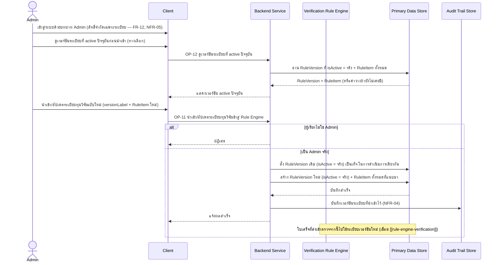
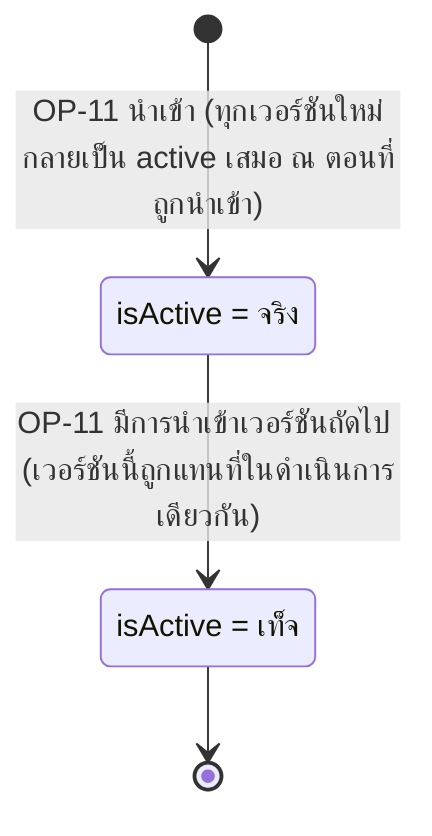

# Detailed Design — นำเข้า/อัปเดตระเบียบทุนวิจัยเข้าสู่ Rule Engine (Admin)

> การออกแบบระดับ component สำหรับ [[feature-list#8. นำเข้า/อัปเดตระเบียบทุนวิจัยเข้าสู่ Rule Engine (Admin)|ฟีเจอร์ที่ 8]]
> แปลงจาก [[user-journey#Journey 4: Admin นำเข้า/อัปเดตระเบียบทุนวิจัยเข้าสู่ Rule Engine|Journey 4]]
> อ้างอิง operation จริงจาก [[api-spec#OP-11 นำเข้า/อัปเดตระเบียบทุนวิจัยเข้าสู่ Rule Engine|OP-11]]
> และ [[api-spec#OP-12 ดูเวอร์ชันระเบียบที่ active ปัจจุบัน|OP-12]] เท่านั้น

## 0. สถานะเอกสารนี้

สร้างครั้งแรกเมื่อ 2026-08-23 ครอบคลุม FR-11, NFR-04 ตามที่
[[feature-list#8. นำเข้า/อัปเดตระเบียบทุนวิจัยเข้าสู่ Rule Engine (Admin)|ฟีเจอร์ที่ 8]] กำหนดไว้

## 1. ภาพรวม

ฟีเจอร์นี้เป็นฟีเจอร์เดียวที่ **Admin** เข้าถึงได้ (จำกัดเฉพาะการจัดการระเบียบ/กฎใน Rule Engine
เท่านั้น — ห้ามเข้าถึงข้อมูลใบเสร็จส่วนบุคคลของนักวิจัยเลย ดู [[access-control]]) ประกอบด้วย
[[api-spec#OP-11 นำเข้า/อัปเดตระเบียบทุนวิจัยเข้าสู่ Rule Engine|OP-11]] (นำเข้าเวอร์ชันใหม่) และ
[[api-spec#OP-12 ดูเวอร์ชันระเบียบที่ active ปัจจุบัน|OP-12]] (ตรวจสอบก่อน/หลังนำเข้า — ถูกเรียกใช้
ภายในเองด้วยที่ [[rule-engine-verification]] ตอน OP-04)

Component ที่เกี่ยวข้อง: Client, Backend Service, Verification Rule Engine, Primary Data Store,
Audit Trail Store

## 2. Sequence Diagram

## 3. Operation ↔ Entity ที่กระทบ

| Operation | Entity ที่กระทบ | การกระทำ | ลำดับ/เงื่อนไข |
|---|---|---|---|
| [[api-spec#OP-12 ดูเวอร์ชันระเบียบที่ active ปัจจุบัน\|OP-12]] | [[db-spec#E-04 เวอร์ชันระเบียบ (RuleVersion)\|RuleVersion]] (E-04) + [[db-spec#E-05 ข้อกำหนดย่อยระเบียบ (RuleItem)\|RuleItem]] (E-05) | อ่าน (`isActive` = จริง) | ต้องมีผลลัพธ์เพียง 1 เวอร์ชันเสมอ (db-spec กฎข้อ 7) — ถ้าไม่มีเลย คืนค่าว่าง |
| [[api-spec#OP-11 นำเข้า/อัปเดตระเบียบทุนวิจัยเข้าสู่ Rule Engine\|OP-11]] | RuleVersion (E-04) | แก้ไข (เวอร์ชันเดิม `isActive` → เท็จ) แล้ว สร้าง (เวอร์ชันใหม่ `isActive` = จริง) | ต้องทำ 2 การกระทำนี้ในดำเนินการเดียวกันเสมอ — ห้ามมี 2 เวอร์ชัน active พร้อมกัน (db-spec กฎข้อ 7) |
| OP-11 | RuleItem (E-05) | สร้าง (N records) | ผูกกับ `RuleVersion` ใหม่ที่สร้างในคำขอเดียวกัน |
| OP-11 | [[db-spec#E-12 บันทึกเหตุการณ์ตรวจสอบย้อนหลัง (AuditLogEntry)\|AuditLogEntry]] (E-12) — ผ่าน Audit Trail Store | สร้าง (บันทึกเวอร์ชันที่นำเข้า) | NFR-04 |

## 4. State Diagram — วงจรชีวิตของ RuleVersion แต่ละ record

> เวอร์ชันที่กลายเป็น `isActive = เท็จ` แล้ว **ไม่กลับมาเป็นจริงอีก** (ไม่มี "rollback" เวอร์ชัน) — ถ้า
> ต้องการใช้กฎเดิมอีกครั้ง ต้อง "นำเข้า" เป็นเวอร์ชันใหม่ที่มีเนื้อหาเดียวกัน (ยังไม่มี operation
> สำหรับ "ย้อนกลับไปใช้เวอร์ชันก่อนหน้า" โดยเฉพาะใน [[api-spec]] ปัจจุบัน)

## 5. Edge Case และวิธีจัดการ

| # | Edge Case | วิธีจัดการ | อ้างอิง |
|---|---|---|---|
| 1 | ผู้เรียกไม่ใช่ Admin | ปฏิเสธ | [[api-spec#OP-11 นำเข้า/อัปเดตระเบียบทุนวิจัยเข้าสู่ Rule Engine\|OP-11]], [[api-spec#OP-12 ดูเวอร์ชันระเบียบที่ active ปัจจุบัน\|OP-12]] |
| 2 | นำเข้าเวอร์ชันใหม่สำเร็จ | เวอร์ชันเดิมต้องถูกตั้ง `isActive` = เท็จ ในดำเนินการเดียวกันเสมอ (ห้าม leave 2 เวอร์ชัน active พร้อมกัน) | db-spec กฎข้อ 7 |
| 3 | ยังไม่มี RuleVersion active เลย (Admin ยังไม่เคยนำเข้าระเบียบ) | OP-12 คืนค่าว่างพร้อมสถานะ "ยังไม่มีระเบียบให้ใช้ตรวจ" — บล็อก OP-04/OP-06/OP-07 ไม่ให้ตัดสินใบเสร็จได้จนกว่าจะนำเข้าระเบียบแรก | [[api-spec#OP-12 ดูเวอร์ชันระเบียบที่ active ปัจจุบัน\|OP-12]] |
| 4 | ใบเสร็จที่ยังไม่ถูกส่งตรวจ ณ ขณะนำเข้าระเบียบใหม่ | ใช้เวอร์ชันใหม่ทันทีในการตรวจครั้งต่อไป — ไม่กระทบ `VerificationResult` เดิมที่มีอยู่แล้ว (เป็น snapshot คนละ record) | [[api-spec#OP-11 นำเข้า/อัปเดตระเบียบทุนวิจัยเข้าสู่ Rule Engine\|OP-11]] กฎข้อ 3 |
| 5 | Admin นำเข้าระเบียบใหม่ | ไม่ retrain/แก้ไข External LLM Explanation Service ใดๆ (LLM ไม่เกี่ยวกับการนำเข้าระเบียบ) | OP-11 กฎข้อ 2 |

## เอกสารที่เกี่ยวข้อง

- [[feature-list#8. นำเข้า/อัปเดตระเบียบทุนวิจัยเข้าสู่ Rule Engine (Admin)|feature-list ฟีเจอร์ที่ 8]]
- [[user-journey#Journey 4: Admin นำเข้า/อัปเดตระเบียบทุนวิจัยเข้าสู่ Rule Engine|user-journey Journey 4]]
- [[api-spec#OP-11 นำเข้า/อัปเดตระเบียบทุนวิจัยเข้าสู่ Rule Engine|api-spec OP-11]], [[api-spec#OP-12 ดูเวอร์ชันระเบียบที่ active ปัจจุบัน|OP-12]]
- [[db-spec#E-04 เวอร์ชันระเบียบ (RuleVersion)|db-spec E-04]], [[db-spec#E-05 ข้อกำหนดย่อยระเบียบ (RuleItem)|E-05]]
- [[rule-engine-verification]] — ผู้ใช้ผลลัพธ์ของฟีเจอร์นี้ (RuleVersion active)
- [[access-control]] — ขอบเขตสิทธิ์ของ Admin
- test case: `docs/03-testing/01-test-plan/test-cases/admin-rule-management.md`
