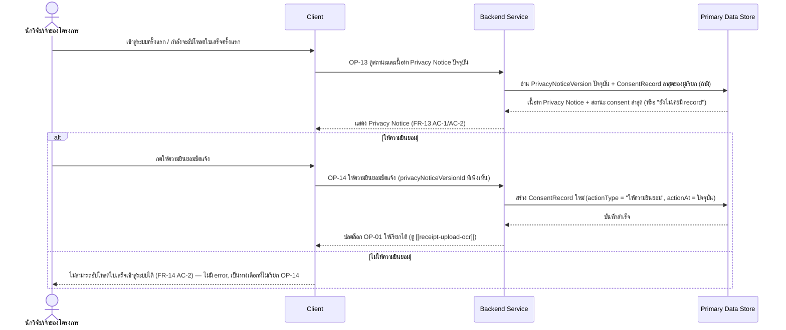
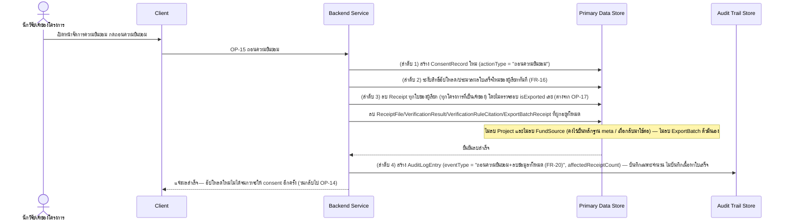
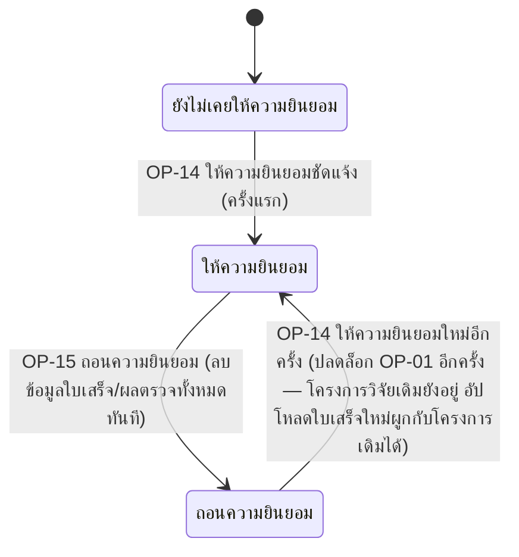

# Detailed Design — แจ้ง Privacy Notice และจัดการความยินยอม (Consent Management)

> การออกแบบระดับ component สำหรับ [[feature-list#10. แจ้ง Privacy Notice และจัดการความยินยอม (Consent Management)|ฟีเจอร์ที่ 10]]
> แปลงจาก [[user-journey#Journey 1: นักวิจัยอัปโหลดใบเสร็จและตรวจสอบผลจนผ่านเกณฑ์|Journey 1 ขั้นตอนที่ 2-3]]
> และ [[user-journey#Journey 5: นักวิจัยถอนความยินยอม (Withdraw Consent) และผลกระทบต่อการใช้งานระบบ|Journey 5]]
> อ้างอิง operation จริงจาก [[api-spec#OP-13 ดูสถานะและเนื้อหา Privacy Notice ปัจจุบัน|OP-13]],
> [[api-spec#OP-14 ให้ความยินยอมชัดแจ้ง|OP-14]], [[api-spec#OP-15 ถอนความยินยอม (รวมการลบข้อมูลทั้งหมดทันที)|OP-15]]
> เท่านั้น

## 0. สถานะเอกสารนี้

- สร้างครั้งแรกเมื่อ 2026-08-23 ครอบคลุม FR-13, FR-14, FR-15, FR-16, FR-20, NFR-11 ตามที่
  [[feature-list#10. แจ้ง Privacy Notice และจัดการความยินยอม (Consent Management)|ฟีเจอร์ที่ 10]]
  กำหนดไว้
- **อัปเดต 2026-09-03 (sync กับ [[architecture]]/[[api-spec]]/[[db-spec]] รอบแก้ไขโมเดลข้อมูล FR-23):**
  เดิมข้อความ OP-15 อ้างถึง "ไม่ลบ Fund" ซึ่งปนแนวคิดเดิม — แก้เป็น **"ไม่ลบ `Project` และไม่ลบ
  `FundSource`"** (ทั้งสอง entity ไม่ถูกลบเมื่อถอนความยินยอม) ปรับรหัส entity ทั้งหมดให้ตรงกับ
  [[db-spec]] ที่จัดเรียงใหม่ (Receipt = E-04, ReceiptFile = E-05, VerificationResult = E-08,
  VerificationRuleCitation = E-09, PrivacyNoticeVersion = E-10, ConsentRecord = E-11,
  ExportBatchReceipt = E-13, AuditLogEntry = E-14) เปลี่ยนคำเรียกบทบาทเป็น "นักวิจัย/เจ้าของโครงการ"

## 1. ภาพรวม

ฟีเจอร์นี้มี 3 operation: [[api-spec#OP-13 ดูสถานะและเนื้อหา Privacy Notice ปัจจุบัน|OP-13]]
(read-only, แสดงก่อนใช้งาน/อัปโหลดครั้งแรก), [[api-spec#OP-14 ให้ความยินยอมชัดแจ้ง|OP-14]] (ปลดล็อก
[[receipt-upload-ocr]]), และ [[api-spec#OP-15 ถอนความยินยอม (รวมการลบข้อมูลทั้งหมดทันที)|OP-15]]
(ระงับสิทธิ์ทันที **พร้อมลบข้อมูลใบเสร็จ/ผลตรวจทั้งหมดในลำดับเดียวกัน** — ต่างจาก
[[right-to-erasure]]/FR-18 โดยเจตนา เพราะ FR-20 ไม่มีเงื่อนไขจำกัดตามสถานะ export)

Component ที่เกี่ยวข้อง: Client, Backend Service, Primary Data Store, Audit Trail Store

## 2. Sequence Diagram

### 2.1 ให้ความยินยอมครั้งแรก (OP-13 → OP-14)

### 2.2 ถอนความยินยอม (OP-15)

## 3. Operation ↔ Entity ที่กระทบ

| Operation | Entity ที่กระทบ | การกระทำ | ลำดับ/เงื่อนไข |
|---|---|---|---|
| [[api-spec#OP-13 ดูสถานะและเนื้อหา Privacy Notice ปัจจุบัน\|OP-13]] | [[db-spec#E-10 เวอร์ชันประกาศความเป็นส่วนตัว (PrivacyNoticeVersion)\|PrivacyNoticeVersion]] (E-10) | อ่าน | ไม่มีการแก้ไข — read-only เสมอ |
| OP-13 | [[db-spec#E-11 ประวัติความยินยอม (ConsentRecord)\|ConsentRecord]] (E-11) | อ่าน (record ล่าสุดตาม `actionAt`) | ใช้คำนวณสถานะ consent ปัจจุบันของผู้เรียก |
| [[api-spec#OP-14 ให้ความยินยอมชัดแจ้ง\|OP-14]] | ConsentRecord (E-11) | สร้าง (`actionType` = "ให้ความยินยอม") | ต้องบันทึกคู่กับ `privacyNoticeVersionId` ที่เห็นจริง ณ ตอนนั้น (append-only) |
| [[api-spec#OP-15 ถอนความยินยอม (รวมการลบข้อมูลทั้งหมดทันที)\|OP-15]] | ConsentRecord (E-11) | สร้าง (`actionType` = "ถอนความยินยอม") | ลำดับ 1 — เกิดก่อนการลบข้อมูลเสมอ |
| OP-15 | [[db-spec#E-04 ใบเสร็จ (Receipt)\|Receipt]] (E-04), [[db-spec#E-05 ไฟล์ประกอบใบเสร็จ (ReceiptFile)\|ReceiptFile]] (E-05), [[db-spec#E-08 ผลตรวจใบเสร็จ (VerificationResult)\|VerificationResult]] (E-08), [[db-spec#E-09 ข้อระเบียบที่อ้างอิงในผลตรวจ (VerificationRuleCitation)\|VerificationRuleCitation]] (E-09), [[db-spec#E-13 ใบเสร็จในรอบ Export (ExportBatchReceipt)\|ExportBatchReceipt]] (E-13) | ลบทั้งหมด | ลำดับ 3 — ลบโดย**ไม่ตรวจสอบ** `isExported` (ต่างจาก [[right-to-erasure]]) — ไม่ลบ `Project`/`FundSource`/`ExportBatch` ตัวมันเอง |
| OP-15 | [[db-spec#E-14 บันทึกเหตุการณ์ตรวจสอบย้อนหลัง (AuditLogEntry)\|AuditLogEntry]] (E-14) | สร้าง | ลำดับ 4 — บันทึกเฉพาะ meta (จำนวน) ไม่บันทึกเนื้อหาใบเสร็จ |

## 4. State Diagram — สถานะความยินยอมปัจจุบันของผู้ใช้ 1 คน (คำนวณจาก ConsentRecord ล่าสุด)

> สถานะนี้ไม่ได้เก็บเป็น field แยกที่ overwrite ได้ตรงๆ — คำนวณจาก `ConsentRecord` ที่มี `actionAt`
> ล่าสุดเสมอ (append-only ตาม db-spec กฎข้อ 8) เพื่อรักษาประวัติสำหรับ Accountability (FR-15)

## 5. Edge Case และวิธีจัดการ

| # | Edge Case | วิธีจัดการ | อ้างอิง |
|---|---|---|---|
| 1 | นักวิจัยเข้าสู่ระบบครั้งแรก | แสดง Privacy Notice ก่อนให้ใช้งานฟีเจอร์อื่น | FR-13 AC-1 |
| 2 | เคยเห็น Privacy Notice ตอนเข้าระบบแล้ว แต่ยังไม่เคยอัปโหลดใบเสร็จ | ยืนยันว่ามีการแสดง Privacy Notice/ขอความยินยอมแล้วก่อนเริ่มเก็บ/ประมวลผลข้อมูลใบเสร็จจริง (เชื่อม FR-14) | FR-13 AC-2 |
| 3 | ไม่ให้ความยินยอม | ไม่อนุญาตให้อัปโหลดใบเสร็จเข้าสู่ระบบ — ไม่ใช่ error เป็นทางเลือกที่ไม่เรียก OP-14 | FR-14 AC-2 |
| 4 | ให้ความยินยอมสำเร็จ | บันทึกวันที่ + เวอร์ชัน Privacy Notice ที่เห็น ณ ตอนนั้น (Accountability) | FR-15 AC-1 |
| 5 | ถอนความยินยอม | ระงับอัปโหลด/ประมวลผลใหม่ทันที **และ**ลบข้อมูลใบเสร็จ/ผลตรวจทั้งหมดทันทีในลำดับเดียวกัน โดยไม่แยกตามสถานะ export | FR-16 AC-1, FR-20 AC-1/AC-2 |
| 6 | ถอนความยินยอมแล้วมีทั้งใบที่ export ไปแล้วและใบที่ยังไม่ export | ลบทั้งหมดเหมือนกัน ไม่แยกกรณี (ต่างจาก [[right-to-erasure]]/FR-18 ที่ยังคงเงื่อนไขล็อกใบที่ export แล้ว) — เหตุผล: ไม่มีฐานทางกฎหมายเหลืออยู่หลังถอน consent | FR-20 AC-1 |
| 7 | `Project`/`FundSource`/`ExportBatch` เมื่อถอนความยินยอม | ไม่ถูกลบทั้งคู่ — `Project` เผื่อกลับมาให้ consent ใหม่แล้วอัปโหลดใบเสร็จผูกโครงการเดิมได้ต่อ, `FundSource` ไม่มีเจ้าของเป็นนักวิจัยจึงไม่เกี่ยวกับ consent เลย, `ExportBatch` เก็บ record เปล่าไว้เป็นหลักฐาน meta ว่ามีการ export เกิดขึ้นจริงในอดีต | db-spec E-02/E-03 สมมติฐาน, db-spec กฎข้อ 6 |
| 8 | เนื้อหา Privacy Notice ต้องมีอะไรบ้าง | ต้องระบุระยะเวลาเก็บข้อมูล/นโยบายเก็บ-ลบข้อมูลแม้ตัวเลขจริงยังเป็น TBD (ต้องระบุว่ามีนโยบายอยู่) | NFR-11 AC-1 |

## เอกสารที่เกี่ยวข้อง

- [[feature-list#10. แจ้ง Privacy Notice และจัดการความยินยอม (Consent Management)|feature-list ฟีเจอร์ที่ 10]]
- [[user-journey#Journey 1: นักวิจัยอัปโหลดใบเสร็จและตรวจสอบผลจนผ่านเกณฑ์|user-journey Journey 1]],
  [[user-journey#Journey 5: นักวิจัยถอนความยินยอม (Withdraw Consent) และผลกระทบต่อการใช้งานระบบ|Journey 5]]
- [[api-spec#OP-13 ดูสถานะและเนื้อหา Privacy Notice ปัจจุบัน|api-spec OP-13]],
  [[api-spec#OP-14 ให้ความยินยอมชัดแจ้ง|OP-14]],
  [[api-spec#OP-15 ถอนความยินยอม (รวมการลบข้อมูลทั้งหมดทันที)|OP-15]]
- [[db-spec#E-10 เวอร์ชันประกาศความเป็นส่วนตัว (PrivacyNoticeVersion)|db-spec E-10]],
  [[db-spec#E-11 ประวัติความยินยอม (ConsentRecord)|E-11]]
- [[receipt-upload-ocr]] — ฟีเจอร์ที่ถูกปลดล็อก/ระงับโดยฟีเจอร์นี้
- [[right-to-erasure]] — เปรียบเทียบเงื่อนไขการลบที่ต่างกัน (FR-18 vs FR-20)
- test case: `docs/03-testing/01-test-plan/test-cases/consent-management.md`
