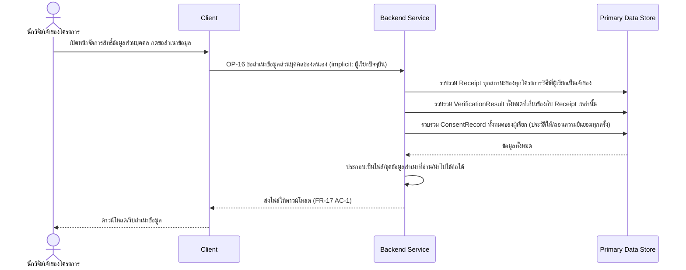

# Detailed Design — ขอเข้าถึง/ขอสำเนาข้อมูลส่วนบุคคลของตนเอง (Data Access & Portability)

> การออกแบบระดับ component สำหรับ [[feature-list#11. ขอเข้าถึง/ขอสำเนาข้อมูลส่วนบุคคลของตนเอง (Data Access & Portability)|ฟีเจอร์ที่ 11]]
> แปลงจาก [[user-journey#Journey 6: นักวิจัยขอเข้าถึง/ขอสำเนาข้อมูลส่วนบุคคลของตนเอง (Data Access & Portability)|Journey 6]]
> อ้างอิง operation จริงจาก [[api-spec#OP-16 ขอสำเนาข้อมูลส่วนบุคคลของตนเอง|OP-16]] เท่านั้น

## 0. สถานะเอกสารนี้

- สร้างครั้งแรกเมื่อ 2026-08-23 ครอบคลุม FR-17 ตามที่
  [[feature-list#11. ขอเข้าถึง/ขอสำเนาข้อมูลส่วนบุคคลของตนเอง (Data Access & Portability)|ฟีเจอร์ที่ 11]]
  กำหนดไว้
- **อัปเดต 2026-09-03**: แก้ "ทุกทุนที่ผู้เรียกถือ" เป็น "ทุกโครงการวิจัยที่ผู้เรียกเป็นเจ้าของ" ปรับ
  รหัส entity ให้ตรงกับ [[db-spec]] ที่จัดเรียงใหม่ (Receipt = E-04, VerificationResult = E-08,
  ConsentRecord = E-11) เปลี่ยนคำเรียกบทบาทเป็น "นักวิจัย/เจ้าของโครงการ"

## 1. ภาพรวม

ฟีเจอร์นี้มี operation เดียวคือ [[api-spec#OP-16 ขอสำเนาข้อมูลส่วนบุคคลของตนเอง|OP-16]] เป็น
read-only ทั้งหมด — คืน `Receipt` **ทุกสถานะ** ของทุกโครงการวิจัยที่ผู้เรียกเป็นเจ้าของ (ไม่ใช่แค่
สถานะ "ผ่าน" แบบ [[export-verified-report]]/OP-10), `VerificationResult` ทั้งหมดที่เกี่ยวข้อง, และ
`ConsentRecord` ทั้งหมด (ประวัติให้/ถอนความยินยอม) — ตั้งใจแยกเจตนาจาก OP-10 อย่างชัดเจน (สำเนาข้อมูล
ส่วนบุคคลตามสิทธิ์ PDPA ไม่ใช่รายงานสรุปสำหรับยื่นเจ้าหน้าที่การเงิน)

ตามที่ [[architecture#3. Data Flow Diagram ต่อ Journey หลัก|architecture หัวข้อ 3]] ระบุไว้ Journey นี้
มี pattern เดียวกับ [[export-verified-report]]/Journey 3 (รวบรวมจาก Data Store แล้วส่งไฟล์ให้
ดาวน์โหลด) เพียงต่างขอบเขตข้อมูลที่ดึง

Component ที่เกี่ยวข้อง: Client, Backend Service, Primary Data Store

## 2. Sequence Diagram

## 3. Operation ↔ Entity ที่กระทบ

| Operation | Entity ที่กระทบ | การกระทำ | ลำดับ/เงื่อนไข |
|---|---|---|---|
| [[api-spec#OP-16 ขอสำเนาข้อมูลส่วนบุคคลของตนเอง\|OP-16]] | [[db-spec#E-04 ใบเสร็จ (Receipt)\|Receipt]] (E-04) | อ่าน (**ทุกสถานะ**, ทุกโครงการวิจัยของผู้เรียก) | ครบถ้วนกว่า [[export-verified-report]] เสมอ (ไม่กรองเฉพาะ "ผ่าน") |
| OP-16 | [[db-spec#E-08 ผลตรวจใบเสร็จ (VerificationResult)\|VerificationResult]] (E-08) | อ่าน (ทั้งหมดที่เกี่ยวข้อง) | รวมทุก record แม้ใบเสร็จถูกส่งตรวจซ้ำหลายรอบ (append-only history) |
| OP-16 | [[db-spec#E-11 ประวัติความยินยอม (ConsentRecord)\|ConsentRecord]] (E-11) | อ่าน (ทั้งหมด) | รวมประวัติให้/ถอนความยินยอมทุกครั้ง ไม่ใช่แค่ record ล่าสุด |

ไม่มีการแก้ไข entity ใดในฟีเจอร์นี้ — เป็น read-only ทั้งหมด

## 4. State Diagram

ไม่มี — ฟีเจอร์นี้เป็น read-only ทั้งหมด ไม่มีการเปลี่ยนแปลงสถานะของ entity ใดๆ

## 5. Edge Case และวิธีจัดการ

| # | Edge Case | วิธีจัดการ | อ้างอิง |
|---|---|---|---|
| 1 | นักวิจัยมีข้อมูลใบเสร็จ/ผลตรวจ/ประวัติ consent ครบทุกประเภท | คืนสำเนาครบทั้ง 3 ประเภท ในรูปแบบที่อ่าน/นำไปใช้ต่อได้ | FR-17 AC-1 |
| 2 | ไม่มีข้อมูลใบเสร็จเลย (แต่มีประวัติ consent) | คืนสำเนาที่มีแต่ประวัติ consent ได้ ไม่ใช่ error | [[api-spec#OP-16 ขอสำเนาข้อมูลส่วนบุคคลของตนเอง\|OP-16]] |
| 3 | นักวิจัยเคย export รายงาน (FR-10) มาก่อน | สำเนาที่ได้จากฟีเจอร์นี้ต้องครบถ้วนกว่ารายงานสรุปของ FR-10 เสมอ (รวมทุกสถานะ+ผลตรวจ+ประวัติ consent ไม่ใช่แค่ใบที่ผ่าน) | FR-17 AC-2 |

## เอกสารที่เกี่ยวข้อง

- [[feature-list#11. ขอเข้าถึง/ขอสำเนาข้อมูลส่วนบุคคลของตนเอง (Data Access & Portability)|feature-list ฟีเจอร์ที่ 11]]
- [[user-journey#Journey 6: นักวิจัยขอเข้าถึง/ขอสำเนาข้อมูลส่วนบุคคลของตนเอง (Data Access & Portability)|user-journey Journey 6]]
- [[api-spec#OP-16 ขอสำเนาข้อมูลส่วนบุคคลของตนเอง|api-spec OP-16]]
- [[db-spec#5.2 รูปแบบไฟล์รายงาน Export (FR-10) และรูปแบบไฟล์สำเนาข้อมูลส่วนบุคคล (FR-17)|db-spec หัวข้อ 5.2]] (รูปแบบไฟล์ยังเป็น open point รอ [[technology-stack]])
- [[export-verified-report]] — เปรียบเทียบขอบเขตข้อมูลที่ต่างกัน (FR-10 vs FR-17)
- test case: `docs/03-testing/01-test-plan/test-cases/data-access-portability.md`
