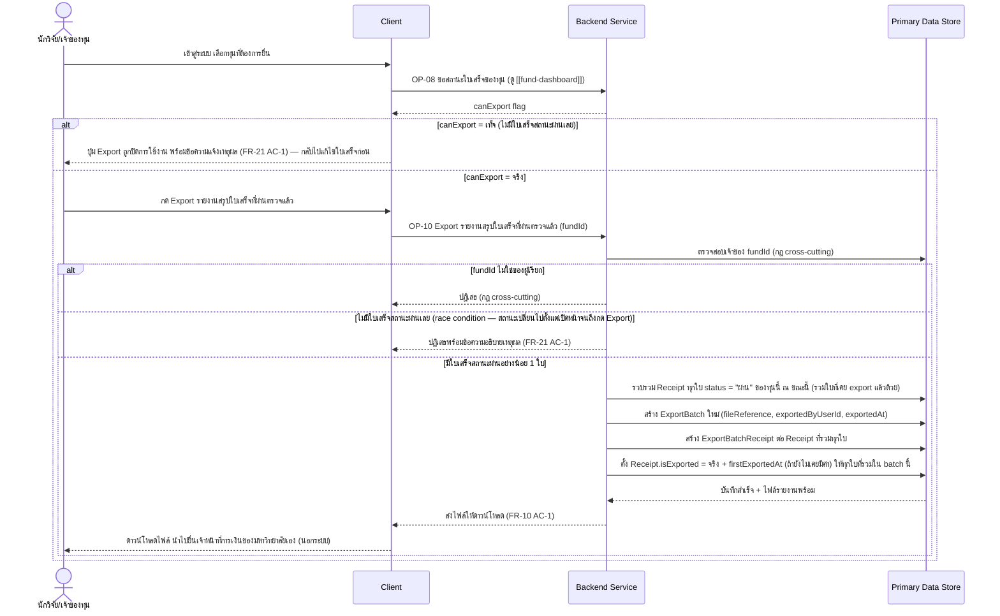
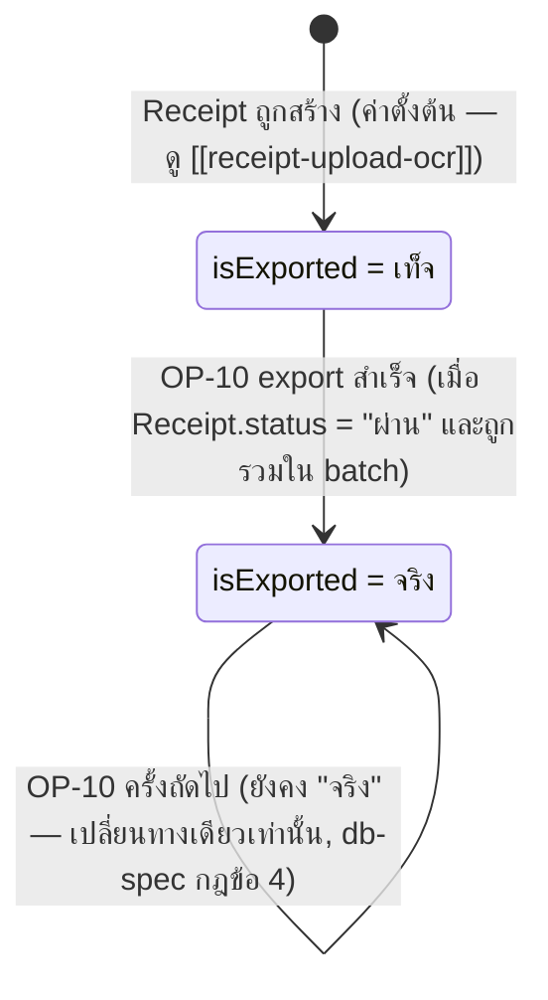

# Detailed Design — Export รายงานสรุปใบเสร็จที่ผ่านตรวจแล้ว

> การออกแบบระดับ component สำหรับ [[feature-list#7. Export รายงานสรุปใบเสร็จที่ผ่านตรวจแล้ว|ฟีเจอร์ที่ 7]]
> แปลงจาก [[user-journey#Journey 3: นักวิจัย Export รายงานสรุปใบเสร็จที่ผ่านตรวจแล้วเพื่อยื่นเจ้าหน้าที่การเงิน|Journey 3]]
> อ้างอิง operation จริงจาก [[api-spec#OP-10 Export รายงานสรุปใบเสร็จที่ผ่านตรวจแล้ว|OP-10]] เท่านั้น
> (ใช้ผลลัพธ์ `canExport` จาก [[fund-dashboard]]/[[api-spec#OP-08 ดูภาพรวมสถานะใบเสร็จของทุน (Dashboard)|OP-08]])

## 0. สถานะเอกสารนี้

สร้างครั้งแรกเมื่อ 2026-08-23 ครอบคลุม FR-10, FR-21 ตามที่
[[feature-list#7. Export รายงานสรุปใบเสร็จที่ผ่านตรวจแล้ว|ฟีเจอร์ที่ 7]] กำหนดไว้

## 1. ภาพรวม

ฟีเจอร์นี้มี operation เดียวคือ [[api-spec#OP-10 Export รายงานสรุปใบเสร็จที่ผ่านตรวจแล้ว|OP-10]] —
สร้าง `ExportBatch` ใหม่พร้อม `ExportBatchReceipt` รวม `Receipt` ทุกใบที่ `status` = "ผ่าน" ของทุนนั้น
ณ ขณะ export (รวมใบเก่าที่เคย export แล้วด้วยเสมอ ไม่ใช่แค่ใบใหม่) แล้วล็อกใบเสร็จเหล่านั้นไม่ให้ลบเอง
ผ่าน UI ต่อจากนี้ (เชื่อมกับ [[right-to-erasure]]) — ปุ่ม Export ถูกปิดตั้งแต่ระดับ UI (จาก `canExport`
ของ [[fund-dashboard]]) ถ้ายังไม่มีใบเสร็จสถานะผ่านเลย ไม่ปล่อยให้เรียก operation นี้ได้เลย

Component ที่เกี่ยวข้อง: Client, Backend Service, Primary Data Store

## 2. Sequence Diagram

## 3. Operation ↔ Entity ที่กระทบ

| Operation | Entity ที่กระทบ | การกระทำ | ลำดับ/เงื่อนไข |
|---|---|---|---|
| [[api-spec#OP-08 ดูภาพรวมสถานะใบเสร็จของทุน (Dashboard)\|OP-08]] | [[db-spec#E-03 ใบเสร็จ (Receipt)\|Receipt]] (E-03) | อ่าน (`canExport` คำนวณจาก `status`) | เกิดก่อน OP-10 เสมอ เพื่อควบคุมปุ่ม Export ที่ UI |
| [[api-spec#OP-10 Export รายงานสรุปใบเสร็จที่ผ่านตรวจแล้ว\|OP-10]] | [[db-spec#E-02 ทุนวิจัย (Fund)\|Fund]] (E-02) | อ่าน (`ownerUserId`) | ตรวจสอบเจ้าของก่อนดำเนินการ (กฎ cross-cutting) |
| OP-10 | Receipt (E-03) | อ่าน (`status` = "ผ่าน" ทุกใบของทุนนี้) แล้วแก้ไข (`isExported`, `firstExportedAt`) | รวบรวมก่อน แล้วล็อกทุกใบที่รวมในการดำเนินการเดียวกัน — `isExported` เปลี่ยนทางเดียว (db-spec กฎข้อ 4) |
| OP-10 | [[db-spec#E-10 รอบการ Export (ExportBatch)\|ExportBatch]] (E-10) | สร้าง | 1 record ต่อการกด Export 1 ครั้ง |
| OP-10 | [[db-spec#E-11 ใบเสร็จในรอบ Export (ExportBatchReceipt)\|ExportBatchReceipt]] (E-11) | สร้าง (N records) | ผูกกับ `ExportBatch` ที่สร้างในคำขอเดียวกัน — ใบเสร็จหนึ่งใบอาจถูกรวมได้หลายรอบ |

## 4. State Diagram

> หมายเหตุ: `isExported` เปลี่ยนกลับเป็นเท็จไม่ได้ ยกเว้น record ถูกลบทั้งแถวไปเลย (กรณีถอนความยินยอม
> ทั้งหมด — ดู [[consent-management]])

## 5. Edge Case และวิธีจัดการ

| # | Edge Case | วิธีจัดการ | อ้างอิง |
|---|---|---|---|
| 1 | ยังไม่มีใบเสร็จสถานะ "ผ่าน" เลย | ปิดปุ่ม Export ที่ระดับ UI ตั้งแต่ [[fund-dashboard]] ไม่ปล่อยให้เรียก OP-10 ได้เลย | FR-21 AC-1 |
| 2 | `fundId` ไม่ใช่ของผู้เรียก | ปฏิเสธ (กฎ cross-cutting) | [[api-spec#OP-10 Export รายงานสรุปใบเสร็จที่ผ่านตรวจแล้ว\|OP-10]] |
| 3 | สถานะเปลี่ยนไปหลังเปิดหน้า (race condition ระหว่างเปิด Dashboard กับกด Export จริง) | Backend ตรวจสอบซ้ำที่ OP-10 เอง ไม่พึ่ง `canExport` จาก UI เพียงอย่างเดียว — ถ้าไม่มีใบผ่านแล้วจริง ปฏิเสธพร้อมข้อความอธิบาย | FR-21 AC-1 (ตีความการตรวจสอบซ้ำนี้จากหลักการ authoritative validation เดียวกับที่ [[architecture#5.1 ตำแหน่งของการตรวจสอบไฟล์อัปโหลด (FR-19) — Client หรือ Backend Service\|architecture 5.1]] ใช้กับ OP-01) |
| 4 | Export ครั้งถัดไปของทุนเดียวกัน | รวบรวม "ใบเสร็จสถานะผ่านทั้งหมด" ใหม่เสมอ (รวมใบเก่าที่เคย export แล้วด้วย) ไม่ใช่แค่ใบที่ผ่านใหม่ล่าสุด | [[api-spec#OP-10 Export รายงานสรุปใบเสร็จที่ผ่านตรวจแล้ว\|OP-10]] กฎทางธุรกิจข้อ 3 |
| 5 | ใบเสร็จที่ export แล้วถูกพยายามลบผ่าน UI | ล็อกไม่ให้ลบ (เชื่อมกับ [[right-to-erasure]]/FR-18) | FR-10 AC-2 |

## เอกสารที่เกี่ยวข้อง

- [[feature-list#7. Export รายงานสรุปใบเสร็จที่ผ่านตรวจแล้ว|feature-list ฟีเจอร์ที่ 7]]
- [[user-journey#Journey 3: นักวิจัย Export รายงานสรุปใบเสร็จที่ผ่านตรวจแล้วเพื่อยื่นเจ้าหน้าที่การเงิน|user-journey Journey 3]]
- [[api-spec#OP-10 Export รายงานสรุปใบเสร็จที่ผ่านตรวจแล้ว|api-spec OP-10]]
- [[db-spec#E-10 รอบการ Export (ExportBatch)|db-spec E-10]], [[db-spec#E-11 ใบเสร็จในรอบ Export (ExportBatchReceipt)|E-11]]
- [[fund-dashboard]] — ที่มาของ `canExport` flag
- [[right-to-erasure]] — ผลกระทบของ `isExported` ต่อการลบใบเสร็จ
- [[access-control]] — กฎ cross-cutting เรื่องเจ้าของ `fundId`
- test case: `docs/03-testing/01-test-plan/test-cases/export-verified-report.md`
