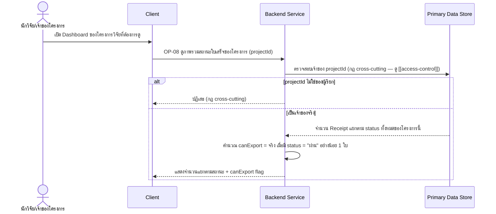

# Detailed Design — Dashboard สรุปภาพรวมใบเสร็จของโครงการ

> การออกแบบระดับ component สำหรับ [[feature-list#5. Dashboard สรุปภาพรวมใบเสร็จของโครงการ|ฟีเจอร์ที่ 5]]
> แปลงจาก [[user-journey#Journey 2: นักวิจัยติดตามภาพรวมโครงการและจัดการใบเสร็จที่มีปัญหาผ่าน Dashboard และการแจ้งเตือน|Journey 2 ขั้นตอนที่ 3]]
> อ้างอิง operation จริงจาก [[api-spec#OP-08 ดูภาพรวมสถานะใบเสร็จของโครงการ (Dashboard)|OP-08]] เท่านั้น
>
> **หมายเหตุชื่อไฟล์**: ไฟล์นี้ยังคงใช้ชื่อ `fund-dashboard.md` (ไม่เปลี่ยนเป็น `project-dashboard.md`)
> เพื่อให้ตรงกับ slug ที่ `test-writer` ใช้ตั้งชื่อไฟล์ test case ของฟีเจอร์เดียวกันแล้ว
> (`docs/03-testing/01-test-plan/test-cases/fund-dashboard.md`) — เนื้อหาภายในสะท้อนโมเดลข้อมูล
> ปัจจุบัน (Project ไม่ใช่ Fund) ทั้งหมด

## 0. สถานะเอกสารนี้

- สร้างครั้งแรกเมื่อ 2026-08-23 ครอบคลุม FR-08, FR-21 (ส่วน `canExport` flag) ตามที่
  [[feature-list#5. Dashboard สรุปภาพรวมใบเสร็จของโครงการ|ฟีเจอร์ที่ 5]] กำหนดไว้
- **อัปเดต 2026-09-03 (sync กับ [[architecture]]/[[api-spec]]/[[db-spec]] รอบแก้ไขโมเดลข้อมูล FR-23):**
  เดิม operation นี้รับ `fundId` และตรวจสอบเจ้าของผ่าน `Fund.ownerUserId` — แก้เป็น **`projectId`**
  และตรวจสอบผ่าน `Project.ownerUserId` แทน ปรับรหัส entity ให้ตรงกับ [[db-spec]] ที่จัดเรียงใหม่
  (Receipt = E-04, Project = E-03) เปลี่ยนคำเรียกบทบาทเป็น "นักวิจัย/เจ้าของโครงการ"

## 1. ภาพรวม

ฟีเจอร์นี้มี operation เดียวคือ [[api-spec#OP-08 ดูภาพรวมสถานะใบเสร็จของโครงการ (Dashboard)|OP-08]]
เป็น **read-only aggregation** ทั้งหมด — นับจำนวนใบเสร็จของโครงการวิจัยหนึ่งโครงการแยกตามสถานะ และ
คำนวณ flag `canExport` (จริง เมื่อมีใบเสร็จ `status` = "ผ่าน" อย่างน้อย 1 ใบ) เพื่อควบคุมว่าปุ่ม Export
ของ [[export-verified-report]] ใช้งานได้หรือไม่ (เชื่อม FR-21)

Component ที่เกี่ยวข้อง: Client, Backend Service, Primary Data Store

## 2. Sequence Diagram

## 3. Operation ↔ Entity ที่กระทบ

| Operation | Entity ที่กระทบ | การกระทำ | ลำดับ/เงื่อนไข |
|---|---|---|---|
| [[api-spec#OP-08 ดูภาพรวมสถานะใบเสร็จของโครงการ (Dashboard)\|OP-08]] | [[db-spec#E-03 โครงการวิจัย (Project)\|Project]] (E-03) | อ่าน (`ownerUserId`) | ตรวจสอบเจ้าของก่อนคืนข้อมูล (กฎ cross-cutting) — ไม่ใช่ผ่าน `Fund` อีกต่อไป |
| OP-08 | [[db-spec#E-04 ใบเสร็จ (Receipt)\|Receipt]] (E-04) | อ่าน (`status` ทุก record ของโครงการนี้) | นับจำนวนแยกตามสถานะ — ไม่มีการแก้ไข entity ใดในฟีเจอร์นี้ |

## 4. State Diagram

ไม่มี — ฟีเจอร์นี้เป็น read-only aggregation ทั้งหมด ไม่มีการเปลี่ยนแปลงสถานะของ entity ใดๆ

## 5. Edge Case และวิธีจัดการ

| # | Edge Case | วิธีจัดการ | อ้างอิง |
|---|---|---|---|
| 1 | `projectId` ไม่ใช่ของผู้เรียก | ปฏิเสธ (กฎ cross-cutting) | [[api-spec#OP-08 ดูภาพรวมสถานะใบเสร็จของโครงการ (Dashboard)\|OP-08]] |
| 2 | โครงการที่ยังไม่มีใบเสร็จเลย | แสดงจำนวนทุกสถานะเป็น 0 ไม่ใช่ error | FR-08 AC-2 |
| 3 | โครงการมีใบเสร็จหลายสถานะปนกัน | แสดงจำนวนแยกตามสถานะให้ถูกต้องตรงกับข้อมูลจริง | FR-08 AC-1 |
| 4 | ยังไม่มีใบเสร็จสถานะ "ผ่าน" เลย | `canExport` = เท็จ — ปิดปุ่ม Export ที่ [[export-verified-report]] | FR-21 AC-1 |

## เอกสารที่เกี่ยวข้อง

- [[feature-list#5. Dashboard สรุปภาพรวมใบเสร็จของโครงการ|feature-list ฟีเจอร์ที่ 5]]
- [[user-journey#Journey 2: นักวิจัยติดตามภาพรวมโครงการและจัดการใบเสร็จที่มีปัญหาผ่าน Dashboard และการแจ้งเตือน|user-journey Journey 2]]
- [[api-spec#OP-08 ดูภาพรวมสถานะใบเสร็จของโครงการ (Dashboard)|api-spec OP-08]]
- [[db-spec#E-04 ใบเสร็จ (Receipt)|db-spec E-04]], [[db-spec#E-03 โครงการวิจัย (Project)|E-03]]
- [[pending-issue-notification]] — ฟีเจอร์ที่เกี่ยวข้องกัน (แจ้งเตือนจากสถานะเดียวกัน)
- [[export-verified-report]] — ใช้ `canExport` flag จากฟีเจอร์นี้
- [[access-control]] — กฎ cross-cutting เรื่องเจ้าของ `projectId`
- test case: `docs/03-testing/01-test-plan/test-cases/fund-dashboard.md`
