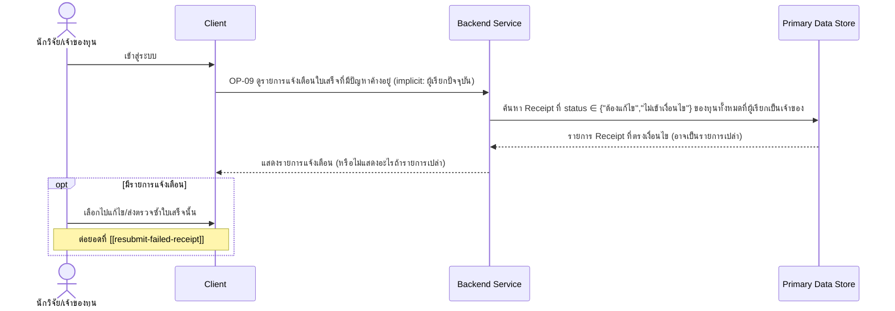

# Detailed Design — แจ้งเตือนใบเสร็จที่มีปัญหาค้างอยู่

> การออกแบบระดับ component สำหรับ [[feature-list#6. แจ้งเตือนใบเสร็จที่มีปัญหาค้างอยู่|ฟีเจอร์ที่ 6]]
> แปลงจาก [[user-journey#Journey 2: นักวิจัยติดตามภาพรวมทุนและจัดการใบเสร็จที่มีปัญหาผ่าน Dashboard และการแจ้งเตือน|Journey 2 ขั้นตอนที่ 2]]
> อ้างอิง operation จริงจาก [[api-spec#OP-09 ดูรายการแจ้งเตือนใบเสร็จที่มีปัญหาค้างอยู่|OP-09]] เท่านั้น

## 0. สถานะเอกสารนี้

สร้างครั้งแรกเมื่อ 2026-08-23 ครอบคลุม FR-09 ตามที่
[[feature-list#6. แจ้งเตือนใบเสร็จที่มีปัญหาค้างอยู่|ฟีเจอร์ที่ 6]] กำหนดไว้

## 1. ภาพรวม

ฟีเจอร์นี้มี operation เดียวคือ [[api-spec#OP-09 ดูรายการแจ้งเตือนใบเสร็จที่มีปัญหาค้างอยู่|OP-09]]
เป็น **read-only** ทั้งหมด — **ไม่มี entity การแจ้งเตือนแยกต่างหากใน [[db-spec]]** การแจ้งเตือน
คำนวณจากสถานะ `Receipt.status` ณ เวลาที่เรียกโดยตรง (`status` ∈ {"ต้องแก้ไข", "ไม่เข้าเงื่อนไข"})
ไม่ใช่ entity ที่ persist ไว้ต่างหาก — ตรงกับที่
[[architecture#3.2 Journey 2 — ติดตามภาพรวมทุนและจัดการใบเสร็จที่มีปัญหา (Dashboard + แจ้งเตือน)|architecture Journey 2]]
ออกแบบไว้

Component ที่เกี่ยวข้อง: Client, Backend Service, Primary Data Store

## 2. Sequence Diagram

## 3. Operation ↔ Entity ที่กระทบ

| Operation | Entity ที่กระทบ | การกระทำ | ลำดับ/เงื่อนไข |
|---|---|---|---|
| [[api-spec#OP-09 ดูรายการแจ้งเตือนใบเสร็จที่มีปัญหาค้างอยู่\|OP-09]] | [[db-spec#E-03 ใบเสร็จ (Receipt)\|Receipt]] (E-03) | อ่าน (`status`, `fundId`) | กรองเฉพาะ `status` ∈ {"ต้องแก้ไข","ไม่เข้าเงื่อนไข"} ของทุกทุนที่ผู้เรียกเป็นเจ้าของ — ไม่มีการแก้ไข entity ใดในฟีเจอร์นี้ |
| OP-09 | [[db-spec#E-02 ทุนวิจัย (Fund)\|Fund]] (E-02) | อ่าน (`ownerUserId`) | ใช้กรองว่าเป็นทุนของผู้เรียกเท่านั้น (implicit — ไม่ต้องรับ `fundId` เป็น input) |

## 4. State Diagram

ไม่มี — ฟีเจอร์นี้เป็น read-only ทั้งหมด ไม่มี entity การแจ้งเตือนที่มี state ของตัวเอง (คำนวณจาก
`Receipt.status` สดๆ ทุกครั้งที่เรียก ไม่ใช่ state ที่ persist)

## 5. Edge Case และวิธีจัดการ

| # | Edge Case | วิธีจัดการ | อ้างอิง |
|---|---|---|---|
| 1 | มีใบเสร็จสถานะ "ต้องแก้ไข"/"ไม่เข้าเงื่อนไข" ค้างอยู่ | แจ้งเตือนนักวิจัยว่ามีใบเสร็จที่มีปัญหายังไม่ได้แก้ไข | FR-09 AC-1 |
| 2 | ไม่มีใบเสร็จค้างอยู่เลย | คืนรายการเปล่า ไม่ใช่ error ไม่ส่งการแจ้งเตือนใดๆ | FR-09 AC-2 |
| 3 | การแจ้งเตือนตามกำหนดเวลาส่งหลักฐานรายทุน | ไม่รวมอยู่ในขอบเขต — ตัดออกจาก MVP นี้แล้ว | [[20260816-01-grant-receipt-verification#2.2 ตัดออกจากขอบเขต MVP นี้ (ยืนยันโดยผู้ใช้เมื่อ 2026-08-16 — ดูหัวข้อ 7)]] |

## เอกสารที่เกี่ยวข้อง

- [[feature-list#6. แจ้งเตือนใบเสร็จที่มีปัญหาค้างอยู่|feature-list ฟีเจอร์ที่ 6]]
- [[user-journey#Journey 2: นักวิจัยติดตามภาพรวมทุนและจัดการใบเสร็จที่มีปัญหาผ่าน Dashboard และการแจ้งเตือน|user-journey Journey 2]]
- [[api-spec#OP-09 ดูรายการแจ้งเตือนใบเสร็จที่มีปัญหาค้างอยู่|api-spec OP-09]]
- [[db-spec#E-03 ใบเสร็จ (Receipt)|db-spec E-03]]
- [[fund-dashboard]] — ฟีเจอร์ที่เกี่ยวข้องกัน (สรุปสถานะเดียวกันในรูปแบบอื่น)
- [[resubmit-failed-receipt]] — จุดที่นักวิจัยไปต่อเมื่อแก้ไขใบเสร็จที่ถูกแจ้งเตือน
- test case: `docs/03-testing/01-test-plan/test-cases/pending-issue-notification.md`
