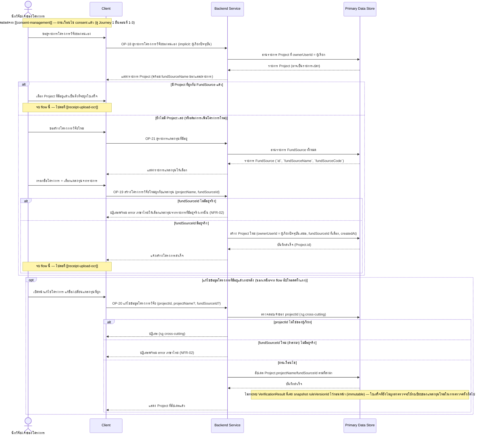

# Detailed Design — จัดการข้อมูลโครงการวิจัยและผูกกับแหล่งทุน (Project Setup)

> การออกแบบระดับ component สำหรับ [[feature-list#13. จัดการข้อมูลโครงการวิจัยและผูกกับแหล่งทุน (Project Setup)|ฟีเจอร์ที่ 13]]
> แปลงจาก [[user-journey#Journey 1: นักวิจัยอัปโหลดใบเสร็จและตรวจสอบผลจนผ่านเกณฑ์|Journey 1 ขั้นตอนที่ 4]]
> (ไม่มี journey แยกต่างหาก — ผูกเข้าเป็นส่วนต่อยอดของ Journey 1 ตามที่ `feature-journey-writer`
> ตัดสินใจไว้แล้ว) อ้างอิง operation จริงจาก [[api-spec#OP-18 ดูรายการโครงการวิจัยของตนเอง|OP-18]],
> [[api-spec#OP-19 สร้างโครงการวิจัยใหม่ผูกกับแหล่งทุน|OP-19]],
> [[api-spec#OP-20 แก้ไขข้อมูลโครงการวิจัย (ชื่อ/แหล่งทุนที่ผูก)|OP-20]], และ
> [[api-spec#OP-21 ดูรายการแหล่งทุนที่มีอยู่|OP-21]] เท่านั้น

## 0. สถานะเอกสารนี้

- **สร้างใหม่ทั้งหมดเมื่อ 2026-09-03** — ฟีเจอร์นี้ (ฟีเจอร์ที่ 13) เพิ่งถูกเพิ่มเข้า
  [[feature-list]]/[[user-journey]]/[[api-spec]]/[[db-spec]] ในรอบเดียวกัน (รองรับ **FR-23**) ยังไม่
  เคยมีไฟล์ detailed-design สำหรับฟีเจอร์นี้มาก่อน ครอบคลุม FR-23 ทั้งหมดตามที่
  [[feature-list#13. จัดการข้อมูลโครงการวิจัยและผูกกับแหล่งทุน (Project Setup)|ฟีเจอร์ที่ 13]] กำหนดไว้
- **หมายเหตุ**: ยังไม่พบไฟล์ test case ที่ตรงกันใน `docs/03-testing/01-test-plan/test-cases/` (ไฟล์
  ที่มีอยู่ยังไม่ครอบคลุมฟีเจอร์ที่ 13) — ใช้ slug `project-setup` ตามรูปแบบเดียวกับไฟล์ detailed-design
  อื่น (ตั้งชื่อจากชื่อฟีเจอร์ภาษาอังกฤษสั้นๆ) หากภายหลัง `test-writer` ตั้งชื่อไฟล์ test case ของ
  ฟีเจอร์นี้ด้วย slug อื่น ควรปรับชื่อไฟล์นี้ให้ตรงกันในรอบ `sync-technical-spec` ถัดไป

## 1. ภาพรวม

ฟีเจอร์นี้เป็น**เงื่อนไขก่อนหน้า (gate)** ที่ต้องผ่านก่อนฟีเจอร์ที่ 1 (อัปโหลดใบเสร็จ) เสมอ เพราะ
`Receipt.projectId` ต้องชี้ไปยัง `Project` ที่มีอยู่แล้ว มี 4 operation:

1. [[api-spec#OP-18 ดูรายการโครงการวิจัยของตนเอง|OP-18]] — read-only, ดูรายการ `Project` ที่ผู้เรียก
   เป็นเจ้าของ (คืนรายการเปล่าได้ถ้ายังไม่เคยสร้างเลย ไม่ถือเป็น error)
2. [[api-spec#OP-21 ดูรายการแหล่งทุนที่มีอยู่|OP-21]] — read-only, ดูรายการ `FundSource` ทั้งหมดที่
   Admin นำเข้าไว้แล้ว (ผ่าน [[admin-rule-management]]) เพื่อให้นักวิจัยเลือกผูกตอนสร้าง/แก้ไขโครงการ
3. [[api-spec#OP-19 สร้างโครงการวิจัยใหม่ผูกกับแหล่งทุน|OP-19]] — สร้าง `Project` ใหม่ (เจ้าของ = ผู้
   เรียกปัจจุบันเสมอ, ผูกกับ `fundSourceId` ที่เลือกจาก OP-21)
4. [[api-spec#OP-20 แก้ไขข้อมูลโครงการวิจัย (ชื่อ/แหล่งทุนที่ผูก)|OP-20]] — แก้ไขชื่อ/แหล่งทุนที่ผูก
   ของโครงการที่มีอยู่แล้ว (เจ้าของเดิมเท่านั้น)

Component ที่เกี่ยวข้อง: Client, Backend Service, Primary Data Store

## 2. Sequence Diagram

## 3. Operation ↔ Entity ที่กระทบ

| Operation | Entity ที่กระทบ | การกระทำ | ลำดับ/เงื่อนไข |
|---|---|---|---|
| [[api-spec#OP-18 ดูรายการโครงการวิจัยของตนเอง\|OP-18]] | [[db-spec#E-03 โครงการวิจัย (Project)\|Project]] (E-03) | อ่าน (`ownerUserId` = ผู้เรียก) | คืนรายการเปล่าได้ ไม่ถือเป็น error |
| [[api-spec#OP-21 ดูรายการแหล่งทุนที่มีอยู่\|OP-21]] | [[db-spec#E-02 แหล่งทุน (FundSource)\|FundSource]] (E-02) | อ่าน (ทั้งหมด — ไม่กรองตามเจ้าของ) | `FundSource` ไม่มีเจ้าของเฉพาะคน (กฎ cross-cutting ข้อ 3) — ไม่รวม `RuleItem` |
| [[api-spec#OP-19 สร้างโครงการวิจัยใหม่ผูกกับแหล่งทุน\|OP-19]] | FundSource (E-02) | อ่าน (ตรวจสอบ `fundSourceId` มีอยู่จริง) | ป้องกันการสร้างโครงการที่ผูกกับแหล่งทุนที่ไม่มีระเบียบให้ตรวจ |
| OP-19 | Project (E-03) | สร้าง | `ownerUserId` ถูกกำหนดเป็นผู้เรียกปัจจุบันเสมอ (ไม่รับ input นี้จากภายนอก) — 1 โครงการมีเจ้าของเพียง 1 คน (db-spec กฎข้อ 12) |
| [[api-spec#OP-20 แก้ไขข้อมูลโครงการวิจัย (ชื่อ/แหล่งทุนที่ผูก)\|OP-20]] | Project (E-03) | อ่าน (ตรวจสอบเจ้าของ) แล้วแก้ไข (`projectName`/`fundSourceId`) | เจ้าของโครงการนั้นเท่านั้น (กฎ cross-cutting) |
| OP-20 | FundSource (E-02) | อ่าน (ตรวจสอบ `fundSourceId` ใหม่มีอยู่จริง ถ้าส่งมา) | เงื่อนไขเดียวกับ OP-19 |
| OP-20 | [[db-spec#E-08 ผลตรวจใบเสร็จ (VerificationResult)\|VerificationResult]] (E-08) | ไม่แก้ไข (อ่านทางอ้อมเพื่อยืนยันว่าไม่กระทบ) | `ruleVersionId` ที่ snapshot ไว้ก่อนหน้าเป็น immutable แม้ `Project.fundSourceId` จะเปลี่ยน (db-spec กฎข้อ 2/11) |

## 4. State Diagram

ไม่มี state diagram แยกสำหรับ `Project` — `Project` ไม่มี field สถานะ (`status`) ของตัวเองใน
[[db-spec#E-03 โครงการวิจัย (Project)|db-spec E-03]] (มีเพียง `projectName`/`ownerUserId`/
`fundSourceId`/`createdAt`) จึงไม่มีวงจรชีวิตสถานะที่ต้องแสดง — ความสัมพันธ์ที่เปลี่ยนแปลงได้มีเพียง
`fundSourceId` ที่ผูกอยู่ (แก้ไขได้ผ่าน OP-20 โดยไม่กระทบผลตรวจเก่า)

## 5. Edge Case และวิธีจัดการ

| # | Edge Case | วิธีจัดการ | อ้างอิง |
|---|---|---|---|
| 1 | นักวิจัยยังไม่เคยสร้างโครงการเลย | OP-18 คืนรายการเปล่า ไม่ใช่ error — Client พาไปสร้างโครงการใหม่ผ่าน OP-19 แทน | FR-23 |
| 2 | Admin ยังไม่เคยนำเข้าแหล่งทุนเลย | OP-21 คืนรายการเปล่า — นักวิจัยยังไม่สามารถสร้างโครงการใหม่ได้จนกว่า Admin จะนำเข้าแหล่งทุนอย่างน้อย 1 แหล่งผ่าน [[admin-rule-management]] | FR-23, FR-11 |
| 3 | `fundSourceId` ที่ส่งมาตอนสร้าง/แก้ไขโครงการไม่มีอยู่จริง | ปฏิเสธพร้อม error ภาษาไทยให้เลือกแหล่งทุนจากรายการที่มีอยู่จริงเท่านั้น | NFR-02, OP-19/OP-20 |
| 4 | `projectId` ไม่ใช่ของผู้เรียก (OP-20) | ปฏิเสธ (กฎ cross-cutting) | [[access-control]] |
| 5 | นักวิจัย 1 คนสร้างโครงการได้กี่โครงการ | ไม่จำกัดจำนวน (1:N จากฝั่ง User) | db-spec กฎข้อ 12 |
| 6 | เปลี่ยน `fundSourceId` ของโครงการที่มีใบเสร็จอยู่แล้ว (OP-20) | ไม่กระทบ `VerificationResult` ที่เคยเกิดขึ้นแล้ว (`ruleVersionId` เป็น snapshot immutable) — ใบเสร็จที่ยังไม่ถูกส่งตรวจ ณ ขณะนี้จะใช้ระเบียบของแหล่งทุนใหม่ในการตรวจครั้งถัดไปทันที | db-spec กฎข้อ 2/11 |
| 7 | ผู้ใช้พยายามอัปโหลดใบเสร็จ (OP-01) โดยยังไม่มี `Project` เลย | OP-01 ปฏิเสธ พร้อมนำทางกลับมาที่ OP-19 ของฟีเจอร์นี้ก่อน | [[receipt-upload-ocr]] |

## เอกสารที่เกี่ยวข้อง

- [[feature-list#13. จัดการข้อมูลโครงการวิจัยและผูกกับแหล่งทุน (Project Setup)|feature-list ฟีเจอร์ที่ 13]]
- [[user-journey#Journey 1: นักวิจัยอัปโหลดใบเสร็จและตรวจสอบผลจนผ่านเกณฑ์|user-journey Journey 1 ขั้นตอนที่ 4]]
- [[api-spec#OP-18 ดูรายการโครงการวิจัยของตนเอง|api-spec OP-18]], [[api-spec#OP-19 สร้างโครงการวิจัยใหม่ผูกกับแหล่งทุน|OP-19]], [[api-spec#OP-20 แก้ไขข้อมูลโครงการวิจัย (ชื่อ/แหล่งทุนที่ผูก)|OP-20]], [[api-spec#OP-21 ดูรายการแหล่งทุนที่มีอยู่|OP-21]]
- [[db-spec#E-02 แหล่งทุน (FundSource)|db-spec E-02]], [[db-spec#E-03 โครงการวิจัย (Project)|E-03]]
- [[architecture#3.1 Journey 1 — อัปโหลดใบเสร็จและตรวจสอบผลจนผ่านเกณฑ์ (รวม consent gate + FR-23 project setup gate + FR-19 + FR-22 multi-file bundle)|architecture 3.1]]
- [[receipt-upload-ocr]] — ฟีเจอร์ถัดไป (เงื่อนไขก่อนหน้าของฟีเจอร์นี้ต้องผ่านก่อน)
- [[admin-rule-management]] — ที่มาของ `FundSource` ที่ฟีเจอร์นี้อ่านผ่าน OP-21
- [[rule-engine-verification]] — ใช้ `Project.fundSourceId` ที่ฟีเจอร์นี้จัดการเลือก `RuleVersion`
- [[access-control]] — กฎ cross-cutting เรื่องเจ้าของ `projectId`
- test case: ยังไม่มีไฟล์ตรงกันใน `docs/03-testing/01-test-plan/test-cases/` (ดูหมายเหตุหัวข้อ 0)
