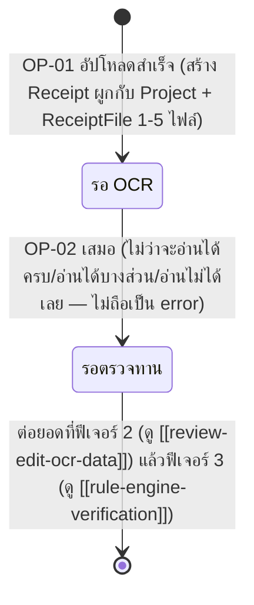

# Detailed Design — อัปโหลดใบเสร็จและอ่านข้อมูลอัตโนมัติด้วย OCR

> การออกแบบระดับ component สำหรับ [[feature-list#1. อัปโหลดใบเสร็จและอ่านข้อมูลอัตโนมัติด้วย OCR|ฟีเจอร์ที่ 1]]
> แปลงจาก [[user-journey#Journey 1: นักวิจัยอัปโหลดใบเสร็จและตรวจสอบผลจนผ่านเกณฑ์|Journey 1 ขั้นตอนที่ 5-7]]
> อ้างอิง operation จริงจาก [[api-spec#OP-01 อัปโหลดใบเสร็จ|OP-01]] และ
> [[api-spec#OP-02 อ่านข้อมูลใบเสร็จด้วย OCR (internal)|OP-02]] เท่านั้น — ไม่มี operation/entity ใหม่
> ที่คิดขึ้นเองในเอกสารนี้ ทุก field/ชื่อ component ตรงกับ [[api-spec]]/[[db-spec]]/[[architecture]]

## 0. สถานะเอกสารนี้

- สร้างครั้งแรกเมื่อ 2026-08-23 พร้อมกับไฟล์ detailed-design อื่นอีก 11 ฟีเจอร์ (ไม่มีไฟล์เดิมมาก่อน)
  ครอบคลุม FR-01, FR-02, FR-19, FR-22, NFR-01, NFR-06 ตามที่ [[feature-list#1. อัปโหลดใบเสร็จและอ่านข้อมูลอัตโนมัติด้วย OCR|ฟีเจอร์ที่ 1]] กำหนดไว้
- **อัปเดต 2026-09-03 (sync กับ [[architecture]]/[[api-spec]]/[[db-spec]] รอบแก้ไขโมเดลข้อมูล FR-23):**
  เดิมเอกสารนี้ใช้ `fundId` อ้างถึง "Fund" (ปนแนวคิดแหล่งทุน/โครงการเข้าด้วยกัน) และรหัส entity เดิม
  (E-02 Fund, E-03 Receipt, E-13 ReceiptFile) แก้ไขทั้งหมดดังนี้: `fundId` → **`projectId`** (อ้างอิง
  [[db-spec#E-03 โครงการวิจัย (Project)|Project]]), รหัส entity ปรับตาม db-spec ที่จัดเรียงใหม่
  (Receipt = E-04, ReceiptFile = E-05), เพิ่ม**เงื่อนไขก่อนหน้า (gate)**ว่าต้องมี `Project` ที่ผูกกับ
  `FundSource` ไว้แล้วก่อนเรียก OP-01 เสมอ (ผ่าน [[project-setup]] ฟีเจอร์ที่ 13 ใหม่) และเปลี่ยนคำเรียก
  บทบาทจาก "นักวิจัย/เจ้าของทุน" เป็น **"นักวิจัย/เจ้าของโครงการ"** ทั้งเอกสาร

## 1. ภาพรวม

ฟีเจอร์นี้ประกอบด้วย 2 operation ที่ทำงานต่อเนื่องกันในคำขอเดียว (synchronous ตาม
[[architecture#5.2 รูปแบบการสื่อสารระหว่าง Backend Service ↔ OCR/Rule Engine/LLM — Synchronous หรือ Asynchronous|architecture 5.2]]):
[[api-spec#OP-01 อัปโหลดใบเสร็จ|OP-01]] (รับไฟล์ทั้งชุด 1–5 ไฟล์ + ตรวจสอบ + สร้าง record ผูกกับ
`Project` ที่เลือกไว้) ต่อด้วย [[api-spec#OP-02 อ่านข้อมูลใบเสร็จด้วย OCR (internal)|OP-02]] (ระบบเรียก
เอง ไม่มีผู้ใช้เรียกตรง) — ผู้เรียกไม่เห็นการแบ่ง 2 operation นี้เป็นขั้นตอนแยกกันในหน้าจอ เห็นเป็นการ
อัปโหลดครั้งเดียวที่จบด้วยข้อมูล OCR ให้ตรวจทานทันที

**เงื่อนไขก่อนหน้า (gate)**: OP-01 เรียกได้เฉพาะเมื่อผู้เรียกมี `Project` ที่ผูกกับ `FundSource` ไว้แล้ว
อย่างน้อย 1 โครงการ (ผ่าน [[project-setup]] ฟีเจอร์ที่ 13 — OP-18/OP-19 ก่อนหน้านี้เสมอ) — ไม่ใช่ความ
รับผิดชอบของเอกสารนี้ที่จะสร้าง `Project` ให้ แต่เป็นเงื่อนไขนำเข้าที่ต้องผ่านมาก่อน

Component ที่เกี่ยวข้อง (ชื่อตรงกับ [[architecture#2. Component Diagram|architecture หัวข้อ 2]]):
Client, Backend Service, Primary Data Store, External OCR Service

## 2. Sequence Diagram

```mermaid
sequenceDiagram
    actor R as นักวิจัย/เจ้าของโครงการ
    participant C as Client
    participant B as Backend Service
    participant DS as Primary Data Store
    participant O as External OCR Service

    Note over R,C: ก่อนหน้านี้ต้องมี Project ที่ผูกกับ FundSource แล้ว (ดู [[project-setup]])
    R->>C: เลือกไฟล์ทั้งชุดของค่าใช้จ่าย 1 เรื่อง (1-5 ไฟล์) + เลือก Project ของตนเอง
    Note over C,R: Client แสดงคำเตือน "อัปโหลดครั้งละ 1 รายการเท่านั้น" (FR-22) — ไม่ตรวจสอบไฟล์เอง
    C->>B: OP-01 อัปโหลดใบเสร็จ (รายการไฟล์ทั้งชุด + projectId)
    B->>DS: ตรวจสอบสถานะ Consent ล่าสุดของผู้เรียก
    DS-->>B: สถานะ consent ปัจจุบัน
    alt ยังไม่ให้ความยินยอม (FR-14)
        B-->>C: ปฏิเสธ + นำทางไปหน้า Privacy Notice/Consent (ดู [[consent-management]])
    else projectId ไม่ใช่ของผู้เรียก หรือไม่มีอยู่จริง (กฎ cross-cutting)
        B-->>C: ปฏิเสธ ไม่เปิดเผยว่าโครงการนั้นมีอยู่จริงหรือไม่ (ดู [[access-control]]) — ถ้ายังไม่เคย
        สร้าง Project เลย นำทางไปสร้างผ่าน [[project-setup]] ก่อน
    else ผ่านเงื่อนไข consent + เจ้าของโครงการ
        B->>B: ตรวจสอบไฟล์ทั้งชุดที่จุดเดียว (authoritative) — จำนวน 1-5 ไฟล์ / ชนิด jpg-png-pdf / ไม่เสียหาย / ไม่เกิน 5 MB ต่อไฟล์
        alt ไฟล์/จำนวนไฟล์ไม่ผ่านเงื่อนไขใดเงื่อนไขหนึ่ง
            B-->>C: ปฏิเสธทั้งคำขอ พร้อม error ภาษาไทยตามสาเหตุจริง (FR-19 AC-1/AC-2/AC-3, FR-22)
            C-->>R: แสดง error แนะนำให้ลดจำนวนไฟล์/แยกเป็นรายการใหม่/อัปโหลดใหม่ — วนกลับขั้นตอนเลือกไฟล์
        else ไฟล์ทั้งชุดถูกต้องครบตามเงื่อนไข
            B->>DS: สร้าง Receipt ใหม่ (projectId, status = "รอ OCR") + ReceiptFile 1 record ต่อไฟล์ (ผูก receiptId เดียวกัน)
            DS-->>B: บันทึกสำเร็จ (Receipt.id, ReceiptFile.id ทุกรายการ)
            B-->>C: แจ้งอัปโหลดสำเร็จ (ไม่รอ OCR เสร็จก่อนตอบ Client เพราะ OP-02 ต่อเนื่องในคำขอเดียวกัน)
            B->>O: OP-02 ส่งไฟล์ทั้งชุดของ Receipt นี้ให้อ่านข้อมูล (ภาษาไทย)
            O-->>B: ยอดเงิน/วันที่/หมวดค่าใช้จ่าย/ชื่อร้าน (รวมผลจากทุกไฟล์เป็นค่าเดียวต่อ record) — หรือค่าว่างถ้าอ่านไม่ได้เลยทุก field
            B->>DS: อัปเดต Receipt.ocrAmount/ocrDate/ocrCategory/ocrVendorName + status = "รอตรวจทาน"
            DS-->>B: บันทึกสำเร็จ
            B-->>C: แสดงข้อมูล OCR ให้ตรวจทาน (ต่อยอดที่ [[review-edit-ocr-data]])
        end
    end
```

> **หมายเหตุการออกแบบ (กรณี External OCR Service ล้มเหลวทางเทคนิค เช่น เรียกไม่ติด/timeout — ไม่ใช่
> กรณี "อ่านข้อมูลไม่ได้" ตามปกติ):** [[api-spec#OP-02 อ่านข้อมูลใบเสร็จด้วย OCR (internal)|OP-02]]
> ระบุไว้เฉพาะกรณี "OCR อ่านไม่ได้เลยทุก field จากทุกไฟล์ในชุด → ยัง set status เป็น 'รอตรวจทาน' โดย
> ปล่อยทุกช่องว่างให้นักวิจัยกรอกเองทั้งหมด (ไม่ถือเป็น error ที่ block flow)" เอกสารนี้ตีความว่ากรณี
> บริการล้มเหลวทางเทคนิคเป็น**กรณีย่อยเดียวกัน**กับกรณีนี้ (ผลลัพธ์ปลายทางต่อผู้ใช้เหมือนกัน: ทุกช่อง
> ว่าง สถานะเป็น "รอตรวจทาน") เพราะเป็นการตีความตรงไปตรงมาจากถ้อยคำที่มีอยู่แล้ว ไม่ใช่การเพิ่ม
> status/entity ใหม่ที่ api-spec/db-spec ไม่มี จำนวนครั้ง retry ก่อนเข้าสู่กรณีนี้เป็นรายละเอียดที่ผูก
> กับ [[technology-stack]] (ยังไม่มีเนื้อหา) จึงไม่ระบุในเอกสารนี้

## 3. Operation ↔ Entity ที่กระทบ

| Operation | Entity ที่กระทบ | การกระทำ | ลำดับ/เงื่อนไข |
|---|---|---|---|
| [[api-spec#OP-01 อัปโหลดใบเสร็จ\|OP-01]] | [[db-spec#E-11 ประวัติความยินยอม (ConsentRecord)\|ConsentRecord]] (E-11) | อ่าน | ตรวจสอบก่อนอนุมัติคำขอ (record ล่าสุดตาม `actionAt`) — ไม่แก้ไข/สร้างใน operation นี้ |
| OP-01 | [[db-spec#E-03 โครงการวิจัย (Project)\|Project]] (E-03) | อ่าน | ตรวจสอบ `Project.ownerUserId` = ผู้เรียก และ `projectId` มีอยู่จริง ก่อนสร้าง Receipt (กฎ cross-cutting) — ไม่มีเงื่อนไขนี้ผ่าน `Fund` อีกต่อไป |
| OP-01 | [[db-spec#E-04 ใบเสร็จ (Receipt)\|Receipt]] (E-04) | สร้าง | สร้าง 1 record ใหม่ (`projectId`, `status` = "รอ OCR") ก่อน ReceiptFile เสมอ (ต้องมี `id` ก่อนจึงผูกไฟล์ได้) |
| OP-01 | [[db-spec#E-05 ไฟล์ประกอบใบเสร็จ (ReceiptFile)\|ReceiptFile]] (E-05) | สร้าง (1–5 records) | ผูกกับ `Receipt.id` ที่สร้างในคำขอเดียวกัน — ต้องมี 1–5 record เสมอ (db-spec กฎข้อ 9), ไม่รองรับ 0 หรือมากกว่า 5 |
| [[api-spec#OP-02 อ่านข้อมูลใบเสร็จด้วย OCR (internal)\|OP-02]] | ReceiptFile (E-05) | อ่าน (`fileReference` ทุกไฟล์ในชุด) | เกิดขึ้นทันทีต่อจาก OP-01 สำเร็จ (internal, ไม่มีผู้ใช้เรียกตรง) |
| OP-02 | Receipt (E-04) | แก้ไข (`ocrAmount`/`ocrDate`/`ocrCategory`/`ocrVendorName`, `status` → "รอตรวจทาน") | เขียนทับเฉพาะ field `ocr*` เท่านั้น — ไม่แตะ `confirmed*` (ยังไม่มีค่าในขั้นนี้) |

## 4. State Diagram — วงจรชีวิตสถานะใบเสร็จ (ภาพรวมทั้งหมด อ้างอิงจากทุกฟีเจอร์ที่แก้ `Receipt.status`)

แสดงเฉพาะส่วนของฟีเจอร์นี้ (สร้าง record ใหม่จนถึง "รอตรวจทาน") — ส่วนที่เหลือ (การตรวจกับ Rule Engine,
การส่งซ้ำ) ดูภาพเต็มที่ [[rule-engine-verification#4. State Diagram|rule-engine-verification]] และ
[[resubmit-failed-receipt#4. State Diagram|resubmit-failed-receipt]]



> **หมายเหตุ (แก้ไขแล้ว 2026-08-23):** เดิมพบช่องว่างว่า `Receipt.status` enum มีค่า **"รอผลตรวจ"**
> ที่ไม่มี operation ใดตั้งค่าจริง — `api-db-writer` แก้ไขแล้วโดยลบ **"รอผลตรวจ"** ออกจาก enum ทั้งใน
> [[db-spec#E-04 ใบเสร็จ (Receipt)|db-spec E-04]] และ [[api-spec#OP-08 ดูภาพรวมสถานะใบเสร็จของโครงการ (Dashboard)|api-spec OP-08]]
> (ปัจจุบันเหลือ 5 ค่า — ดูเหตุผลเต็มที่ [[db-spec#5.4 สถานะ Receipt.status ที่ตัดออก (แก้ไข 2026-08-23)|db-spec หัวข้อ 5.4]])
> ไดอะแกรมในเอกสารนี้ตรงกับ enum ปัจจุบันอยู่แล้ว (ไม่เคยวาด "รอผลตรวจ" ไว้ตั้งแต่แรก เพราะ OP-04
> เปลี่ยนสถานะจาก "รอตรวจทาน" ไปเป็นผลตัดสินสุดท้ายโดยตรงเสมอ) จึงไม่ต้องปรับไดอะแกรมเพิ่มเติม

## 5. Edge Case และวิธีจัดการ

| # | Edge Case | วิธีจัดการ | อ้างอิง |
|---|---|---|---|
| 1 | ผู้เรียกยังไม่เคยให้ความยินยอม | ปฏิเสธคำขออัปโหลดทั้งหมด นำทางไปหน้า Privacy Notice/Consent | FR-14 AC-2, [[api-spec#OP-01 อัปโหลดใบเสร็จ\|OP-01]] |
| 2 | ผู้เรียกยังไม่มี `Project` เลย (หรือ `projectId` ไม่มีอยู่จริง) | ปฏิเสธ พร้อมนำทางไปสร้างโครงการก่อนผ่าน [[project-setup]] (OP-19) | FR-23 |
| 3 | `projectId` ไม่ใช่ของผู้เรียก | ปฏิเสธ ไม่เปิดเผยว่าโครงการนั้นมีอยู่จริงหรือไม่ (ป้องกันการเดา ID) | FR-12 AC-2, NFR-05 |
| 4 | จำนวนไฟล์เกิน 5 ไฟล์ | ปฏิเสธ**ทั้งคำขอ** (ไม่ใช่แค่ไฟล์ส่วนเกิน) พร้อม error ภาษาไทยแนะนำลดจำนวน/แยกรายการใหม่ | FR-19(4), FR-22 |
| 5 | จำนวนไฟล์เป็น 0 (ไม่แนบไฟล์เลย) | ปฏิเสธทั้งคำขอ (ขั้นต่ำ 1 ไฟล์ตาม db-spec กฎข้อ 9) | FR-22, db-spec กฎข้อ 9 |
| 6 | ไฟล์ใดไฟล์หนึ่งในชุดเป็นชนิดที่ไม่รองรับ | ปฏิเสธทั้งคำขอทันที ระบุชนิดไฟล์ที่รองรับ | FR-19 AC-1 |
| 7 | ไฟล์ใดไฟล์หนึ่งในชุดเสียหาย/เปิดไม่ได้ | ปฏิเสธทั้งคำขอทันที แจ้งให้อัปโหลดใหม่ | FR-19 AC-2 |
| 8 | ไฟล์ใดไฟล์หนึ่งในชุดเกิน 5 MB | ปฏิเสธทั้งคำขอทันที แจ้งขนาดที่กำหนด | FR-19 AC-3, FR-22 |
| 9 | OCR อ่านไม่ได้เลยทุก field จากทุกไฟล์ (รวมกรณีบริการล้มเหลวทางเทคนิค — ดูหมายเหตุหัวข้อ 2) | ไม่ block flow — ตั้ง `status` = "รอตรวจทาน" ปล่อยทุกช่องว่างให้กรอกเอง | FR-02 AC-2 |
| 10 | ไม่มีชื่อร้าน/ผู้ขายในใบเสร็จ | แสดงข้อมูลเท่าที่อ่านได้ ปล่อยช่องชื่อร้านว่าง | FR-02 AC-2 |
| 11 | ใบเสร็จ 1 แผ่นมีสินค้าหลายชิ้นจากร้านเดียวกัน | ไม่ต้องแยกรายการสินค้า ยังนับเป็น `ReceiptFile` 1 record ตามปกติ | FR-22 |

## เอกสารที่เกี่ยวข้อง

- [[feature-list#1. อัปโหลดใบเสร็จและอ่านข้อมูลอัตโนมัติด้วย OCR|feature-list ฟีเจอร์ที่ 1]]
- [[user-journey#Journey 1: นักวิจัยอัปโหลดใบเสร็จและตรวจสอบผลจนผ่านเกณฑ์|user-journey Journey 1]]
- [[api-spec#OP-01 อัปโหลดใบเสร็จ|api-spec OP-01]], [[api-spec#OP-02 อ่านข้อมูลใบเสร็จด้วย OCR (internal)|OP-02]]
- [[db-spec#E-04 ใบเสร็จ (Receipt)|db-spec E-04]], [[db-spec#E-05 ไฟล์ประกอบใบเสร็จ (ReceiptFile)|E-05]], [[db-spec#E-03 โครงการวิจัย (Project)|E-03]]
- [[architecture#3.1 Journey 1 — อัปโหลดใบเสร็จและตรวจสอบผลจนผ่านเกณฑ์ (รวม consent gate + FR-23 project setup gate + FR-19 + FR-22 multi-file bundle)|architecture 3.1]]
- [[project-setup]] — เงื่อนไขก่อนหน้า (gate) ที่ต้องผ่านก่อนฟีเจอร์นี้
- [[review-edit-ocr-data]] — ฟีเจอร์ถัดไป (ตรวจทาน/แก้ไขข้อมูล)
- [[consent-management]] — เงื่อนไข consent gate ที่ต้องผ่านก่อนฟีเจอร์นี้
- [[access-control]] — กฎ cross-cutting เรื่องเจ้าของ `projectId`
- test case: `docs/03-testing/01-test-plan/test-cases/receipt-upload-ocr.md`
