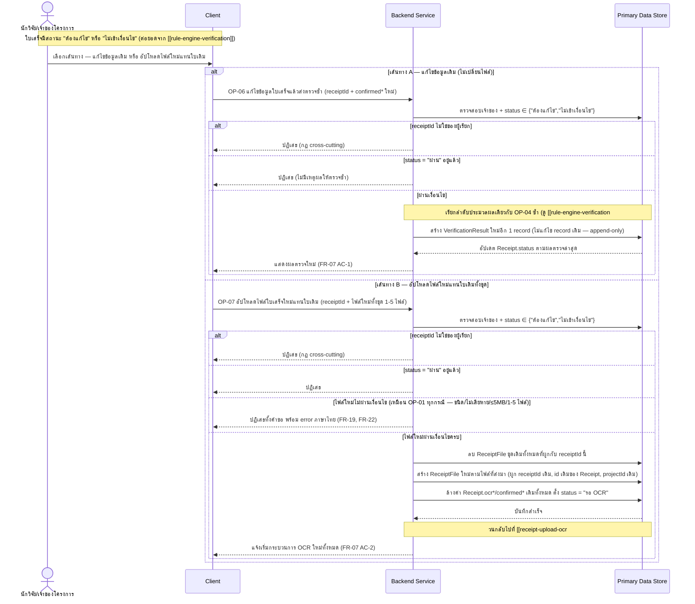
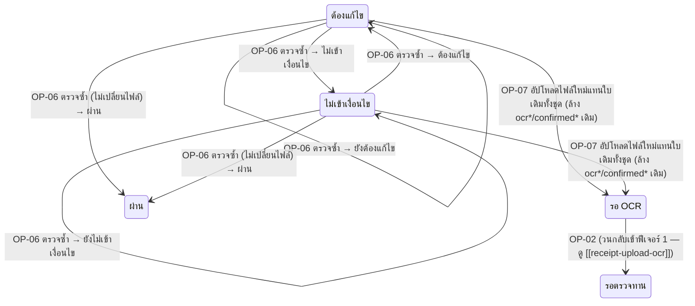

# Detailed Design — แก้ไขและส่งใบเสร็จที่ไม่ผ่านตรวจซ้ำ

> การออกแบบระดับ component สำหรับ [[feature-list#4. แก้ไขและส่งใบเสร็จที่ไม่ผ่านตรวจซ้ำ|ฟีเจอร์ที่ 4]]
> แปลงจาก [[user-journey#Journey 1: นักวิจัยอัปโหลดใบเสร็จและตรวจสอบผลจนผ่านเกณฑ์|Journey 1 ขั้นตอนที่ 11]]
> อ้างอิง operation จริงจาก [[api-spec#OP-06 แก้ไขข้อมูลใบเสร็จแล้วส่งตรวจซ้ำ|OP-06]] และ
> [[api-spec#OP-07 อัปโหลดไฟล์ใบเสร็จใหม่แทนใบเดิม|OP-07]] เท่านั้น

## 0. สถานะเอกสารนี้

- สร้างครั้งแรกเมื่อ 2026-08-23 ครอบคลุม FR-07 ตามที่
  [[feature-list#4. แก้ไขและส่งใบเสร็จที่ไม่ผ่านตรวจซ้ำ|ฟีเจอร์ที่ 4]] กำหนดไว้
- **อัปเดต 2026-09-03**: ปรับรหัส entity ให้ตรงกับ [[db-spec]] ที่จัดเรียงใหม่ (Receipt = E-04,
  ReceiptFile = E-05, VerificationResult = E-08) — เนื้อหา flow ไม่เปลี่ยนแปลง (OP-06/OP-07 ไม่ได้
  แก้ไขในรอบ FR-23 นอกจากอ้างอิงระเบียบผ่าน Project→FundSource ที่ [[rule-engine-verification]]
  จัดการอยู่แล้ว) เปลี่ยนคำเรียกบทบาทเป็น "นักวิจัย/เจ้าของโครงการ"

## 1. ภาพรวม

ฟีเจอร์นี้มี 2 เส้นทางที่นักวิจัยเลือกได้เมื่อใบเสร็จมีสถานะ "ต้องแก้ไข" หรือ "ไม่เข้าเงื่อนไข":

1. **แก้ไขข้อมูลเดิม** ผ่าน [[api-spec#OP-06 แก้ไขข้อมูลใบเสร็จแล้วส่งตรวจซ้ำ|OP-06]] — ใช้ไฟล์เดิม
   แก้ไขเฉพาะค่า `confirmed*` แล้วเรียกลำดับประมวลผลเดียวกับ OP-04 ซ้ำ (ไม่ผ่าน OCR ใหม่ — ยังคงอ้างอิง
   ระเบียบของ FundSource ที่ Project ของใบเสร็จนี้สังกัดอยู่ เวอร์ชันที่ active ณ เวลาที่ส่งซ้ำ)
2. **อัปโหลดไฟล์ใหม่แทนใบเดิมทั้งชุด** ผ่าน [[api-spec#OP-07 อัปโหลดไฟล์ใบเสร็จใหม่แทนใบเดิม|OP-07]]
   — แทนที่ `ReceiptFile` ทั้งชุด ล้างค่า `ocr*`/`confirmed*` เดิม (คง `projectId` เดิมไว้ ไม่เปลี่ยน
   โครงการที่ผูกอยู่) วนกลับไปที่ฟีเจอร์ 1 (OCR ใหม่) แล้วไล่ผ่านฟีเจอร์ 2-3 อีกครั้งทั้งหมด

Component ที่เกี่ยวข้อง: Client, Backend Service, Primary Data Store, External OCR Service (เฉพาะ
เส้นทาง OP-07), Verification Rule Engine, External LLM Explanation Service

## 2. Sequence Diagram

## 3. Operation ↔ Entity ที่กระทบ

| Operation | Entity ที่กระทบ | การกระทำ | ลำดับ/เงื่อนไข |
|---|---|---|---|
| [[api-spec#OP-06 แก้ไขข้อมูลใบเสร็จแล้วส่งตรวจซ้ำ\|OP-06]] | [[db-spec#E-04 ใบเสร็จ (Receipt)\|Receipt]] (E-04) | แก้ไข (`confirmed*` ใหม่, `status`) | เรียกได้เฉพาะ `status` ∈ {"ต้องแก้ไข","ไม่เข้าเงื่อนไข"} |
| OP-06 | [[db-spec#E-08 ผลตรวจใบเสร็จ (VerificationResult)\|VerificationResult]] (E-08) | สร้าง (record ใหม่) | append-only — ไม่แก้ไข/ลบ record ผลตรวจเดิม (db-spec กฎข้อ 3) |
| [[api-spec#OP-07 อัปโหลดไฟล์ใบเสร็จใหม่แทนใบเดิม\|OP-07]] | [[db-spec#E-05 ไฟล์ประกอบใบเสร็จ (ReceiptFile)\|ReceiptFile]] (E-05) | ลบ (ชุดเดิมทั้งหมด) แล้วสร้างใหม่ (1–5 records) | ลบก่อนสร้างเสมอ ผูกกับ `Receipt.id` เดิม (ไม่สร้าง Receipt ใหม่) |
| OP-07 | Receipt (E-04) | แก้ไข (ล้าง `ocr*`/`confirmed*` ทั้งหมด, `status` → "รอ OCR") | คง `id` และ `projectId` เดิมไว้ — วนกลับเข้า OP-02 โดยอัตโนมัติ |

## 4. State Diagram

## 5. Edge Case และวิธีจัดการ

| # | Edge Case | วิธีจัดการ | อ้างอิง |
|---|---|---|---|
| 1 | `receiptId` ไม่ใช่ของผู้เรียก | ปฏิเสธ (กฎ cross-cutting) | OP-06, OP-07 |
| 2 | ใบเสร็จมีสถานะ "ผ่าน" อยู่แล้ว | ปฏิเสธ (ไม่มีเหตุผลให้ตรวจซ้ำ) | [[api-spec#OP-06 แก้ไขข้อมูลใบเสร็จแล้วส่งตรวจซ้ำ\|OP-06]] |
| 3 | เรียก OP-06/OP-07 กับใบเสร็จที่ยังอยู่ "รอ OCR"/"รอตรวจทาน" (ยังไม่เคยถูกตัดสิน) | ปฏิเสธ — เรียกได้เฉพาะ `status` ∈ {"ต้องแก้ไข","ไม่เข้าเงื่อนไข"} เท่านั้น | OP-06, OP-07 |
| 4 | อัปโหลดไฟล์ใหม่ (OP-07) แต่ไฟล์ไม่ผ่านเงื่อนไข (ชนิด/เสียหาย/ขนาด/จำนวน) | ปฏิเสธทั้งคำขอ ใช้กฎเดียวกับ OP-01 ทุกข้อ | FR-19, FR-22 (เดียวกับ [[receipt-upload-ocr]]) |
| 5 | ส่งตรวจซ้ำหลายรอบต่อเนื่อง | ทุกครั้งสร้าง `VerificationResult` record ใหม่เสมอ (append-only) เพื่อรักษาประวัติ dispute | db-spec กฎข้อ 3, NFR-04 |

## เอกสารที่เกี่ยวข้อง

- [[feature-list#4. แก้ไขและส่งใบเสร็จที่ไม่ผ่านตรวจซ้ำ|feature-list ฟีเจอร์ที่ 4]]
- [[user-journey#Journey 1: นักวิจัยอัปโหลดใบเสร็จและตรวจสอบผลจนผ่านเกณฑ์|user-journey Journey 1]]
- [[api-spec#OP-06 แก้ไขข้อมูลใบเสร็จแล้วส่งตรวจซ้ำ|api-spec OP-06]], [[api-spec#OP-07 อัปโหลดไฟล์ใบเสร็จใหม่แทนใบเดิม|OP-07]]
- [[db-spec#4. กฎทางธุรกิจที่กระทบโครงสร้างข้อมูล (Business Rules)|db-spec กฎข้อ 9]] (1-5 ไฟล์/รายการ)
- [[receipt-upload-ocr]] — จุดที่วนกลับไปเมื่อใช้เส้นทาง OP-07
- [[rule-engine-verification]] — จุดที่วนกลับไปเมื่อใช้เส้นทาง OP-06
- [[access-control]] — กฎ cross-cutting เรื่องเจ้าของ `receiptId`
- test case: `docs/03-testing/01-test-plan/test-cases/resubmit-failed-receipt.md`
