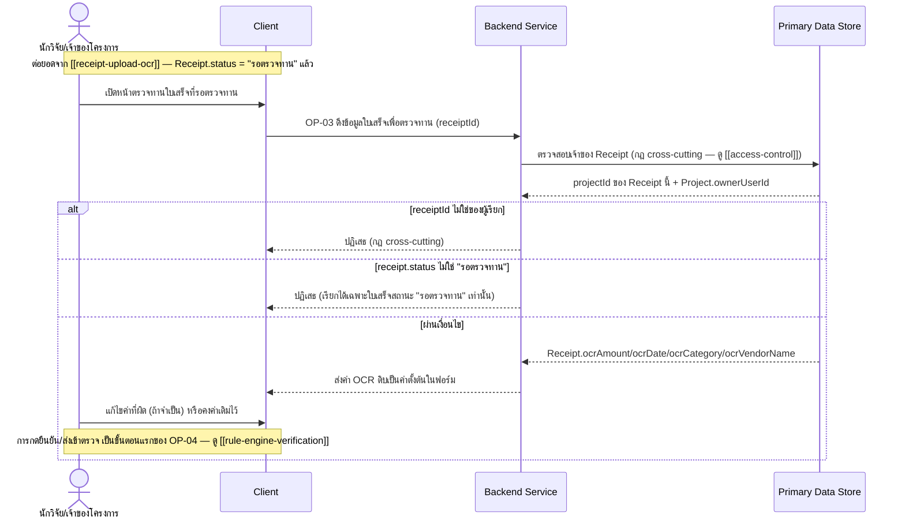

# Detailed Design — ตรวจสอบและแก้ไขข้อมูลก่อนส่งตรวจ

> การออกแบบระดับ component สำหรับ [[feature-list#2. ตรวจสอบและแก้ไขข้อมูลก่อนส่งตรวจ|ฟีเจอร์ที่ 2]]
> แปลงจาก [[user-journey#Journey 1: นักวิจัยอัปโหลดใบเสร็จและตรวจสอบผลจนผ่านเกณฑ์|Journey 1 ขั้นตอนที่ 8]]
> อ้างอิง operation จริงจาก [[api-spec#OP-03 ดึงข้อมูลใบเสร็จเพื่อตรวจทาน|OP-03]] เท่านั้น

## 0. สถานะเอกสารนี้

- สร้างครั้งแรกเมื่อ 2026-08-23 ครอบคลุม FR-03 ตามที่
  [[feature-list#2. ตรวจสอบและแก้ไขข้อมูลก่อนส่งตรวจ|ฟีเจอร์ที่ 2]] กำหนดไว้
- **อัปเดต 2026-09-03**: แก้ไขรหัส entity ให้ตรงกับ [[db-spec]] ที่จัดเรียงใหม่ (Receipt = E-04 แทน
  E-03 เดิม) และเปลี่ยนการตรวจสอบเจ้าของจาก `Fund.ownerUserId` เป็น `Project.ownerUserId` (ผ่าน
  `Receipt.projectId`) ตามกฎ cross-cutting ที่แก้ไขแล้ว — เปลี่ยนคำเรียกบทบาทเป็น "นักวิจัย/เจ้าของ
  โครงการ"

## 1. ภาพรวม

ฟีเจอร์นี้มี operation เดียวคือ [[api-spec#OP-03 ดึงข้อมูลใบเสร็จเพื่อตรวจทาน|OP-03]] เป็น
operation แบบ **read-only** เท่านั้น (ดึงค่า OCR ดิบมาแสดงเป็นค่าตั้งต้นในฟอร์มแก้ไข) — การบันทึกค่า
ที่นักวิจัยแก้ไขแล้วจริง (`confirmed*`) ไม่ได้เกิดขึ้นใน operation นี้ แต่เกิดขึ้นเป็นขั้นตอนแรกของ
[[api-spec#OP-04 ยืนยันข้อมูลใบเสร็จและส่งเข้าตรวจ|OP-04]] ในฟีเจอร์ที่ 3 (ดู [[rule-engine-verification]])
— ฟีเจอร์นี้จึงเป็นเพียงขั้นตอน "แสดงฟอร์มให้แก้ไข" ฝั่ง Client เท่านั้น ไม่มีการเขียนข้อมูลลง
Primary Data Store ในขั้นตอนนี้

Component ที่เกี่ยวข้อง: Client, Backend Service, Primary Data Store

## 2. Sequence Diagram

## 3. Operation ↔ Entity ที่กระทบ

| Operation | Entity ที่กระทบ | การกระทำ | ลำดับ/เงื่อนไข |
|---|---|---|---|
| [[api-spec#OP-03 ดึงข้อมูลใบเสร็จเพื่อตรวจทาน\|OP-03]] | [[db-spec#E-04 ใบเสร็จ (Receipt)\|Receipt]] (E-04) | อ่าน (`ocrAmount`/`ocrDate`/`ocrCategory`/`ocrVendorName`) | ต้องเรียกได้เฉพาะใบเสร็จที่ `status` = "รอตรวจทาน" เท่านั้น — ไม่มีการแก้ไข entity ใดใน operation นี้ |
| OP-03 | [[db-spec#E-03 โครงการวิจัย (Project)\|Project]] (E-03) | อ่าน (`ownerUserId`) | ตรวจสอบเจ้าของก่อนคืนข้อมูล (กฎ cross-cutting) — ไม่ใช่ผ่าน `Fund` อีกต่อไป |

## 4. State Diagram

ไม่มี — ฟีเจอร์นี้เป็น read-only ทั้งหมด ไม่มีการเปลี่ยนแปลงสถานะของ `Receipt` หรือ entity ใดๆ
(การเปลี่ยนสถานะจาก "รอตรวจทาน" เป็นสถานะอื่นเกิดขึ้นในฟีเจอร์ที่ 3 หลังกดส่งเข้าตรวจแล้วเท่านั้น
— ดู [[rule-engine-verification#4. State Diagram|rule-engine-verification]])

## 5. Edge Case และวิธีจัดการ

| # | Edge Case | วิธีจัดการ | อ้างอิง |
|---|---|---|---|
| 1 | `receiptId` ไม่ใช่ของผู้เรียก | ปฏิเสธ (กฎ cross-cutting) | [[api-spec#OP-03 ดึงข้อมูลใบเสร็จเพื่อตรวจทาน\|OP-03]] |
| 2 | เรียกดูใบเสร็จที่ไม่ได้อยู่สถานะ "รอตรวจทาน" (เช่น ยังอยู่ "รอ OCR" หรือผ่านไปแล้ว) | ปฏิเสธ — ต้องเรียกได้เฉพาะสถานะ "รอตรวจทาน" เท่านั้น | [[api-spec#OP-03 ดึงข้อมูลใบเสร็จเพื่อตรวจทาน\|OP-03]] |
| 3 | OCR อ่านข้อมูลได้ถูกต้องครบถ้วน ไม่ต้องแก้ไขอะไร | นักวิจัยกดยืนยันโดยไม่แก้ไข ระบบส่งค่าชุดเดิม (ที่มาจาก OCR) เข้าสู่ Rule Engine | FR-03 AC-1 |
| 4 | OCR อ่านค่าผิดพลาดบางส่วน (ยอดเงิน/วันที่/หมวด/ชื่อร้าน) | นักวิจัยแก้ไขค่าที่ผิด ระบบใช้ค่าที่แก้ไขแล้ว (ไม่ใช่ค่าดิบ) เป็น input เข้า Rule Engine | FR-03 AC-2 |
| 5 | บางช่องเป็นค่าว่าง (OCR อ่านไม่ได้) | นักวิจัยต้องกรอกเองก่อนกดยืนยัน (ไม่ได้ระบุว่าเป็น optional ทุกช่อง — ดู [[db-spec#E-04 ใบเสร็จ (Receipt)\|db-spec E-04]] `confirmed*` เป็น "จำเป็นต้องมีค่า (หลังผ่านขั้นตอนยืนยัน)" ยกเว้น `confirmedVendorName`) | db-spec E-04 |

## เอกสารที่เกี่ยวข้อง

- [[feature-list#2. ตรวจสอบและแก้ไขข้อมูลก่อนส่งตรวจ|feature-list ฟีเจอร์ที่ 2]]
- [[user-journey#Journey 1: นักวิจัยอัปโหลดใบเสร็จและตรวจสอบผลจนผ่านเกณฑ์|user-journey Journey 1]]
- [[api-spec#OP-03 ดึงข้อมูลใบเสร็จเพื่อตรวจทาน|api-spec OP-03]]
- [[db-spec#E-04 ใบเสร็จ (Receipt)|db-spec E-04]]
- [[receipt-upload-ocr]] — ฟีเจอร์ก่อนหน้า
- [[rule-engine-verification]] — ฟีเจอร์ถัดไป (การยืนยัน/ส่งเข้าตรวจจริงเกิดที่นี่)
- [[access-control]] — กฎ cross-cutting เรื่องเจ้าของ `receiptId`
- test case: `docs/03-testing/01-test-plan/test-cases/review-edit-ocr-data.md`
