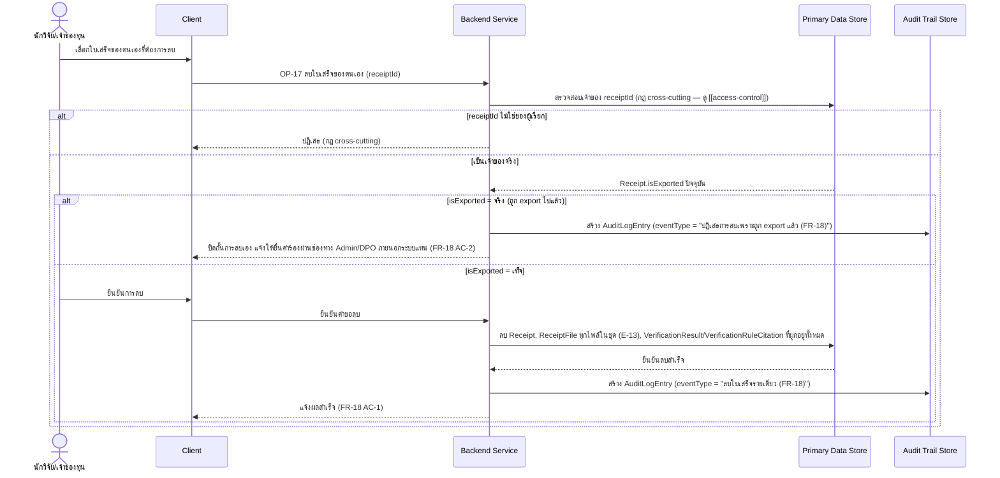
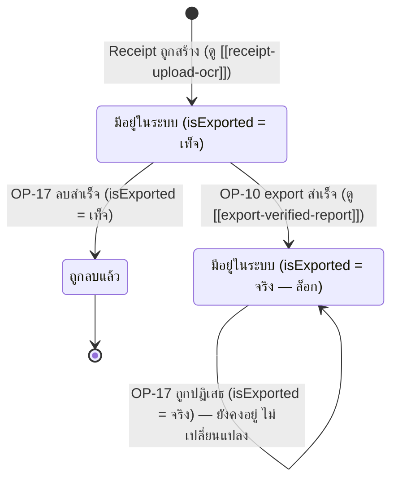

# Detailed Design — ลบข้อมูลใบเสร็จของตนเองด้วยตนเอง (Right to Erasure)

> การออกแบบระดับ component สำหรับ [[feature-list#12. ลบข้อมูลใบเสร็จของตนเองด้วยตนเอง (Right to Erasure)|ฟีเจอร์ที่ 12]]
> แปลงจาก [[user-journey#Journey 7: นักวิจัยลบข้อมูลใบเสร็จของตนเองด้วยตนเอง (Right to Erasure)|Journey 7]]
> อ้างอิง operation จริงจาก [[api-spec#OP-17 ลบใบเสร็จของตนเอง|OP-17]] เท่านั้น

## 0. สถานะเอกสารนี้

สร้างครั้งแรกเมื่อ 2026-08-23 ครอบคลุม FR-18, NFR-11 ตามที่
[[feature-list#12. ลบข้อมูลใบเสร็จของตนเองด้วยตนเอง (Right to Erasure)|ฟีเจอร์ที่ 12]] กำหนดไว้

## 1. ภาพรวม

ฟีเจอร์นี้มี operation เดียวคือ [[api-spec#OP-17 ลบใบเสร็จของตนเอง|OP-17]] — ลบใบเสร็จรายเดียวได้
**เฉพาะเมื่อ `Receipt.isExported` = เท็จเท่านั้น** (ต่างจาก [[consent-management]]/OP-15/FR-20 ที่ลบ
ทั้งหมดทันทีโดยไม่มีเงื่อนไขนี้ เพราะกรณีนั้นนักวิจัยถอนความยินยอมทั้งหมดแล้ว ไม่มีฐานทางกฎหมายเหลืออยู่)
เหตุผลของเงื่อนไข `isExported` คือรักษา Audit Trail/ป้องกันการลบหลักฐานหนีความรับผิดหลังยื่นเบิกไปแล้ว
ไม่ใช่ข้อกำหนดเก็บหลักฐานทางการเงินอย่างเป็นทางการ

Component ที่เกี่ยวข้อง: Client, Backend Service, Primary Data Store, Audit Trail Store

## 2. Sequence Diagram

## 3. Operation ↔ Entity ที่กระทบ

| Operation | Entity ที่กระทบ | การกระทำ | ลำดับ/เงื่อนไข |
|---|---|---|---|
| [[api-spec#OP-17 ลบใบเสร็จของตนเอง\|OP-17]] | [[db-spec#E-03 ใบเสร็จ (Receipt)\|Receipt]] (E-03) | อ่าน (`isExported`) แล้วลบ (ถ้าเท็จ) | ตรวจสอบ `isExported` ก่อนทุกครั้ง — เป็นเงื่อนไขบล็อกเดียวของ operation นี้ |
| OP-17 | [[db-spec#E-13 ไฟล์ประกอบใบเสร็จ (ReceiptFile)\|ReceiptFile]] (E-13) | ลบทั้งหมด (ทุกไฟล์ในชุด) | ลบพร้อม `Receipt` ในดำเนินการเดียวกัน — ล็อก/ลบทั้งชุด ไม่ใช่ทีละไฟล์ (db-spec กฎข้อ 10) |
| OP-17 | [[db-spec#E-06 ผลตรวจใบเสร็จ (VerificationResult)\|VerificationResult]] (E-06) + [[db-spec#E-07 ข้อระเบียบที่อ้างอิงในผลตรวจ (VerificationRuleCitation)\|VerificationRuleCitation]] (E-07) | ลบทั้งหมด | ลบทุก record ที่ผูกกับ `receiptId` นี้ (รวมทุกรอบที่เคยส่งตรวจซ้ำ) |
| OP-17 | [[db-spec#E-12 บันทึกเหตุการณ์ตรวจสอบย้อนหลัง (AuditLogEntry)\|AuditLogEntry]] (E-12) | สร้าง | สร้างทั้ง 2 เส้นทาง (ลบสำเร็จ หรือ ถูกปฏิเสธเพราะ export แล้ว) — คนละ `eventType` |

## 4. State Diagram

> หมายเหตุ: `s_locked` เป็น terminal state ของฟีเจอร์นี้เพียงอย่างเดียว (ลบเองผ่าน UI ไม่ได้อีก) — ทางเดียว
> ที่จะออกจากสถานะนี้คือถอนความยินยอมทั้งหมด (ดู [[consent-management]]/OP-15/FR-20 ซึ่งลบโดยไม่ตรวจ
> `isExported`) หรือยื่นคำร้องผ่าน Admin/DPO ภายนอกระบบ (นอกขอบเขต operation ของระบบนี้)

## 5. Edge Case และวิธีจัดการ

| # | Edge Case | วิธีจัดการ | อ้างอิง |
|---|---|---|---|
| 1 | ลบใบเสร็จที่ยังไม่ถูก export | ลบข้อมูลใบเสร็จนั้นออกจากระบบทันที (ทั้ง Receipt/ReceiptFile/VerificationResult/VerificationRuleCitation) | FR-18 AC-1 |
| 2 | พยายามลบใบเสร็จที่ถูก export ไปแล้ว | ปิดกั้นการลบเองผ่าน UI แจ้งให้ยื่นคำร้องผ่านช่องทาง Admin/DPO ภายนอกระบบแทน | FR-18 AC-2 |
| 3 | `receiptId` ไม่ใช่ของผู้เรียก | ปฏิเสธ (กฎ cross-cutting) | [[api-spec#OP-17 ลบใบเสร็จของตนเอง\|OP-17]] |
| 4 | เหตุผลของเงื่อนไข `isExported` | เป็นการรักษา Audit Trail/ป้องกันการลบหลักฐานหนีความรับผิด **ไม่ใช่** ข้อกำหนดเก็บหลักฐานทางการเงินอย่างเป็นทางการ | [[20260816-02-pdpa-compliance#8.2 ทบทวนเหตุผลของ FR-18 หลังคำชี้แจงเรื่องบทบาทระบบ (ประเมินเมื่อ 2026-08-16 รอบ 3)]] |
| 5 | เทียบกับการถอนความยินยอมทั้งหมด (FR-20) | ต่างกันโดยเจตนา — FR-20 ลบทั้งหมดทันทีไม่มีเงื่อนไข `isExported` เพราะไม่มีฐานทางกฎหมายเหลืออยู่ ส่วน FR-18 ยังมีฐาน consent อยู่จึงต้องรักษาเงื่อนไขนี้ | ดู [[consent-management]] |

## เอกสารที่เกี่ยวข้อง

- [[feature-list#12. ลบข้อมูลใบเสร็จของตนเองด้วยตนเอง (Right to Erasure)|feature-list ฟีเจอร์ที่ 12]]
- [[user-journey#Journey 7: นักวิจัยลบข้อมูลใบเสร็จของตนเองด้วยตนเอง (Right to Erasure)|user-journey Journey 7]]
- [[api-spec#OP-17 ลบใบเสร็จของตนเอง|api-spec OP-17]]
- [[db-spec#4. กฎทางธุรกิจที่กระทบโครงสร้างข้อมูล (Business Rules)|db-spec กฎข้อ 5, 10]]
- [[export-verified-report]] — ที่มาของ `isExported` = จริง
- [[consent-management]] — เปรียบเทียบเงื่อนไขการลบที่ต่างกัน (FR-18 vs FR-20)
- [[access-control]] — กฎ cross-cutting เรื่องเจ้าของ `receiptId`
- test case: `docs/03-testing/01-test-plan/test-cases/right-to-erasure.md`
