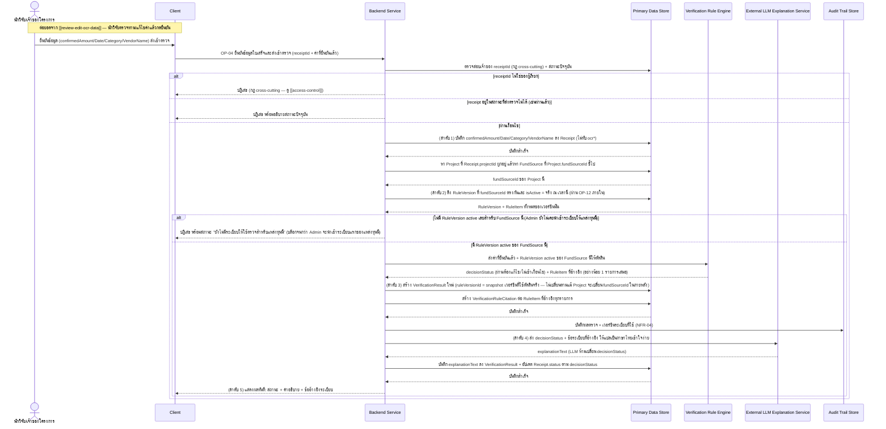
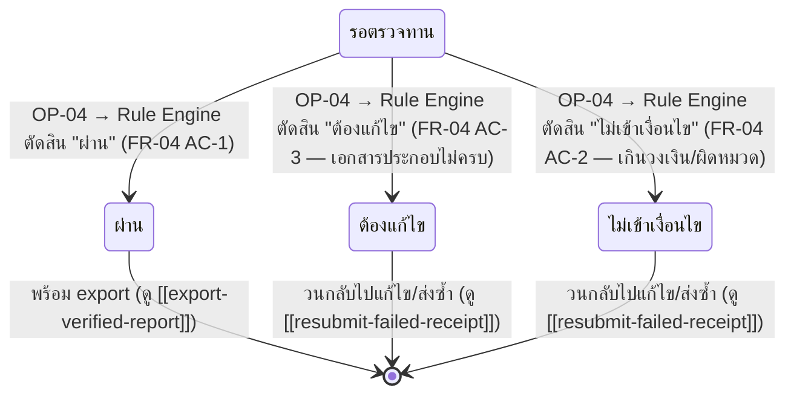

# Detailed Design — ตรวจสอบใบเสร็จด้วย Rule Engine พร้อมคำอธิบายจาก LLM

> การออกแบบระดับ component สำหรับ [[feature-list#3. ตรวจสอบใบเสร็จด้วย Rule Engine พร้อมคำอธิบายจาก LLM|ฟีเจอร์ที่ 3]]
> แปลงจาก [[user-journey#Journey 1: นักวิจัยอัปโหลดใบเสร็จและตรวจสอบผลจนผ่านเกณฑ์|Journey 1 ขั้นตอนที่ 9-10]]
> อ้างอิง operation จริงจาก [[api-spec#OP-04 ยืนยันข้อมูลใบเสร็จและส่งเข้าตรวจ|OP-04]] และ
> [[api-spec#OP-05 ดูรายละเอียดผลตรวจใบเสร็จ|OP-05]] เท่านั้น

## 0. สถานะเอกสารนี้

- สร้างครั้งแรกเมื่อ 2026-08-23 ครอบคลุม FR-04, FR-05, FR-06, NFR-01–NFR-04, NFR-06, NFR-08, NFR-09
  ตามที่ [[feature-list#3. ตรวจสอบใบเสร็จด้วย Rule Engine พร้อมคำอธิบายจาก LLM|ฟีเจอร์ที่ 3]] กำหนดไว้
- **อัปเดต 2026-09-03 (sync กับ [[architecture]]/[[api-spec]]/[[db-spec]] รอบแก้ไขโมเดลข้อมูล FR-23):**
  เดิมเอกสารนี้เขียนว่า Rule Engine ใช้ "เวอร์ชันเดียวรวมทั้งระบบ" ซึ่งผิด — แก้ไขลำดับการประมวลผลให้
  เลือก `RuleVersion` จาก **FundSource ที่ Project ของใบเสร็จนั้นสังกัดอยู่** เวอร์ชันที่ `isActive`
  = จริง **ณ วันที่ตรวจ** (finalize แล้ว) แทน และปรับรหัส entity ทั้งหมดให้ตรงกับ [[db-spec]] ที่
  จัดเรียงใหม่ (RuleVersion = E-06, RuleItem = E-07, VerificationResult = E-08,
  VerificationRuleCitation = E-09) เปลี่ยนคำเรียกบทบาทเป็น "นักวิจัย/เจ้าของโครงการ"

## 1. ภาพรวม

ฟีเจอร์นี้เป็นหัวใจของหลักการกัน hallucination ของระบบ (ดู
[[architecture#1. ภาพรวมสถาปัตยกรรม|architecture หัวข้อ 1]]): **Rule Engine เป็นผู้ตัดสินใจเพียงผู้
เดียว ไม่ใช่ LLM** — [[api-spec#OP-04 ยืนยันข้อมูลใบเสร็จและส่งเข้าตรวจ|OP-04]] รวม FR-03 (บันทึกค่า
ยืนยัน), FR-04 (Rule Engine ตัดสินโดยอ้างอิงระเบียบของ FundSource ที่ Project สังกัด), FR-05 (LLM
แปลผล), FR-06 (แสดงผล) เป็น operation เดียวเพราะ pipeline เป็น synchronous request-response ตลอดสาย
(ตัดสินใจแล้วที่
[[architecture#5.2 รูปแบบการสื่อสารระหว่าง Backend Service ↔ OCR/Rule Engine/LLM — Synchronous หรือ Asynchronous|architecture 5.2]])
ส่วน [[api-spec#OP-05 ดูรายละเอียดผลตรวจใบเสร็จ|OP-05]] เป็น operation แยกสำหรับดูผลตรวจย้อนหลัง
(read-only)

Component ที่เกี่ยวข้อง: Client, Backend Service, Primary Data Store, Verification Rule Engine,
External LLM Explanation Service, Audit Trail Store

## 2. Sequence Diagram

> **หมายเหตุการออกแบบ (กรณี Verification Rule Engine หรือ External LLM Explanation Service ล้มเหลว
> ทางเทคนิคระหว่าง pipeline นี้ — เช่น เรียกไม่ติด/timeout):** [[api-spec#OP-04 ยืนยันข้อมูลใบเสร็จและส่งเข้าตรวจ|OP-04]]
> ไม่ได้ระบุพฤติกรรมของกรณีนี้ไว้ตรงๆ ในหัวข้อ "กรณี Error หลัก" (ระบุแค่ 3 กรณี: เจ้าของไม่ตรง,
> สถานะไม่ถูกต้อง, และไม่มีระเบียบ active สำหรับแหล่งทุนนี้) เอกสารนี้เลือกยึดตามลำดับการประมวลผลที่
> ระบุไว้ตรงตัวอยู่แล้ว (ลำดับ 1-5 ข้างบน) โดยตีความว่า **หากลำดับ Rule Engine หรือ LLM ล้มเหลวทาง
> เทคนิค ระบบจะยังไม่สร้าง `VerificationResult`** เพราะ [[db-spec#4. กฎทางธุรกิจที่กระทบโครงสร้างข้อมูล (Business Rules)|db-spec กฎข้อ 3]]
> กำหนดให้ `VerificationResult` เป็น append-only (สร้างเมื่อมีผลตัดสินจริงเท่านั้น) และ NFR-03
> กำหนดให้ทุกผลตรวจต้องมีข้อระเบียบอ้างอิงอย่างน้อย 1 รายการเสมอ — ผลตรวจที่ยังไม่มีข้อระเบียบอ้างอิง
> (เช่น กรณี Rule Engine ล้มเหลวก่อนตอบ) จึงไม่ควรถูกสร้างขึ้นเลย ส่วน `Receipt.confirmed*` ที่บันทึก
> ไปแล้วในลำดับ 1 **จะยังคงอยู่** (ไม่ rollback) และ `Receipt.status` ยังคงเป็น "รอตรวจทาน" เหมือนเดิม
> — ผลคือนักวิจัยสามารถกดส่งเข้าตรวจซ้ำได้ทันทีโดยไม่เสียค่าที่ยืนยันไปแล้ว การตีความนี้เป็นการต่อขยาย
> ตรงไปตรงมาจากกฎที่มีอยู่แล้ว ไม่ใช่การเพิ่ม entity/status ใหม่ — หากผู้ใช้เห็นว่าควรมีข้อความ error
> ที่สื่อสารกรณีนี้ชัดเจนกว่านี้ (เช่น "ระบบขัดข้อง กรุณาลองใหม่") ควรเพิ่มเป็นกรณี error ใหม่ใน
> `api-spec.md` ผ่าน `sync-api-db` ในรอบถัดไป

## 3. Operation ↔ Entity ที่กระทบ

| Operation | Entity ที่กระทบ | การกระทำ | ลำดับ/เงื่อนไข |
|---|---|---|---|
| [[api-spec#OP-04 ยืนยันข้อมูลใบเสร็จและส่งเข้าตรวจ\|OP-04]] | [[db-spec#E-04 ใบเสร็จ (Receipt)\|Receipt]] (E-04) | แก้ไข (`confirmed*`) | ลำดับ 1 — เกิดก่อนเรียก Rule Engine เสมอ (ไม่ทับ `ocr*`) |
| OP-04 | [[db-spec#E-03 โครงการวิจัย (Project)\|Project]] (E-03) | อ่าน (`fundSourceId`) | หา FundSource ที่โครงการของใบเสร็จนี้สังกัดอยู่ ก่อนเลือก RuleVersion |
| OP-04 | [[db-spec#E-06 เวอร์ชันระเบียบ (RuleVersion)\|RuleVersion]] (E-06) + [[db-spec#E-07 ข้อกำหนดย่อยระเบียบ (RuleItem)\|RuleItem]] (E-07) | อ่าน (`fundSourceId` ตรงกับ Project + `isActive` = จริง) | ลำดับ 2 — ต้องมี record active อย่างน้อย 1 ตัวของ FundSource นี้ ไม่เช่นนั้นบล็อกการตรวจ |
| OP-04 | [[db-spec#E-08 ผลตรวจใบเสร็จ (VerificationResult)\|VerificationResult]] (E-08) | สร้าง | ลำดับ 3 — `ruleVersionId` เป็น snapshot (ไม่ใช่ live reference), append-only |
| OP-04 | [[db-spec#E-09 ข้อระเบียบที่อ้างอิงในผลตรวจ (VerificationRuleCitation)\|VerificationRuleCitation]] (E-09) | สร้าง (≥1 record เสมอ) | ลำดับ 3 — ผูกกับ `VerificationResult` ที่สร้างในคำขอเดียวกัน |
| OP-04 | Receipt (E-04) | แก้ไข (`status` → ตาม `decisionStatus`) | ลำดับ 5 — หลัง LLM แปลผลสำเร็จแล้วเท่านั้น |
| [[api-spec#OP-05 ดูรายละเอียดผลตรวจใบเสร็จ\|OP-05]] | Receipt (E-04), VerificationResult (E-08), RuleItem (E-07) ผ่าน VerificationRuleCitation | อ่านทั้งหมด | read-only — ไม่มีการแก้ไข |

## 4. State Diagram

> ดูวงจรชีวิตแบบเต็มทั้งหมด (รวมสถานะ "รอ OCR"/"รอตรวจทาน" ก่อนหน้านี้) ที่
> [[receipt-upload-ocr#4. State Diagram — วงจรชีวิตสถานะใบเสร็จ (ภาพรวมทั้งหมด อ้างอิงจากทุกฟีเจอร์ที่แก้ Receipt.status)|receipt-upload-ocr หัวข้อ 4]]
> (`Receipt.status` enum ปัจจุบันมี 5 ค่า — ค่า "รอผลตรวจ" ที่เคยเป็นช่องว่างถูกลบออกแล้วเมื่อ
> 2026-08-23 โดย `api-db-writer` ดู [[db-spec#5.4 สถานะ Receipt.status ที่ตัดออก (แก้ไข 2026-08-23)|db-spec หัวข้อ 5.4]])

## 5. Edge Case และวิธีจัดการ

| # | Edge Case | วิธีจัดการ | อ้างอิง |
|---|---|---|---|
| 1 | `receiptId` ไม่ใช่ของผู้เรียก | ปฏิเสธ (กฎ cross-cutting) | [[api-spec#OP-04 ยืนยันข้อมูลใบเสร็จและส่งเข้าตรวจ\|OP-04]] |
| 2 | ใบเสร็จอยู่ในสถานะที่ส่งตรวจไม่ได้ (เช่นผ่านแล้ว) | ปฏิเสธพร้อมอธิบายสถานะปัจจุบัน | OP-04 |
| 3 | ยังไม่มี RuleVersion ที่ active เลยสำหรับ FundSource ที่ Project สังกัด (Admin ยังไม่นำเข้าระเบียบแรกของแหล่งทุนนี้) | คืนค่าว่างพร้อมสถานะ "ยังไม่มีระเบียบให้ใช้ตรวจสำหรับแหล่งทุนนี้" บล็อกไม่ให้ตัดสินใจได้จนกว่า Admin จะนำเข้าระเบียบแรกของแหล่งทุนนี้ | [[api-spec#OP-12 ดูเวอร์ชันระเบียบที่ active ปัจจุบันของแหล่งทุน\|OP-12]] |
| 4 | ข้อมูลเข้าเงื่อนไขหมวด/วงเงิน แต่ขาดเอกสารประกอบที่ระเบียบกำหนด | Rule Engine ตัดสิน "ต้องแก้ไข" | FR-04 AC-3 |
| 5 | อยู่ในหมวดไม่อนุญาต หรือเกินวงเงินสูงสุดของหมวด | Rule Engine ตัดสิน "ไม่เข้าเงื่อนไข" | FR-04 AC-2 |
| 6 | ทุกผลตรวจต้องมีข้ออ้างอิงระเบียบเสมอ | ห้ามมีผลตรวจที่ไม่มี `VerificationRuleCitation` แม้แต่รายการเดียว | NFR-03 |
| 7 | LLM พยายามเปลี่ยนผลตัดสิน | ไม่อนุญาต — `decisionStatus` มาจาก Rule Engine เท่านั้น `explanationText` เก็บแยก field ชัดเจน | FR-04, FR-05 |
| 8 | ผู้ให้บริการ OCR/LLM ประมวลผลข้อมูลนอกราชอาณาจักรไทย | ต้องผ่านมาตรการ cross-border ตาม NFR-08/NFR-09 ก่อน (organizational ไม่ใช่ logic ในโค้ด) | NFR-08, NFR-09 |
| 9 | Rule Engine/LLM ล้มเหลวทางเทคนิคระหว่าง pipeline | ไม่สร้าง `VerificationResult`; `Receipt.confirmed*` ที่บันทึกแล้วคงอยู่; `status` ยังเป็น "รอตรวจทาน" — ผู้ใช้ส่งเข้าตรวจซ้ำได้ (ดูหมายเหตุการออกแบบหัวข้อ 2 — แนะนำ `sync-api-db` เพิ่ม error case นี้ให้ชัดเจนขึ้น) | หมายเหตุการออกแบบ (ใหม่จากงานนี้) |
| 10 | Project เปลี่ยน `fundSourceId` ที่ผูกในภายหลัง | `VerificationResult.ruleVersionId` ที่ snapshot ไว้ก่อนหน้าไม่เปลี่ยนตาม (immutable) — การตรวจครั้งถัดไปเท่านั้นที่ใช้ FundSource ใหม่ | db-spec กฎข้อ 2/11 |

## เอกสารที่เกี่ยวข้อง

- [[feature-list#3. ตรวจสอบใบเสร็จด้วย Rule Engine พร้อมคำอธิบายจาก LLM|feature-list ฟีเจอร์ที่ 3]]
- [[user-journey#Journey 1: นักวิจัยอัปโหลดใบเสร็จและตรวจสอบผลจนผ่านเกณฑ์|user-journey Journey 1]]
- [[api-spec#OP-04 ยืนยันข้อมูลใบเสร็จและส่งเข้าตรวจ|api-spec OP-04]], [[api-spec#OP-05 ดูรายละเอียดผลตรวจใบเสร็จ|OP-05]]
- [[db-spec#E-08 ผลตรวจใบเสร็จ (VerificationResult)|db-spec E-08]], [[db-spec#E-09 ข้อระเบียบที่อ้างอิงในผลตรวจ (VerificationRuleCitation)|E-09]]
- [[review-edit-ocr-data]] — ฟีเจอร์ก่อนหน้า
- [[resubmit-failed-receipt]] — ฟีเจอร์ถัดไป (กรณีไม่ผ่าน)
- [[export-verified-report]] — ฟีเจอร์ถัดไป (กรณีผ่าน)
- [[admin-rule-management]] — ที่มาของ RuleVersion/RuleItem ที่ใช้ตัดสิน
- [[project-setup]] — ที่มาของ `Project.fundSourceId` ที่ใช้เลือก RuleVersion
- [[access-control]] — กฎ cross-cutting เรื่องเจ้าของ `receiptId`
- test case: `docs/03-testing/01-test-plan/test-cases/rule-engine-verification.md`
