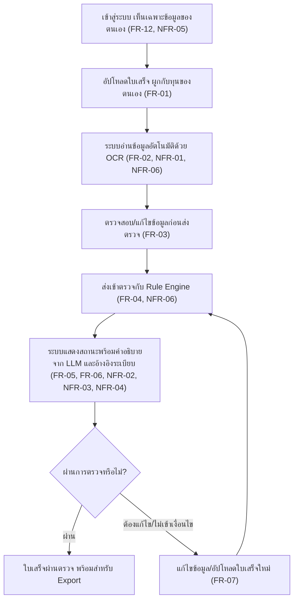
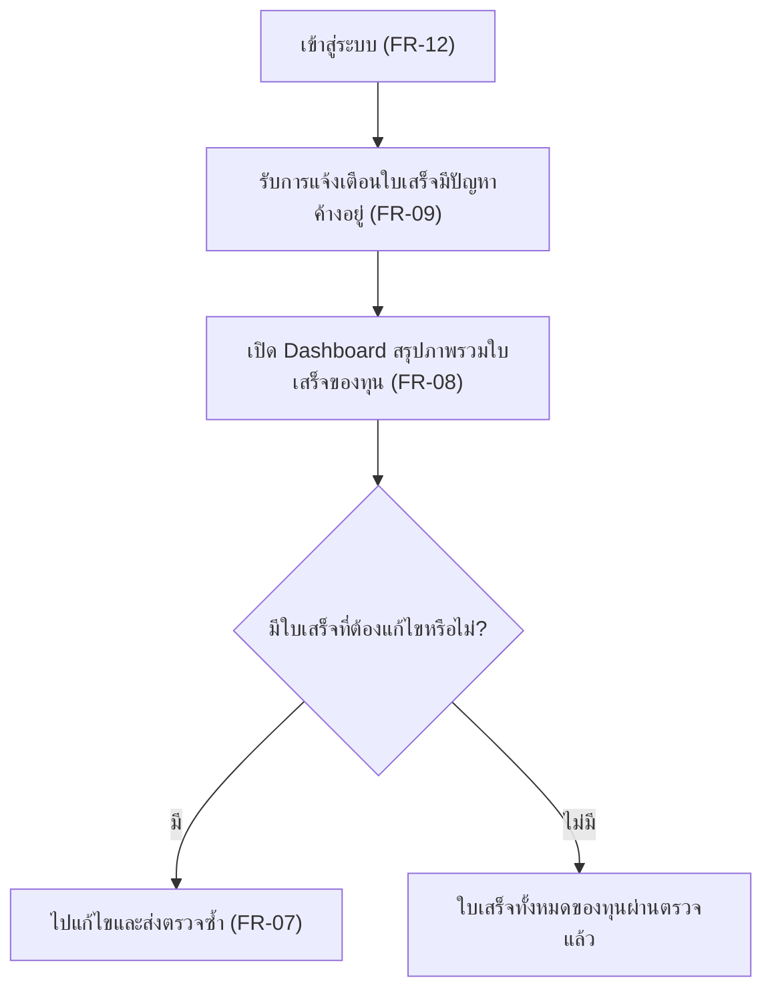
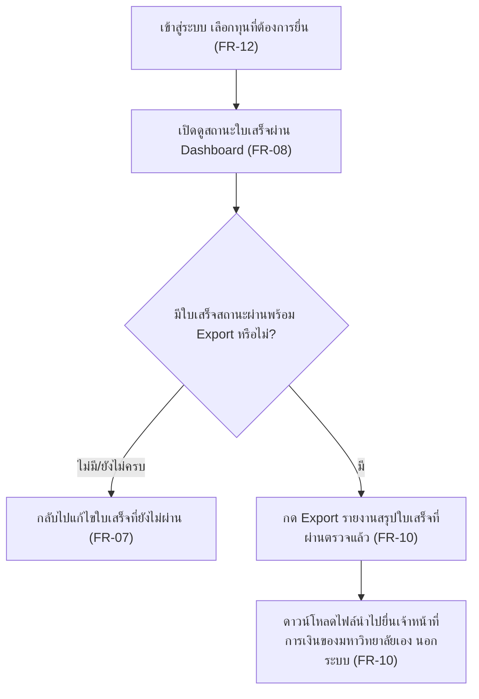
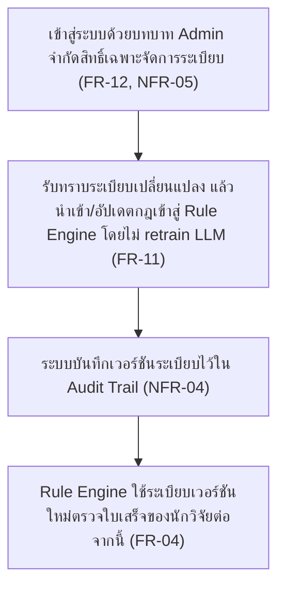

# User Journey — Grant Receipt Assistant

แมปฟีเจอร์จาก [[feature-list]] เป็น flow การใช้งานจริงตามบทบาทผู้ใช้ (step-by-step) ระบบมี 2
บทบาทเท่านั้น: **นักวิจัย/เจ้าของทุน** และ **Admin (ผู้ดูแลระบบ/ผู้อัปเดตระเบียบ)** (ดู
[[20260816-01-grant-receipt-verification#3. บทบาทผู้ใช้ (User Roles)]]) แต่ละ journey ด้านล่างมี
แผนภาพ Mermaid flowchart กำกับก่อนรายการขั้นตอนแบบข้อความเสมอ เพื่อให้เห็นภาพรวมได้เร็ว

## Journey 1: นักวิจัยอัปโหลดใบเสร็จและตรวจสอบผลจนผ่านเกณฑ์

บทบาท: นักวิจัย/เจ้าของทุน

ขั้นตอน:
1. เข้าสู่ระบบ — เห็นเฉพาะข้อมูลใบเสร็จ/ทุนของตนเองเท่านั้น
   ([[20260816-01-grant-receipt-verification#4. Functional Requirements|FR-12]],
   [[20260816-01-grant-receipt-verification#5. Non-Functional Requirements|NFR-05]])
2. อัปโหลดไฟล์ใบเสร็จ (jpg/png หรือ PDF สแกน) ผูกกับทุนวิจัยของตนเอง
   ([[20260816-01-grant-receipt-verification#4. Functional Requirements|FR-01]])
3. ระบบอ่านข้อมูลจากใบเสร็จอัตโนมัติด้วย OCR (ยอดเงิน วันที่ หมวดค่าใช้จ่าย ชื่อร้าน/ผู้ขาย)
   ([[20260816-01-grant-receipt-verification#4. Functional Requirements|FR-02]],
   [[20260816-01-grant-receipt-verification#5. Non-Functional Requirements|NFR-01]],
   [[20260816-01-grant-receipt-verification#5. Non-Functional Requirements|NFR-06]])
4. ตรวจสอบและแก้ไขข้อมูลที่ OCR อ่านได้ ก่อนกดส่งเข้าตรวจ
   ([[20260816-01-grant-receipt-verification#4. Functional Requirements|FR-03]])
5. กดส่งข้อมูลเข้าตรวจกับ Rule Engine
   ([[20260816-01-grant-receipt-verification#4. Functional Requirements|FR-04]],
   [[20260816-01-grant-receipt-verification#5. Non-Functional Requirements|NFR-06]])
6. ระบบแสดงสถานะใบเสร็จ (ผ่าน / ต้องแก้ไข / ไม่เข้าเงื่อนไข) พร้อมคำอธิบายจาก LLM ที่แปลผลจาก
   Rule Engine เป็นภาษาที่เข้าใจง่าย และอ้างอิงข้อระเบียบที่ใช้ตัดสิน
   ([[20260816-01-grant-receipt-verification#4. Functional Requirements|FR-05]],
   [[20260816-01-grant-receipt-verification#4. Functional Requirements|FR-06]],
   [[20260816-01-grant-receipt-verification#5. Non-Functional Requirements|NFR-02]],
   [[20260816-01-grant-receipt-verification#5. Non-Functional Requirements|NFR-03]],
   [[20260816-01-grant-receipt-verification#5. Non-Functional Requirements|NFR-04]])
7. ตามสถานการณ์: ถ้า**ผ่าน** → ใบเสร็จพร้อมสำหรับนำไป export (ดู Journey 3) จบ flow นี้
   ถ้า**ต้องแก้ไข/ไม่เข้าเงื่อนไข** → แก้ไขข้อมูลหรืออัปโหลดใบเสร็จใหม่แทนใบเดิม แล้ววนกลับไปขั้น
   ตอนที่ 5 (ส่งเข้าตรวจกับ Rule Engine ซ้ำ) จนกว่าจะผ่าน
   ([[20260816-01-grant-receipt-verification#4. Functional Requirements|FR-07]])

## Journey 2: นักวิจัยติดตามภาพรวมทุนและจัดการใบเสร็จที่มีปัญหาผ่าน Dashboard และการแจ้งเตือน

บทบาท: นักวิจัย/เจ้าของทุน

ขั้นตอน:
1. เข้าสู่ระบบ — เห็นเฉพาะทุนของตนเอง
   ([[20260816-01-grant-receipt-verification#4. Functional Requirements|FR-12]])
2. รับการแจ้งเตือนเมื่อมีใบเสร็จสถานะ "ต้องแก้ไข"/"ไม่เข้าเงื่อนไข" ค้างอยู่ยังไม่ได้รับการแก้ไข
   (ไม่รวมการแจ้งเตือนตามกำหนดเวลาส่งหลักฐาน ซึ่งตัดออกจากขอบเขต MVP นี้)
   ([[20260816-01-grant-receipt-verification#4. Functional Requirements|FR-09]])
3. เปิดดู Dashboard สรุปภาพรวมสถานะใบเสร็จของแต่ละทุนที่ถือ (จำนวนที่ผ่าน/ต้องแก้/ไม่เข้าเงื่อนไข)
   ([[20260816-01-grant-receipt-verification#4. Functional Requirements|FR-08]])
4. ตามสถานการณ์: ถ้า**มี**ใบเสร็จที่ต้องแก้ไข → ไปที่ใบเสร็จนั้นเพื่อแก้ไขและส่งตรวจซ้ำ (ต่อยอดจาก
   Journey 1 ขั้นตอนที่ 7) ถ้า**ไม่มี** → ใบเสร็จทั้งหมดของทุนผ่านตรวจแล้ว พร้อมสำหรับ export
   ([[20260816-01-grant-receipt-verification#4. Functional Requirements|FR-07]])

## Journey 3: นักวิจัย Export รายงานสรุปใบเสร็จที่ผ่านตรวจแล้วเพื่อยื่นเจ้าหน้าที่การเงิน

บทบาท: นักวิจัย/เจ้าของทุน

ขั้นตอน:
1. เข้าสู่ระบบและเลือกทุนที่ต้องการยื่นเบิก
   ([[20260816-01-grant-receipt-verification#4. Functional Requirements|FR-12]])
2. เปิดดูสถานะใบเสร็จของทุนผ่าน Dashboard
   ([[20260816-01-grant-receipt-verification#4. Functional Requirements|FR-08]])
3. ตามสถานการณ์: ถ้า**ไม่มี**ใบเสร็จสถานะผ่านครบตามที่ต้องการยื่น → กลับไปแก้ไขใบเสร็จที่ยังไม่ผ่าน
   ก่อน (ต่อยอดจาก Journey 1 ขั้นตอนที่ 7) ถ้า**มี**ใบเสร็จสถานะผ่านพร้อม export → ไปขั้นตอนถัดไป
   ([[20260816-01-grant-receipt-verification#4. Functional Requirements|FR-07]])
4. กด Export รายงานสรุปใบเสร็จที่ผ่านการตรวจแล้วของทุน
   ([[20260816-01-grant-receipt-verification#4. Functional Requirements|FR-10]])
5. ดาวน์โหลดไฟล์รายงานและนำไปยื่นต่อเจ้าหน้าที่การเงินของมหาวิทยาลัยเอง (เจ้าหน้าที่การเงินรับไฟล์
   ภายนอกระบบเท่านั้น ไม่ใช่ user ของระบบนี้)
   ([[20260816-01-grant-receipt-verification#4. Functional Requirements|FR-10]])

## Journey 4: Admin นำเข้า/อัปเดตระเบียบทุนวิจัยเข้าสู่ Rule Engine

บทบาท: Admin (ผู้ดูแลระบบ/ผู้อัปเดตระเบียบ)

ขั้นตอน:
1. เข้าสู่ระบบด้วยบทบาท Admin — จำกัดสิทธิ์เฉพาะการจัดการระเบียบ/กฎใน Rule Engine เท่านั้น
   ไม่มีสิทธิ์เข้าถึงข้อมูลใบเสร็จส่วนบุคคลของนักวิจัย
   ([[20260816-01-grant-receipt-verification#4. Functional Requirements|FR-12]],
   [[20260816-01-grant-receipt-verification#5. Non-Functional Requirements|NFR-05]])
2. รับทราบว่าระเบียบทุนวิจัยของมหาวิทยาลัยมีการเปลี่ยนแปลง แล้วนำเข้า/อัปเดตกฎ/เงื่อนไขจากระเบียบ
   ใหม่เข้าสู่ Rule Engine โดยไม่ต้อง retrain LLM
   ([[20260816-01-grant-receipt-verification#4. Functional Requirements|FR-11]])
3. ระบบบันทึกเวอร์ชันระเบียบที่นำเข้าไว้ใน Audit Trail เพื่อรองรับการตรวจสอบย้อนหลังเมื่อระเบียบมี
   การเปลี่ยนแปลงตามเวลา
   ([[20260816-01-grant-receipt-verification#5. Non-Functional Requirements|NFR-04]])
4. Rule Engine ใช้ระเบียบเวอร์ชันใหม่ตรวจใบเสร็จที่นักวิจัยส่งเข้ามาต่อจากนี้ (เชื่อมต่อกับ Journey 1
   ขั้นตอนที่ 5)
   ([[20260816-01-grant-receipt-verification#4. Functional Requirements|FR-04]])

## เอกสารที่เกี่ยวข้อง

- [[feature-list]] — รายการฟีเจอร์ทั้งหมดพร้อมระดับความสำคัญ MoSCoW ที่ journey เหล่านี้อ้างอิง
- [[backlog]] — สรุป FR/NFR ทั้งหมดของโปรเจกต์
- [[20260816-01-grant-receipt-verification]] — เอกสาร spec ต้นทางของ FR/NFR ทั้งหมดในไฟล์นี้
