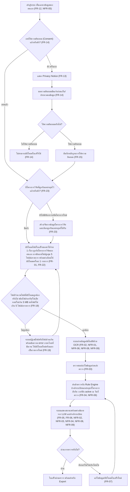
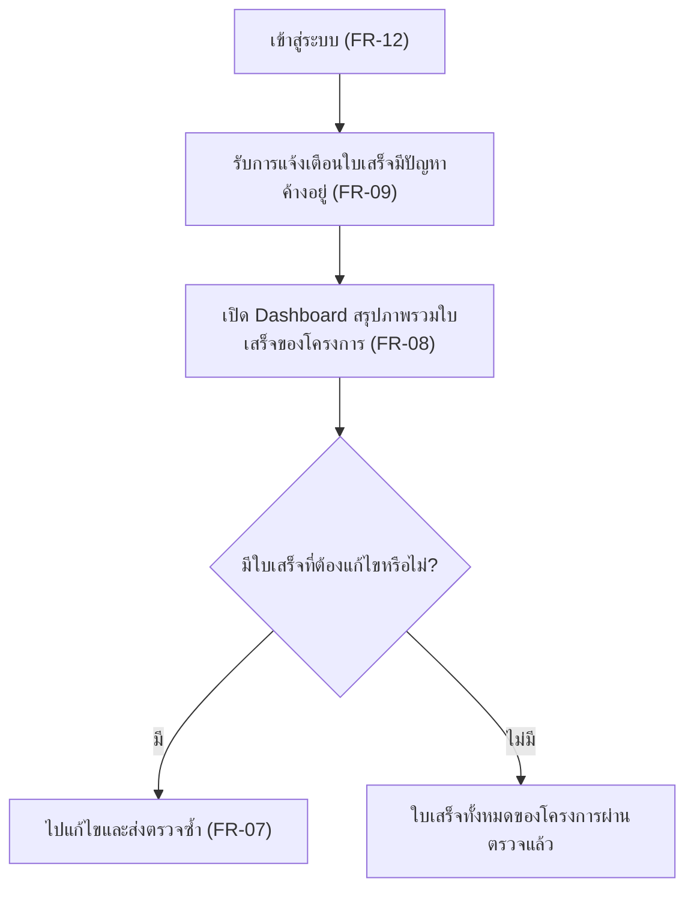
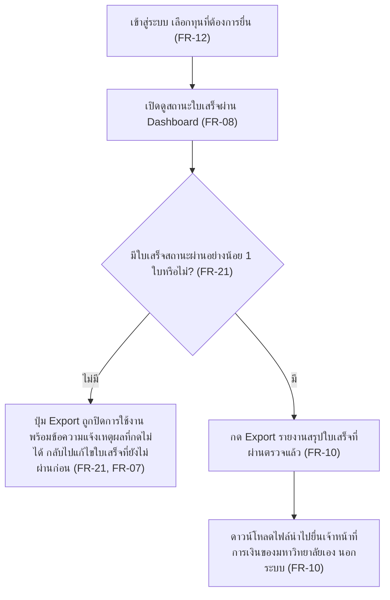
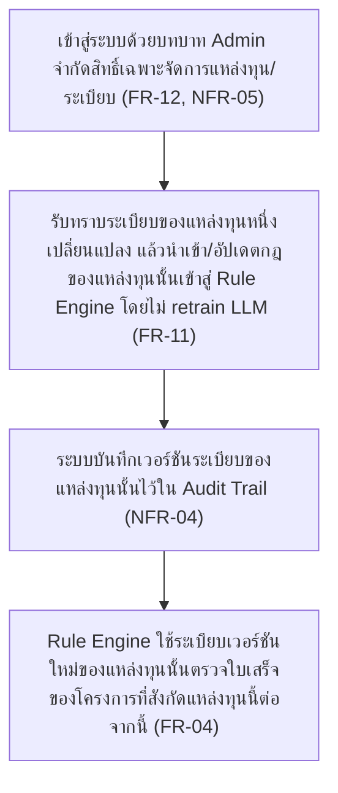
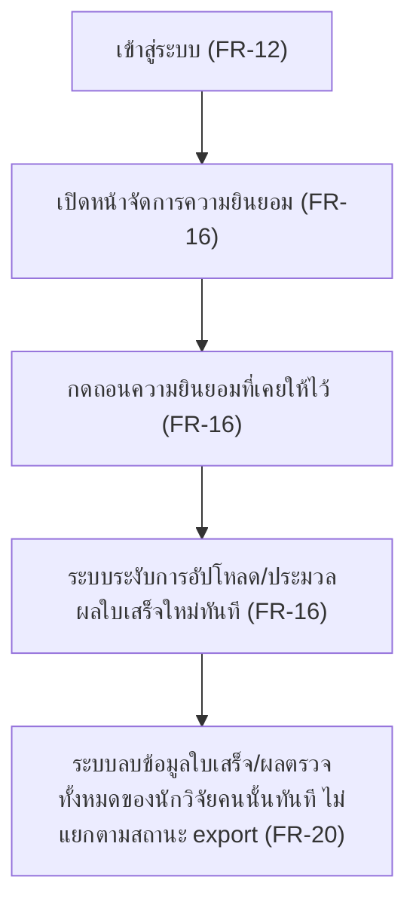
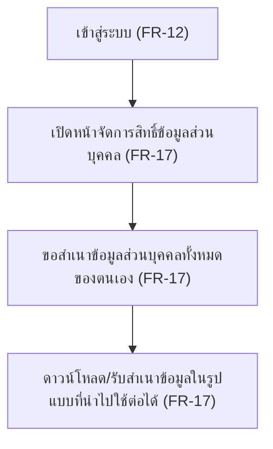
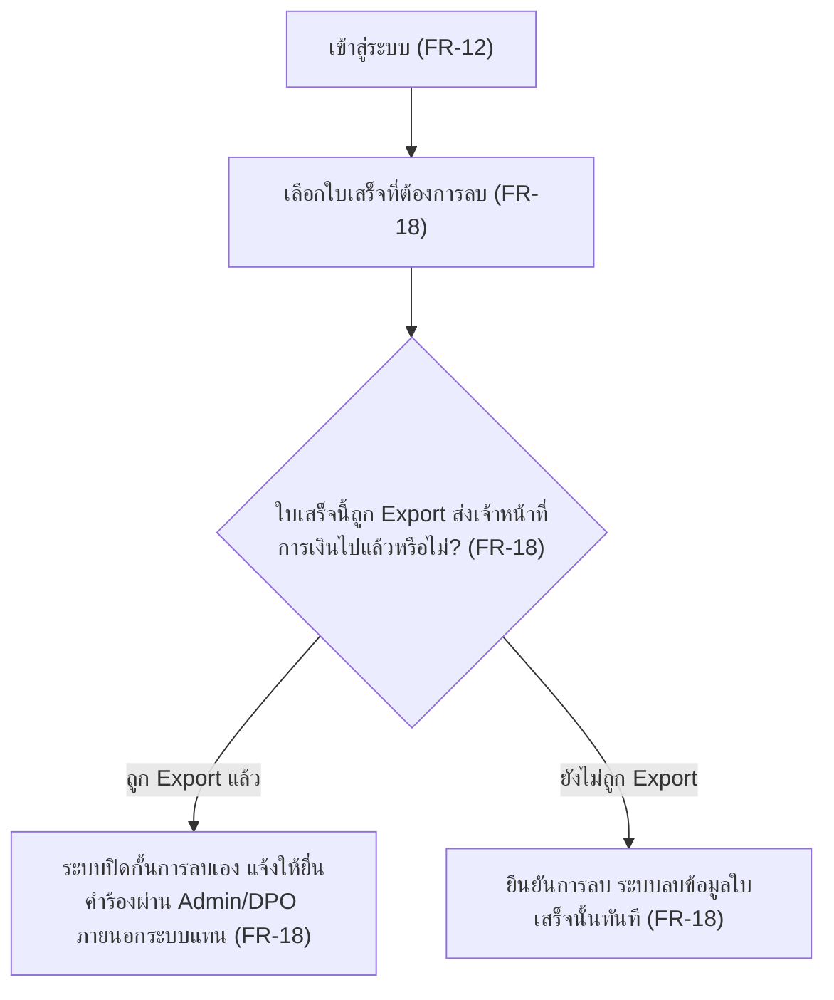

# User Journey — Grant Receipt Assistant

แมปฟีเจอร์จาก [[feature-list]] เป็น flow การใช้งานจริงตามบทบาทผู้ใช้ (step-by-step) ระบบมี 2
บทบาทเท่านั้น: **นักวิจัย/เจ้าของโครงการ** และ **Admin (ผู้ดูแลระบบ/ผู้อัปเดตระเบียบ)** (ดู
[[20260816-01-grant-receipt-verification#3. บทบาทผู้ใช้ (User Roles)]]) — Journey 5-7 (ด้าน
PDPA/การคุ้มครองข้อมูลส่วนบุคคล อ้างอิง [[20260816-02-pdpa-compliance]]) ไม่มีบทบาทใหม่เพิ่มเติม
เป็นสิทธิ์/หน้าที่ของบทบาทนักวิจัย/เจ้าของโครงการเดิมทั้งหมด แต่ละ journey ด้านล่างมี
แผนภาพ Mermaid flowchart กำกับก่อนรายการขั้นตอนแบบข้อความเสมอ เพื่อให้เห็นภาพรวมได้เร็ว

> **อัปเดต 2026-09-03:** ปรับคำศัพท์จาก "ทุนวิจัย/เจ้าของทุน" เป็น "โครงการวิจัย (Project)/เจ้าของ
> โครงการ" ให้ตรงกับโมเดลข้อมูลที่แก้ไขแล้วใน [[feature-list]]/backlog (แยก FundSource ออกจาก
> Project ชัดเจน, ใบเสร็จผูกกับ Project ไม่ใช่ FundSource) แทรก step ใหม่ **"ตั้งค่าโครงการวิจัยและ
> ผูกกับแหล่งทุน" (FR-23, ฟีเจอร์ที่ 13)** เข้าไปใน Journey 1 ก่อนขั้นตอนอัปโหลดใบเสร็จ เพราะเป็น
> ขั้นตอนต่อยอด/ก่อนหน้าของ flow เดิม ไม่ใช่สถานการณ์ใหม่ที่ต้องแยก journey ต่างหาก และปรับคำใน
> Journey 2/4 ให้ตรงกับ FR-08/FR-11 ที่แก้ไขแล้ว

## Journey 1: นักวิจัยอัปโหลดใบเสร็จและตรวจสอบผลจนผ่านเกณฑ์

บทบาท: นักวิจัย/เจ้าของโครงการ

ขั้นตอน:
1. เข้าสู่ระบบ — เห็นเฉพาะข้อมูลใบเสร็จ/โครงการของตนเองเท่านั้น
   ([[20260816-01-grant-receipt-verification#4. Functional Requirements|FR-12]],
   [[20260816-01-grant-receipt-verification#5. Non-Functional Requirements|NFR-05]])
2. ตามสถานการณ์: ถ้า**ยังไม่เคย**ให้ความยินยอมมาก่อน (ใช้งานครั้งแรก/ก่อนอัปโหลดใบเสร็จครั้งแรก) →
   ระบบแสดงประกาศความเป็นส่วนตัว (Privacy Notice) แจ้งวัตถุประสงค์การเก็บ/ใช้ข้อมูล ตัวตนผู้ควบคุม
   ข้อมูล ระยะเวลาเก็บข้อมูล และสิทธิ์ของเจ้าของข้อมูล แล้วขอความยินยอมชัดแจ้ง (Explicit Consent)
   ก่อนเริ่มเก็บ/ประมวลผลข้อมูลใบเสร็จ ถ้า**เคยให้**ความยินยอมแล้ว → ข้ามไปขั้นตอนตรวจสอบโครงการวิจัย
   ได้เลย
   ([[20260816-02-pdpa-compliance#4. Functional Requirements|FR-13]],
   [[20260816-02-pdpa-compliance#4. Functional Requirements|FR-14]])
3. ตามสถานการณ์ (เฉพาะกรณีเป็นครั้งแรก): ถ้า**ให้ความยินยอม** → ระบบบันทึกหลักฐานการให้ความยินยอม
   (วันที่ให้, เวอร์ชัน Privacy Notice) แล้วไปขั้นตอนตรวจสอบโครงการวิจัย ถ้า**ไม่ให้ความยินยอม** → ไม่
   สามารถอัปโหลดใบเสร็จเข้าสู่ระบบได้ จบ flow นี้ (ดูวิธีถอนความยินยอมภายหลังที่ Journey 5)
   ([[20260816-02-pdpa-compliance#4. Functional Requirements|FR-14]],
   [[20260816-02-pdpa-compliance#4. Functional Requirements|FR-15]])
4. ตามสถานการณ์: ถ้า**ยังไม่มี**โครงการวิจัยที่ผูกกับแหล่งทุนไว้เลย (หรือต้องการเพิ่มโครงการใหม่) →
   สร้าง/จัดการข้อมูลโครงการวิจัยของตนเอง (อย่างน้อยชื่อโครงการ) แล้วเลือกผูกโครงการเข้ากับแหล่งทุน
   (fund source) ที่โครงการได้รับจากรายการที่ Admin นำเข้าไว้ (ดู Journey 4) เพื่อให้ระบบทราบว่า
   ใบเสร็จของโครงการนี้ต้องตรวจตามระเบียบของแหล่งทุนใด ถ้า**มีแล้ว** → ข้ามไปขั้นตอนอัปโหลดใบเสร็จ
   ได้เลย โดยเลือกโครงการที่มีอยู่แล้วเป็นตัวที่จะผูกใบเสร็จ
   ([[20260816-01-grant-receipt-verification#4. Functional Requirements|FR-23]])
5. อัปโหลดไฟล์ใบเสร็จของค่าใช้จ่าย 1 เรื่อง (jpg/png หรือ PDF สแกน) ผูกกับ**โครงการวิจัย**ของตนเอง
   (ไม่ใช่ผูกตรงกับแหล่งทุนโดยตรง) — 1 รายการใบเสร็จ (ชุดเอกสารหลักฐานของค่าใช้จ่าย 1 เรื่อง) อาจ
   ประกอบด้วยมากกว่า 1 ไฟล์/แผ่น (เช่น ค่ารถตู้ตามระเบียบมหาวิทยาลัยต้องมี "ใบสำคัญรับเงิน" +
   "สำเนาบัตรผู้รับเงิน" รวมกัน) สูงสุด **5 ไฟล์ต่อรายการ** ต้องอัปโหลดไฟล์ทั้งหมดของค่าใช้จ่ายเรื่อง
   เดียวกันพร้อมกันในครั้งเดียวและผูกกับ record เดียวกัน ไม่ใช่แยกเป็นใบเสร็จคนละรายการ (ใบเสร็จ 1
   แผ่นที่มีสินค้าหลายชิ้นจากร้านเดียวกันยังนับเป็นรายการเดียว ไม่ต้องแยก) ระหว่างขั้นตอนนี้ระบบต้อง
   แสดงข้อความเตือน/คำแนะนำให้อัปโหลดครั้งละ 1 รายการเท่านั้น เพื่อป้องกันความสับสนอัปโหลดใบเสร็จ
   หลายรายการปนกันในครั้งเดียว
   ([[20260816-01-grant-receipt-verification#4. Functional Requirements|FR-01]],
   [[20260816-01-grant-receipt-verification#4. Functional Requirements|FR-22]])
6. ระบบตรวจสอบความถูกต้องของไฟล์ที่อัปโหลดก่อนส่งเข้า OCR เสมอ (ชนิดไฟล์ที่รองรับ, ไฟล์ไม่เสียหาย/
   เปิดได้, ไม่เกินขนาดสูงสุด 5 MB ต่อไฟล์, จำนวนไฟล์ไม่เกิน 5 ไฟล์ต่อรายการ) — ตามสถานการณ์: ถ้า
   **ไฟล์ไม่ถูกต้องหรือมีจำนวนไฟล์เกินที่กำหนด** → ระบบปฏิเสธการอัปโหลด (หรือไฟล์ส่วนเกิน) ทันทีพร้อม
   ข้อความ error ภาษาไทยที่ชัดเจนระบุสาเหตุ แนะนำให้ลดจำนวนไฟล์หรือแยกเป็นรายการใหม่ตามความเหมาะสม
   แล้ววนกลับไปขั้นตอนที่ 5 ให้อัปโหลดใหม่ ถ้า**ไฟล์ถูกต้องครบตามเงื่อนไข** → ไปขั้นตอนถัดไป
   ([[20260816-01-grant-receipt-verification#4. Functional Requirements|FR-19]],
   [[20260816-01-grant-receipt-verification#4. Functional Requirements|FR-22]])
7. ระบบอ่านข้อมูลจากใบเสร็จอัตโนมัติด้วย OCR (ยอดเงิน วันที่ หมวดค่าใช้จ่าย ชื่อร้าน/ผู้ขาย) — หากผู้
   ให้บริการ OCR ประมวลผลข้อมูลนอกราชอาณาจักรไทย ต้องมีมาตรการคุ้มครอง cross-border transfer และ
   ข้อตกลงประมวลผลข้อมูล (DPA) กับผู้ให้บริการตามเงื่อนไขที่กำหนด
   ([[20260816-01-grant-receipt-verification#4. Functional Requirements|FR-02]],
   [[20260816-01-grant-receipt-verification#5. Non-Functional Requirements|NFR-01]],
   [[20260816-01-grant-receipt-verification#5. Non-Functional Requirements|NFR-06]],
   [[20260816-02-pdpa-compliance#5. Non-Functional Requirements|NFR-08]],
   [[20260816-02-pdpa-compliance#5. Non-Functional Requirements|NFR-09]])
8. ตรวจสอบและแก้ไขข้อมูลที่ OCR อ่านได้ ก่อนกดส่งเข้าตรวจ
   ([[20260816-01-grant-receipt-verification#4. Functional Requirements|FR-03]])
9. กดส่งข้อมูลเข้าตรวจกับ Rule Engine — Rule Engine อ้างอิงระเบียบของ**แหล่งทุนที่โครงการสังกัด**
   เวอร์ชันที่ **active ณ วันที่ตรวจใบเสร็จนี้**
   ([[20260816-01-grant-receipt-verification#4. Functional Requirements|FR-04]],
   [[20260816-01-grant-receipt-verification#5. Non-Functional Requirements|NFR-06]])
10. ระบบแสดงสถานะใบเสร็จ (ผ่าน / ต้องแก้ไข / ไม่เข้าเงื่อนไข) พร้อมคำอธิบายจาก LLM ที่แปลผลจาก
    Rule Engine เป็นภาษาที่เข้าใจง่าย และอ้างอิงข้อระเบียบที่ใช้ตัดสิน — เช่นเดียวกับ OCR หากผู้ให้
    บริการ LLM ประมวลผลข้อมูลนอกราชอาณาจักรไทย ต้องมีมาตรการคุ้มครอง cross-border transfer และ DPA
    เช่นกัน
    ([[20260816-01-grant-receipt-verification#4. Functional Requirements|FR-05]],
    [[20260816-01-grant-receipt-verification#4. Functional Requirements|FR-06]],
    [[20260816-01-grant-receipt-verification#5. Non-Functional Requirements|NFR-02]],
    [[20260816-01-grant-receipt-verification#5. Non-Functional Requirements|NFR-03]],
    [[20260816-01-grant-receipt-verification#5. Non-Functional Requirements|NFR-04]],
    [[20260816-02-pdpa-compliance#5. Non-Functional Requirements|NFR-08]],
    [[20260816-02-pdpa-compliance#5. Non-Functional Requirements|NFR-09]])
11. ตามสถานการณ์: ถ้า**ผ่าน** → ใบเสร็จพร้อมสำหรับนำไป export (ดู Journey 3) จบ flow นี้
    ถ้า**ต้องแก้ไข/ไม่เข้าเงื่อนไข** → แก้ไขข้อมูลหรืออัปโหลดใบเสร็จใหม่แทนใบเดิม แล้ววนกลับไปขั้น
    ตอนที่ 9 (ส่งเข้าตรวจกับ Rule Engine ซ้ำ) จนกว่าจะผ่าน
    ([[20260816-01-grant-receipt-verification#4. Functional Requirements|FR-07]])

## Journey 2: นักวิจัยติดตามภาพรวมโครงการและจัดการใบเสร็จที่มีปัญหาผ่าน Dashboard และการแจ้งเตือน

บทบาท: นักวิจัย/เจ้าของโครงการ

ขั้นตอน:
1. เข้าสู่ระบบ — เห็นเฉพาะโครงการของตนเอง
   ([[20260816-01-grant-receipt-verification#4. Functional Requirements|FR-12]])
2. รับการแจ้งเตือนเมื่อมีใบเสร็จสถานะ "ต้องแก้ไข"/"ไม่เข้าเงื่อนไข" ค้างอยู่ยังไม่ได้รับการแก้ไข
   (ไม่รวมการแจ้งเตือนตามกำหนดเวลาส่งหลักฐาน ซึ่งตัดออกจากขอบเขต MVP นี้)
   ([[20260816-01-grant-receipt-verification#4. Functional Requirements|FR-09]])
3. เปิดดู Dashboard สรุปภาพรวมสถานะใบเสร็จของแต่ละ**โครงการวิจัย**ที่เป็นเจ้าของ (จำนวนที่ผ่าน/
   ต้องแก้/ไม่เข้าเงื่อนไข)
   ([[20260816-01-grant-receipt-verification#4. Functional Requirements|FR-08]])
4. ตามสถานการณ์: ถ้า**มี**ใบเสร็จที่ต้องแก้ไข → ไปที่ใบเสร็จนั้นเพื่อแก้ไขและส่งตรวจซ้ำ (ต่อยอดจาก
   Journey 1 ขั้นตอนที่ 11) ถ้า**ไม่มี** → ใบเสร็จทั้งหมดของโครงการผ่านตรวจแล้ว พร้อมสำหรับ export
   ([[20260816-01-grant-receipt-verification#4. Functional Requirements|FR-07]])

## Journey 3: นักวิจัย Export รายงานสรุปใบเสร็จที่ผ่านตรวจแล้วเพื่อยื่นเจ้าหน้าที่การเงิน

บทบาท: นักวิจัย/เจ้าของโครงการ

ขั้นตอน:
1. เข้าสู่ระบบและเลือกทุนที่ต้องการยื่นเบิก
   ([[20260816-01-grant-receipt-verification#4. Functional Requirements|FR-12]])
2. เปิดดูสถานะใบเสร็จของทุนผ่าน Dashboard
   ([[20260816-01-grant-receipt-verification#4. Functional Requirements|FR-08]])
3. ตามสถานการณ์: ถ้า**ไม่มี**ใบเสร็จสถานะผ่านแม้แต่ใบเดียว → ระบบปิดการใช้งาน (disable) ปุ่ม Export
   ของทุนนั้นไว้ก่อน พร้อมข้อความแจ้งเหตุผลที่กดไม่ได้ (เช่น "ยังไม่มีใบเสร็จที่ผ่านการตรวจสำหรับทุนนี้")
   แทนการปล่อยให้กดแล้วได้รายงานเปล่า แล้วกลับไปแก้ไขใบเสร็จที่ยังไม่ผ่านก่อน (ต่อยอดจาก Journey 1
   ขั้นตอนที่ 11) ถ้า**มี**ใบเสร็จสถานะผ่านอย่างน้อย 1 ใบ → ปุ่ม Export ใช้งานได้ตามปกติ ไปขั้นตอนถัดไป
   ([[20260816-01-grant-receipt-verification#4. Functional Requirements|FR-21]],
   [[20260816-01-grant-receipt-verification#4. Functional Requirements|FR-07]])
4. กด Export รายงานสรุปใบเสร็จที่ผ่านการตรวจแล้วของทุน
   ([[20260816-01-grant-receipt-verification#4. Functional Requirements|FR-10]])
5. ดาวน์โหลดไฟล์รายงานและนำไปยื่นต่อเจ้าหน้าที่การเงินของมหาวิทยาลัยเอง (เจ้าหน้าที่การเงินรับไฟล์
   ภายนอกระบบเท่านั้น ไม่ใช่ user ของระบบนี้) — หมายเหตุ: ใบเสร็จที่ถูก export ไปแล้วในขั้นตอนนี้จะ
   ถูกล็อกไม่ให้ลบด้วยตนเองผ่าน UI อีกต่อไป (ดู Journey 7: ลบข้อมูลใบเสร็จของตนเองด้วยตนเอง, FR-18)
   ([[20260816-01-grant-receipt-verification#4. Functional Requirements|FR-10]])

## Journey 4: Admin นำเข้า/อัปเดตระเบียบของแหล่งทุนเข้าสู่ Rule Engine

บทบาท: Admin (ผู้ดูแลระบบ/ผู้อัปเดตระเบียบ)

ขั้นตอน:
1. เข้าสู่ระบบด้วยบทบาท Admin — จำกัดสิทธิ์เฉพาะการจัดการแหล่งทุน/ระเบียบ/กฎใน Rule Engine เท่านั้น
   ไม่มีสิทธิ์เข้าถึงข้อมูลใบเสร็จส่วนบุคคลของนักวิจัย
   ([[20260816-01-grant-receipt-verification#4. Functional Requirements|FR-12]],
   [[20260816-01-grant-receipt-verification#5. Non-Functional Requirements|NFR-05]])
2. รับทราบว่าระเบียบของ**แหล่งทุน (fund source)** แหล่งใดแหล่งหนึ่งมีการเปลี่ยนแปลง (แต่ละแหล่งทุนมี
   รหัส/ระเบียบใบเสร็จเป็นของตัวเอง) แล้วนำเข้า/อัปเดตกฎ/เงื่อนไขจากระเบียบใหม่ของแหล่งทุนนั้นเข้าสู่
   Rule Engine โดยไม่ต้อง retrain LLM
   ([[20260816-01-grant-receipt-verification#4. Functional Requirements|FR-11]])
3. ระบบบันทึกเวอร์ชันระเบียบของแหล่งทุนนั้นที่นำเข้าไว้ใน Audit Trail เพื่อรองรับการตรวจสอบย้อนหลัง
   เมื่อระเบียบมีการเปลี่ยนแปลงตามเวลา
   ([[20260816-01-grant-receipt-verification#5. Non-Functional Requirements|NFR-04]])
4. Rule Engine ใช้ระเบียบเวอร์ชันใหม่ของแหล่งทุนนี้ตรวจใบเสร็จของทุกโครงการที่ผูกกับแหล่งทุนนี้
   (ดู Journey 1 ขั้นตอนที่ 4 เรื่องการผูกโครงการกับแหล่งทุน) ต่อจากนี้ (เชื่อมต่อกับ Journey 1
   ขั้นตอนที่ 9)
   ([[20260816-01-grant-receipt-verification#4. Functional Requirements|FR-04]])

## Journey 5: นักวิจัยถอนความยินยอม (Withdraw Consent) และผลกระทบต่อการใช้งานระบบ

บทบาท: นักวิจัย/เจ้าของโครงการ

ขั้นตอน:
1. เข้าสู่ระบบ
   ([[20260816-01-grant-receipt-verification#4. Functional Requirements|FR-12]])
2. เปิดหน้าจัดการความยินยอม (ต่อยอดจากการให้ความยินยอมครั้งแรกใน Journey 1 ขั้นตอนที่ 2-3)
   ([[20260816-02-pdpa-compliance#4. Functional Requirements|FR-16]])
3. กดถอนความยินยอมที่เคยให้ไว้ — ทำได้ทุกเมื่อผ่าน UI ของระบบ
   ([[20260816-02-pdpa-compliance#4. Functional Requirements|FR-16]])
4. ระบบระงับการอัปโหลด/ประมวลผลใบเสร็จใหม่ของนักวิจัยคนนั้นทันที
   ([[20260816-02-pdpa-compliance#4. Functional Requirements|FR-16]])
5. ระบบลบข้อมูลใบเสร็จ/ผลตรวจทั้งหมดของนักวิจัยคนนั้นที่ระบบเก็บไว้ทันที โดยไม่แยกตามสถานะ export
   (เดิมเป็น open point ในรอบก่อน ยืนยันคำตอบแล้วโดยผู้ใช้เมื่อ 2026-08-16 รอบ 3) — เหตุผล: ระบบ
   Grant Receipt Assistant เป็นเพียง "ด่านตรวจก่อนสอบ" (pre-check gate) ไม่ใช่ archival/official
   retention system ของหลักฐานทางการเงิน เมื่อถอนความยินยอม (ฐานทางกฎหมายเดียวที่ใช้เก็บข้อมูลนี้)
   ระบบจึงไม่มีฐานทางกฎหมายเหลืออยู่ที่จะเก็บข้อมูลต่อได้อีก — ต่างจากการลบเฉพาะรายการใบเสร็จผ่าน UI
   ใน Journey 7 (Right to Erasure, FR-18) ซึ่งยังคงเงื่อนไขจำกัดไม่ให้ลบใบเสร็จที่ export ไปแล้ว
   เพราะนักวิจัยยังไม่ได้ถอนความยินยอมทั้งหมดในกรณีนั้น
   ([[20260816-02-pdpa-compliance#4. Functional Requirements|FR-20]])

## Journey 6: นักวิจัยขอเข้าถึง/ขอสำเนาข้อมูลส่วนบุคคลของตนเอง (Data Access & Portability)

บทบาท: นักวิจัย/เจ้าของโครงการ

ขั้นตอน:
1. เข้าสู่ระบบ
   ([[20260816-01-grant-receipt-verification#4. Functional Requirements|FR-12]])
2. เปิดหน้าจัดการสิทธิ์ข้อมูลส่วนบุคคลของตนเอง
   ([[20260816-02-pdpa-compliance#4. Functional Requirements|FR-17]])
3. ขอสำเนาข้อมูลส่วนบุคคลทั้งหมดที่ระบบเก็บไว้เกี่ยวกับตนเอง (ข้อมูลใบเสร็จ, ผลตรวจ, ประวัติ consent)
   ([[20260816-02-pdpa-compliance#4. Functional Requirements|FR-17]])
4. ดาวน์โหลด/รับสำเนาข้อมูลในรูปแบบที่อ่าน/นำไปใช้ต่อได้ — แยกจาก Journey 3 (Export รายงานสรุปใบเสร็จ
   สำหรับยื่นเจ้าหน้าที่การเงิน) เพราะเป็นสำเนาข้อมูลส่วนบุคคลครบถ้วนตามสิทธิ์ PDPA ไม่ใช่รายงานสรุป
   ([[20260816-02-pdpa-compliance#4. Functional Requirements|FR-17]])

## Journey 7: นักวิจัยลบข้อมูลใบเสร็จของตนเองด้วยตนเอง (Right to Erasure)

บทบาท: นักวิจัย/เจ้าของโครงการ

ขั้นตอน:
1. เข้าสู่ระบบ
   ([[20260816-01-grant-receipt-verification#4. Functional Requirements|FR-12]])
2. เลือกใบเสร็จของตนเองที่ต้องการลบ
   ([[20260816-02-pdpa-compliance#4. Functional Requirements|FR-18]])
3. ตามสถานการณ์: ถ้าใบเสร็จนั้น**ถูก export ไปแล้ว** (รวมอยู่ใน export รายงานที่ส่งเจ้าหน้าที่การเงิน
   ไปแล้ว — ดู Journey 3 ขั้นตอนที่ 5) → ระบบปิดกั้นการลบเองผ่าน UI และแจ้งให้ยื่นคำร้องผ่านช่องทาง
   Admin/DPO ภายนอกระบบแทน เพื่อรักษา Audit Trail/ป้องกันการลบหลักฐานหนีความรับผิดหลังยื่นเบิกไปแล้ว
   (เหตุผลปรับปรุงเมื่อ 2026-08-16 รอบ 3 — ไม่ใช่เพราะข้อกำหนดเก็บหลักฐานทางการเงินอย่างเป็นทางการ
   อีกต่อไป เทียบกับ Journey 5 ซึ่งเป็นการถอนความยินยอมทั้งหมด จึงลบได้ทันทีไม่มีเงื่อนไขนี้)
   ถ้า**ยังไม่ถูก export** → ไปขั้นตอนถัดไป
   ([[20260816-02-pdpa-compliance#4. Functional Requirements|FR-18]])
4. ยืนยันการลบ — ระบบลบข้อมูลใบเสร็จนั้นออกจากระบบทันที
   ([[20260816-02-pdpa-compliance#4. Functional Requirements|FR-18]])

## เอกสารที่เกี่ยวข้อง

- [[feature-list]] — รายการฟีเจอร์ทั้งหมดพร้อมระดับความสำคัญ MoSCoW ที่ journey เหล่านี้อ้างอิง
- [[backlog]] — สรุป FR/NFR ทั้งหมดของโปรเจกต์
- [[20260816-01-grant-receipt-verification]] — เอกสาร spec ต้นทางของ FR-01–FR-12/FR-19/FR-21/FR-22/FR-23/NFR-01–NFR-07
- [[20260816-02-pdpa-compliance]] — เอกสาร spec ต้นทางของ FR-13–FR-18/FR-20/NFR-08–NFR-11 (PDPA)
